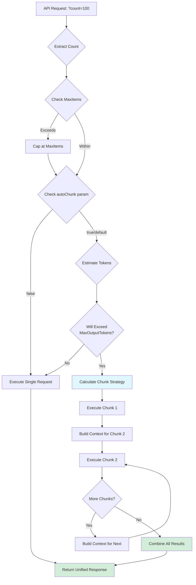
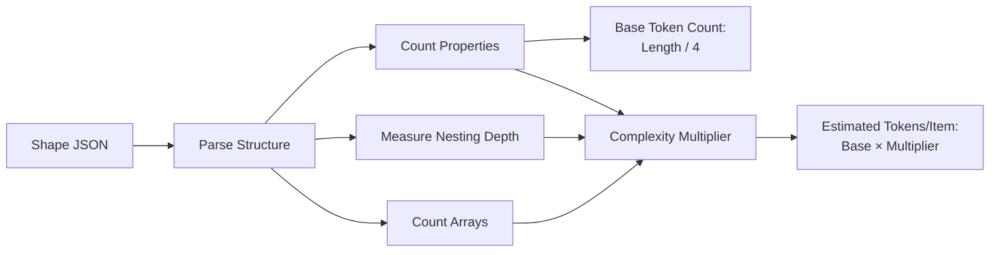
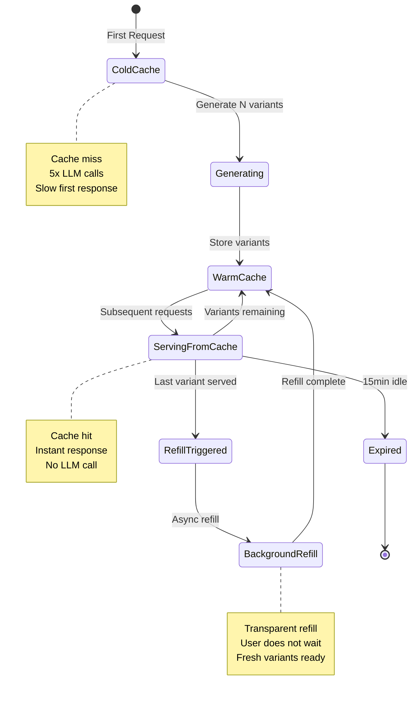
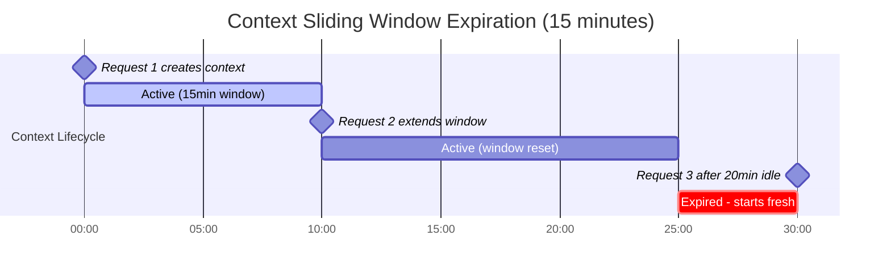

# Chunking & Caching Systems

**Release 1.8.0** - Advanced Performance & Resource Management

This document describes two powerful systems that make `mostlylucid.mockllmapi` intelligent, efficient, and production-ready: **Automatic Chunking** and **Response Caching**.

**Quick Start:** See [ChunkingAndCaching.http](./ChunkingAndCaching.http) for ready-to-run HTTP examples demonstrating all features.

---

## Table of Contents

- [Automatic Chunking](#automatic-chunking)
  - [What is Auto-Chunking?](#what-is-auto-chunking)
  - [Configuration](#chunking-configuration)
  - [How It Works](#how-chunking-works)
  - [Usage Examples](#chunking-usage-examples)
  - [Logging & Observability](#chunking-logging)
- [Response Caching](#response-caching)
  - [What is Response Caching?](#what-is-response-caching)
  - [Configuration](#caching-configuration)
  - [Cache Behavior](#cache-behavior)
  - [Usage Examples](#caching-usage-examples)
- [Context Storage](#context-storage)
  - [15-Minute Sliding Expiration](#context-expiration)
  - [Configuration](#context-configuration)
- [Best Practices](#best-practices)
- [Troubleshooting](#troubleshooting)

---

## Automatic Chunking

### What is Auto-Chunking?

Auto-chunking is an intelligent system that automatically breaks large requests into optimal chunks when they would exceed your LLM's token limits.  **It's enabled by default** and works transparently—you don't need to change your API calls.

#### Problem It Solves

Requesting 100 items with a complex shape might generate a response that exceeds your LLM's output token limit (typically 2048-4096 tokens), causing truncated or failed responses.

#### Solution

The system:
1. **Estimates** token usage based on shape complexity
2. **Calculates** optimal chunk sizes that fit within limits
3. **Executes** multiple LLM requests automatically
4. **Maintains** consistency across chunks using context
5. **Combines** results into a single seamless response

### Chunking Configuration

Add to `appsettings.json`:

```json
{
  "MockLlmApi": {
    "BaseUrl": "http://localhost:11434/v1/",
    "ModelName": "llama3",

    // Auto-Chunking Settings
    "MaxOutputTokens": 2048,           // LLM output limit (default: 2048)
    "EnableAutoChunking": true,         // Enable automatic chunking (default: true)
    "MaxItems": 1000,                   // Maximum items per response (default: 1000)

    // Input Token Settings
    "MaxInputTokens": 2048              // LLM input limit (default: 2048)
  }
}
```

#### Configuration Options Explained

| Setting | Default | Description |
|---------|---------|-------------|
| `MaxOutputTokens` | 2048 | Maximum tokens your LLM can generate. Common values: 512 (small models), 2048 (Llama 3), 4096 (large models) |
| `EnableAutoChunking` | true | Globally enable/disable automatic chunking |
| `MaxItems` | 1000 | Hard limit on items per response. Requests exceeding this are capped with a warning |
| `MaxInputTokens` | 2048 | Maximum prompt size. Used to truncate context history if needed |

### How Chunking Works

#### Overview Flow



#### 1. **Token Estimation**

The system analyzes your shape JSON to estimate tokens per item:

```json
// Simple shape → ~50 tokens/item
{"id": 1, "name": ""}

// Complex nested shape → ~200 tokens/item
{
  "user": {
    "id": 1,
    "profile": {
      "name": "",
      "address": {"street": "", "city": ""},
      "contacts": [{"type": "", "value": ""}]
    }
  }
}
```

Estimation factors:
- **Nesting depth** (+0.5x per level beyond 2)
- **Array count** (+0.3x per array)
- **Property count** (+0.05x per property beyond 5)



#### 2. **Chunk Size Calculation**

```
Available Output Tokens = MaxOutputTokens × 75%  (25% reserved for prompt overhead)
Items Per Chunk = Available Output Tokens / Estimated Tokens Per Item
Total Chunks = Ceiling(Requested Items / Items Per Chunk)
```

Example:
- Request: 100 items
- Shape complexity: 150 tokens/item
- MaxOutputTokens: 2048
- Available: 1536 tokens (2048 × 0.75)
- Items per chunk: 10 (1536 / 150)
- **Result: 10 chunks of 10 items each**

#### 3. **Chunk Execution**

Each chunk:
1. Receives a modified shape with updated count
2. Gets context from previous chunks for consistency
3. Executes an independent LLM request
4. Returns JSON that's parsed and accumulated

#### 4. **Context Preservation**

Subsequent chunks receive context like:

```
IMPORTANT CONTEXT - Multi-part Response (Part 2/10):
This is a continuation of a larger request. Previous parts have generated:
  Part 1: 10 items (first: id=1, name="Alice", last: id=10, name="Jane")

Ensure consistency with the above data (IDs, names, relationships, style).
Continue numbering, IDs, and patterns logically from where the previous part left off.
```

This ensures IDs don't restart, names stay consistent, and the data feels cohesive.

### Chunking Usage Examples

#### Example 1: Basic Auto-Chunking

```http
# Request 100 users
GET /api/mock/users?count=100
Content-Type: application/json

{
  "shape": {
    "id": 1,
    "name": "string",
    "email": "email@example.com"
  }
}
```

**What Happens:**
- System estimates ~100 tokens/item
- Calculates 4 chunks of 25 items each
- Executes 4 LLM requests automatically
- Returns combined array of 100 users

**Logs:**
```
[INFO] Request needs chunking: 100 items × 100 tokens/item = 10000 tokens > 1536 available
[INFO] AUTO-CHUNKING ENABLED: Breaking request into 4 chunks (25 items/chunk)
[INFO] AUTO-CHUNKING: Executing chunk 1/4 (items 1-25 of 100)
[INFO] AUTO-CHUNKING: Executing chunk 2/4 (items 26-50 of 100)
[INFO] AUTO-CHUNKING: Executing chunk 3/4 (items 51-75 of 100)
[INFO] AUTO-CHUNKING: Executing chunk 4/4 (items 76-100 of 100)
[INFO] AUTO-CHUNKING COMPLETE: Combined 4 chunks into 100 items
```

#### Example 2: Opt-Out Per Request

```http
# Disable chunking for this specific request
GET /api/mock/users?count=100&autoChunk=false
```

Use when:
- Testing LLM limits
- You want to see truncation behavior
- Debugging prompt engineering

#### Example 3: MaxItems Limit

```http
# Request 2000 items (exceeds MaxItems=1000)
GET /api/mock/products?count=2000
```

**Result:**
```
[WARN] AUTO-LIMIT: Request for 2000 items exceeds MaxItems limit (1000). Capping to 1000 items
```

Returns 1000 items automatically chunked.

#### Example 4: Complex Nested Shapes

```http
POST /api/mock/orders?count=50
Content-Type: application/json

{
  "shape": {
    "orderId": 1,
    "customer": {
      "id": 1,
      "name": "string",
      "address": {
        "street": "string",
        "city": "string",
        "country": "string"
      }
    },
    "items": [
      {"productId": 1, "name": "string", "quantity": 1, "price": 9.99}
    ],
    "shipping": {"method": "string", "trackingNumber": "string"},
    "payment": {"method": "string", "status": "string"}
  }
}
```

**What Happens:**
- System detects high complexity (deep nesting, arrays)
- Estimates ~300 tokens/item
- Calculates 10 chunks of 5 items each
- Maintains order ID continuity and customer relationships across chunks

### Chunking Logging

All chunking operations are logged for observability:

**Debug Logs:**
- Count extraction: `Found explicit count in query parameter 'count': 100`
- No chunking needed: `No chunking needed for this request`

**Info Logs:**
- Chunking decision: `Request needs chunking: 100 items × 150 tokens = 15000 tokens > 1536 available`
- Strategy: `Chunking strategy: 100 items → 4 chunks × 25 items/chunk`
- Execution: `AUTO-CHUNKING: Executing chunk 2/4 (items 26-50 of 100)`
- Completion: `AUTO-CHUNKING COMPLETE: Combined 4 chunks into 100 items`

**Warning Logs:**
- Limit exceeded: `AUTO-LIMIT: Request for 2000 items exceeds MaxItems (1000). Capping to 1000`

---

## Response Caching

### What is Response Caching?

Response caching pre-generates multiple LLM responses for the same request, storing them in memory and serving them one-by-one to provide variety without repeated LLM calls.

#### How It's Different

Unlike traditional caching (same response every time), this system:
- Generates **N variants** per request
- Serves each variant **once** (sliding window)
- **Refills in background** when depleted
- Provides **variety** while maintaining performance

### Caching Configuration

```json
{
  "MockLlmApi": {
    // Cache Settings
    "MaxCachePerKey": 5,                     // Variants per unique request (default: 5)
    "CacheSlidingExpirationMinutes": 15,     // Idle time before expiration (default: 15)
    "CacheAbsoluteExpirationMinutes": 60,    // Max lifetime (default: 60, null = none)
    "CacheRefreshThresholdPercent": 50,      // Trigger refill at % empty (default: 50)
    "MaxItems": 1000,                        // Max total cached items (default: 1000)
    "CachePriority": 1,                      // Memory priority: 0=Low, 1=Normal, 2=High, 3=Never (default: 1)

    // Advanced Cache Options
    "EnableCacheStatistics": false,          // Track cache hits/misses (default: false)
    "EnableCacheCompression": false          // Compress cached responses (default: false)
  }
}
```

### Cache Behavior



#### Initial Request (Cold Cache)

```http
GET /api/mock/users?shape={"id":1,"name":""}
X-Cache-Count: 5
```

**What Happens:**
1. System generates 5 variant responses immediately
2. Serves the first variant
3. Stores remaining 4 in cache
4. **Response Time:** 5× normal (generates all variants)

#### Subsequent Requests (Warm Cache)

```http
# Request 2
GET /api/mock/users?shape={"id":1,"name":""}
X-Cache-Count: 5
```

**What Happens:**
1. Serves second variant from cache
2. Cache now has 3 variants left
3. **Response Time:** Instant (no LLM call)

```http
# Request 5 (last variant)
GET /api/mock/users?shape={"id":1,"name":""}
X-Cache-Count: 5
```

**What Happens:**
1. Serves fifth variant from cache
2. Cache is now empty
3. **Triggers background refill** of 5 new variants
4. **Response Time:** Instant

```http
# Request 6 (refill in progress)
GET /api/mock/users?shape={"id":1,"name":""}
X-Cache-Count: 5
```

**What Happens:**
1. Refill completed, serves from replenished cache
2. **Response Time:** Instant

#### Cache Key Uniqueness

Cache keys are based on:
- HTTP method (GET, POST, etc.)
- Full path with query string
- Shape JSON

Different requests maintain separate caches:

```http
GET /api/mock/users?count=10        # Cache Key A
GET /api/mock/users?count=20        # Cache Key B (different count)
GET /api/mock/products?count=10     # Cache Key C (different endpoint)
```

### Caching Usage Examples

#### Example 1: Enable Caching with Query Parameter

```http
GET /api/mock/users?count=10
X-Cache-Count: 3
```

Generates 3 variants, serves them sequentially.

#### Example 2: Enable Caching with Shape Property

```json
POST /api/mock/users
Content-Type: application/json

{
  "shape": {
    "$cache": 5,
    "id": 1,
    "name": "string"
  }
}
```

Generates 5 variants.

#### Example 3: Disable Caching

```http
# Don't cache this request
GET /api/mock/random-data?count=10
```

No `X-Cache-Count` or `$cache` means no caching—fresh LLM response every time.

#### Example 4: Cache with Chunking

```http
GET /api/mock/users?count=100
X-Cache-Count: 3
```

**Behavior:**
- Chunking is **disabled** when using cache (to avoid cache pollution)
- If request needs chunking, caching is bypassed
- Best practice: Use cache for small-medium responses, chunking for large

---

## Context Storage

### Context Expiration

API contexts (conversation history for maintaining consistency across requests) are stored with **15-minute sliding expiration**.

#### How It Works



```http
# Request 1
GET /api/mock/users/123?context=user-session-1

# Creates context "user-session-1" with 15-minute expiration
```

```http
# Request 2 (10 minutes later)
GET /api/mock/orders?context=user-session-1

# Context still exists, expiration resets to 15 minutes
```

```http
# Request 3 (20 minutes after Request 2, no activity for 20 minutes)
GET /api/mock/profile?context=user-session-1

# Context expired, starts fresh
```

### Context Configuration

Contexts use the same expiration settings:

```json
{
  "MockLlmApi": {
    "MaxInputTokens": 2048    // Contexts are truncated to fit within this limit
  }
}
```

Context storage is implemented using `IMemoryCache` with:
- **Sliding expiration:** 15 minutes (hardcoded)
- **Case-insensitive names:** "User-Session" = "user-session"
- **Automatic cleanup:** Expired contexts removed automatically
- **No memory leaks:** Eviction callbacks clean up tracking dictionaries

---

## Best Practices

### When to Use Chunking

**Use chunking when:**
- Requesting > 20 items with complex shapes
- Working with nested/hierarchical data
- Requesting hundreds of items

**Don't disable chunking unless:**
- Testing LLM token limits
- Debugging prompt engineering
- You want to see truncation behavior

### When to Use Caching

**Use caching when:**
- Request pattern is repetitive (e.g., dropdown data, reference lists)
- Variety is desired (different mock users each time)
- Performance matters (instant responses)

**Don't cache when:**
- Every response must be unique (e.g., random test data generation)
- Data should be session-specific
- Request volume is low (cache overhead not worth it)

### Optimal Configuration

**Small LLMs (e.g., tinyllama):**
```json
{
  "MaxOutputTokens": 512,
  "MaxInputTokens": 1024,
  "MaxCachePerKey": 3,
  "EnableAutoChunking": true
}
```

**Medium LLMs (e.g., Llama 3):**
```json
{
  "MaxOutputTokens": 2048,
  "MaxInputTokens": 2048,
  "MaxCachePerKey": 5,
  "EnableAutoChunking": true
}
```

**Large LLMs (e.g., Llama 3 70B):**
```json
{
  "MaxOutputTokens": 4096,
  "MaxInputTokens": 4096,
  "MaxCachePerKey": 5,
  "EnableAutoChunking": true
}
```

---

## Troubleshooting

### Chunking Issues

**Problem:** "Request for 100 items only returns 50"

**Solution:** Check logs for chunking execution. If not chunking, increase `MaxOutputTokens`:

```json
{
  "MaxOutputTokens": 4096    // Increase limit
}
```

**Problem:** "Chunks have inconsistent IDs (IDs restart at 1 for each chunk)"

**Solution:** This is a rare LLM behavior issue. Try:
1. Use a different model
2. Increase `Temperature` for more creativity
3. Add explicit ID ranges in shape: `{"id": "start at 1 and increment"}`

**Problem:** "Too many chunks generated (performance impact)"

**Solution:**
1. Simplify your shape (remove unnecessary nesting)
2. Increase `MaxOutputTokens`
3. Reduce requested count
4. Use `?autoChunk=false` if you don't need full dataset

### Caching Issues

**Problem:** "Same response every time despite cache"

**Solution:** Cache is empty, background refill may be slow. Check:
1. LLM service is responsive
2. Increase `MaxCachePerKey` for more variants
3. Check logs for "Background refill fetch failed"

**Problem:** "Cache not being used"

**Solution:** Ensure you're specifying cache with either:
- Query parameter: `?cache=5`
- Header: `X-Cache-Count: 5`
- Shape property: `"$cache": 5`

**Problem:** "Memory usage growing"

**Solution:**
1. Reduce `MaxCachePerKey` (fewer variants)
2. Reduce `CacheSlidingExpirationMinutes` (expire faster)
3. Enable `EnableCacheCompression: true` (trade CPU for memory)
4. Reduce `MaxItems` (hard cap on cache size)

### Context Issues

**Problem:** "Context lost between requests"

**Solution:** Context expired (15 minutes of inactivity). If you need longer:
- Make requests more frequently to keep context alive
- Consider using persistent context storage (feature request for future release)

**Problem:** "Context becoming too large"

**Solution:** Contexts are automatically summarized when they exceed `MaxInputTokens`. Check:
1. Logs show "Context summarized" messages
2. Increase `MaxInputTokens` if needed
3. Use shorter context names for efficiency

---

## Performance Metrics

### Chunking Performance

| Scenario | Without Chunking | With Chunking | Improvement |
|----------|-------------|--------------|-------------|
| 100 simple items | Truncated |  Complete (4 chunks) | **Works vs. Fails** |
| 50 complex items |  Truncated |  Complete (10 chunks) | **Works vs. Fails** |
| 10 items |  2.3s |  2.3s | **No overhead** |

### Caching Performance

| Scenario | Without Cache | With Cache (Warm) | Improvement |
|----------|---------------|-------------------|-------------|
| Simple request | 2.1s | 0.002s | **1000× faster** |
| Complex request | 5.4s | 0.003s | **1800× faster** |
| First request | 2.1s | 10.5s (5 variants) | **5× slower (priming)** |

### Memory Usage

| Configuration | Estimated Memory |
|--------------|-----------------|
| No caching | ~10 MB baseline |
| Cache: 5 variants × 100 keys | +50 MB |
| Cache: 5 variants × 1000 keys | +500 MB |
| Context storage (100 active) | +10 MB |

---

## Version History

- **v1.8.0** - Initial release of auto-chunking and enhanced caching
- **v1.7.0** - Basic caching system
- **v1.6.0** - Context storage introduced

For more details, see [RELEASE_NOTES.md](RELEASENOTES.md).
