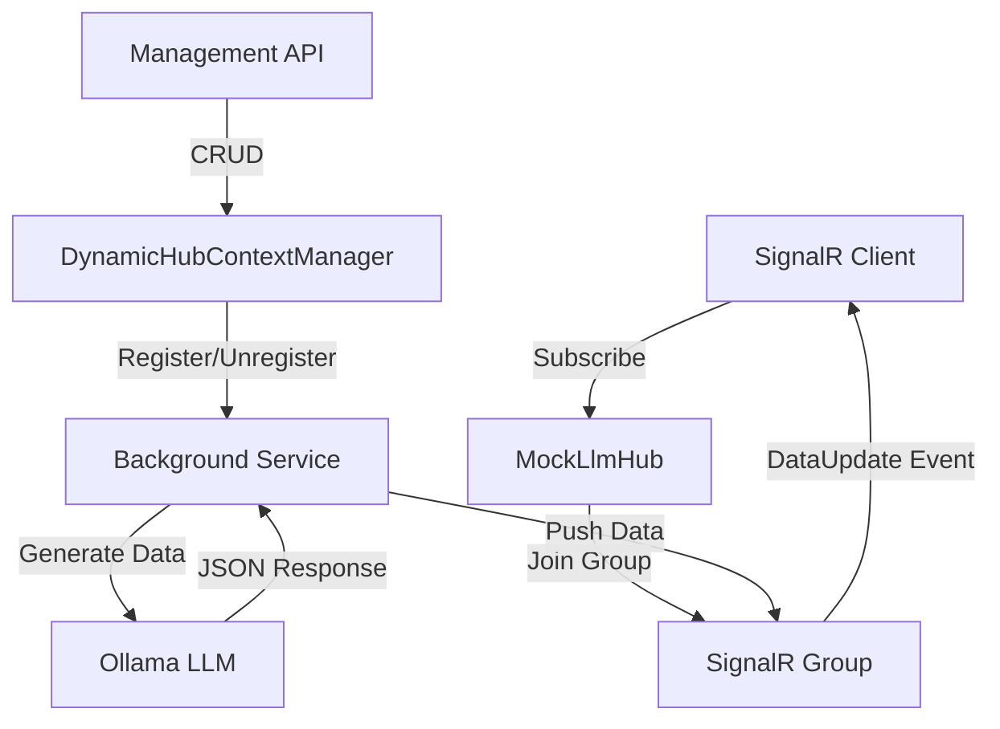
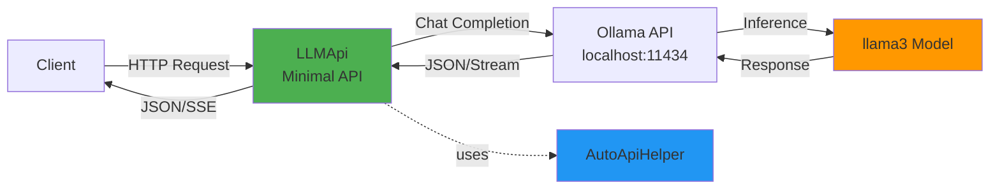
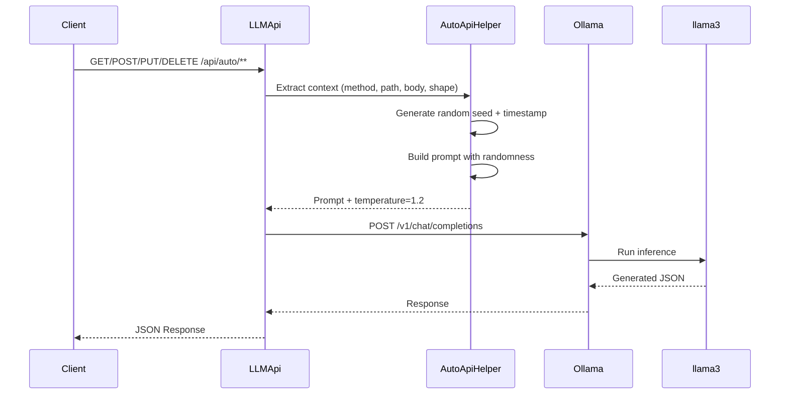
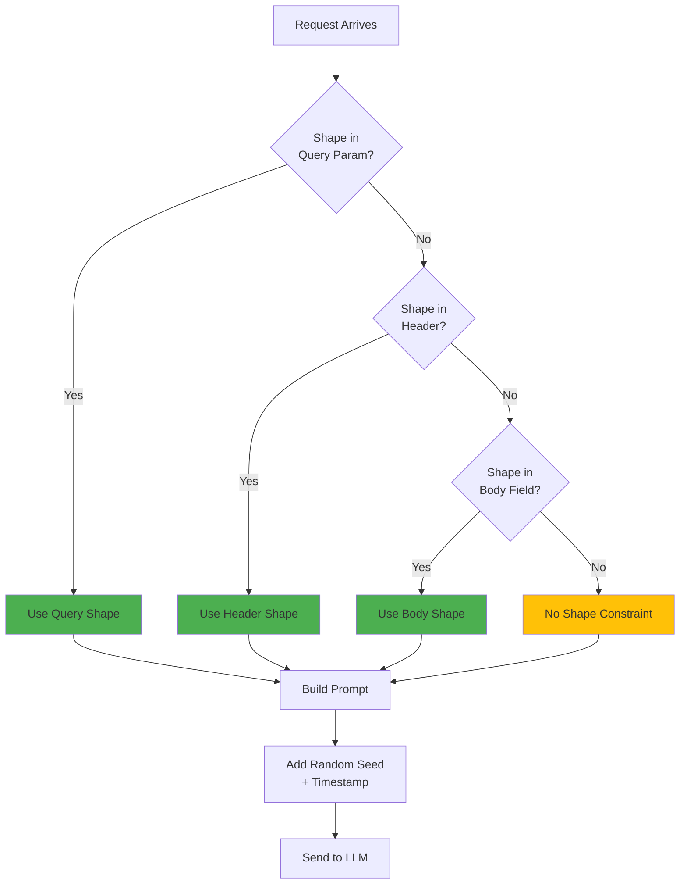

# mostlylucid.mockllmapi

A lightweight ASP.NET Core middleware for generating realistic mock API responses using local LLMs (via Ollama). Add intelligent mock endpoints to any project with just 2 lines of code!

[](https://www.nuget.org/packages/mostlylucid.mockllmapi)
[](https://www.nuget.org/packages/mostlylucid.mockllmapi)

## Features

- ** Super Simple**: `Addmostlylucid.mockllmapi()` + `Mapmostlylucid.mockllmapi("/api/mock")` = instant mock API
- ** SignalR**: `AddLLMockSignalR(builder.Configuration);` lets you build mock signalr contexts and have realistic data streamed to you (with demo page)
- ** Configurable**: appsettings.json or inline configuration
- ** Shape Control**: Specify exact JSON structure via header, query param, or request body
- ** Real-time Streaming**: Server-Sent Events (SSE) support with progressive JSON generation
- ** Highly Variable Data**: Each request generates completely different realistic data
- ** All HTTP Methods**: Supports GET, POST, PUT, DELETE, PATCH
- ** Wildcard Routing**: Any path under your chosen endpoint works
- ** NuGet Package**: Easy to add to existing projects

## Quick Start

### Installation

```bash
dotnet add package mostlylucid.mockllmapi
```

### Prerequisites

1. Install [.NET 8.0 SDK](https://dotnet.microsoft.com/download/dotnet/8.0) or later
2. Install [Ollama](https://ollama.ai/) and pull a model:
   ```bash
   ollama pull llama3
   ```

### Basic Usage

**Program.cs:**
```csharp
using mostlylucid.mockllmapi;

var builder = WebApplication.CreateBuilder(args);

// Add LLMock API services
builder.Services.Addmostlylucid.mockllmapi(builder.Configuration);

var app = builder.Build();

// Map mock endpoints at /api/mock
app.Mapmostlylucid.mockllmapi("/api/mock");

app.Run();
```

**appsettings.json:**
```json
{
  "mostlylucid.mockllmapi": {
    "BaseUrl": "http://localhost:11434/v1/",
    "ModelName": "llama3",
    "Temperature": 1.2
  }
}
```

That's it! Now all requests to `/api/mock/**` return intelligent mock data.

## Configuration Options

### Via appsettings.json (Recommended)

```json
{
  "mostlylucid.mockllmapi": {
    "BaseUrl": "http://localhost:11434/v1/",
    "ModelName": "llama3",
    "Temperature": 1.2,
    "TimeoutSeconds": 30,
    "EnableVerboseLogging": false,
    "CustomPromptTemplate": null
  }
}
```

### Via Code

```csharp
builder.Services.Addmostlylucid.mockllmapi(options =>
{
    options.BaseUrl = "http://localhost:11434/v1/";
    options.ModelName = "mixtral";
    options.Temperature = 1.5;
    options.TimeoutSeconds = 60;
});
```

### Custom Endpoint Patterns

```csharp
// Default: /api/mock/** and /api/mock/stream/**
app.Mapmostlylucid.mockllmapi("/api/mock");

// Custom pattern
app.Mapmostlylucid.mockllmapi("/demo");
// Creates: /demo/** and /demo/stream/**

// Without streaming
app.Mapmostlylucid.mockllmapi("/api/mock", includeStreaming: false);
```

## Usage Examples

### Basic Request

```bash
curl http://localhost:5000/api/mock/users?limit=5
```

Returns realistic user data generated by the LLM.

### With Shape Control

```bash
curl -X POST http://localhost:5000/api/mock/orders \
  -H "X-Response-Shape: {\"orderId\":\"string\",\"total\":0.0,\"items\":[{\"sku\":\"string\",\"qty\":0}]}" \
  -H "Content-Type: application/json" \
  -d '{"customerId":"cus_123"}'
```

LLM generates data matching your exact shape specification.

### Streaming (SSE - Server-Sent Events)

```bash
curl -N http://localhost:5000/api/mock/stream/products?category=electronics \
  -H "Accept: text/event-stream"
```

Returns Server-Sent Events as JSON is generated token-by-token:
```
data: {"chunk":"{","done":false}
data: {"chunk":"\"id\"","done":false}
data: {"chunk":":","done":false}
data: {"chunk":"123","done":false}
...
data: {"content":"{\"id\":123,\"name\":\"Product\"}","done":true,"schema":"{...}"}
```

**JavaScript Example:**
```javascript
const eventSource = new EventSource('/api/mock/stream/users?limit=5');

eventSource.onmessage = (event) => {
    const data = JSON.parse(event.data);

    if (data.done) {
        console.log('Complete:', data.content);
        eventSource.close();
    } else {
        console.log('Chunk:', data.chunk);
    }
};
```

**With Shape Control:**
```bash
curl -N "http://localhost:5000/api/mock/stream/orders?shape=%7B%22id%22%3A0%2C%22items%22%3A%5B%5D%7D"
```

The streaming endpoint supports all the same features as regular endpoints:
- Shape control (query param, header, or body)
- JSON Schema support
- Custom prompts
- All HTTP methods (GET, POST, PUT, DELETE, PATCH)

## SignalR Real-Time Data Streaming

LLMock API includes optional SignalR support for continuous, real-time mock data generation. This is perfect for:
- Dashboard prototypes requiring live updates
- Testing real-time UI components
- Demos with constantly changing data
- WebSocket/SignalR integration testing

### Quick Start with SignalR

**1. Enable SignalR in your application:**

```csharp
using mostlylucid.mockllmapi;

var builder = WebApplication.CreateBuilder(args);

// Add core LLMock API services
builder.Services.AddLLMockApi(builder.Configuration);

// Add SignalR services (optional, separate)
builder.Services.AddLLMockSignalR(builder.Configuration);

builder.Services.AddRazorPages(); // If using demo page

var app = builder.Build();

app.UseRouting();

// Map REST API endpoints
app.MapLLMockApi("/api/mock", includeStreaming: true);

// Map SignalR hub and management endpoints
app.MapLLMockSignalR("/hub/mock", "/api/mock");

app.Run();
```

**2. Configure in appsettings.json:**

```json
{
  "MockLlmApi": {
    "BaseUrl": "http://localhost:11434/v1/",
    "ModelName": "llama3",
    "Temperature": 1.2,

    "SignalRPushIntervalMs": 5000,
    "HubContexts": [
      {
        "Name": "weather",
        "Method": "GET",
        "Path": "/weather/current",
        "Shape": "{\"temperature\":0,\"condition\":\"string\",\"humidity\":0,\"windSpeed\":0}"
      },
      {
        "Name": "stocks",
        "Method": "GET",
        "Path": "/stocks/prices",
        "Shape": "{\"symbol\":\"string\",\"price\":0.0,\"change\":0.0,\"volume\":0}"
      }
    ]
  }
}
```

**3. Connect from client:**

```javascript
// Using @microsoft/signalr
const connection = new signalR.HubConnectionBuilder()
    .withUrl("/hub/mock")
    .withAutomaticReconnect()
    .build();

// Subscribe to a context
connection.on("DataUpdate", (message) => {
    console.log(`${message.context}:`, message.data);
    // message.data contains generated JSON matching the shape
    // message.timestamp is unix timestamp in ms
});

await connection.start();
await connection.invoke("SubscribeToContext", "weather");
```

### Hub Context Configuration

Each hub context simulates a complete API request and generates data continuously:

```json
{
  "Name": "orders",              // Context name for SignalR group
  "Description": "Order data",   // Optional: plain English description
  "Method": "GET",                // HTTP method to simulate
  "Path": "/orders/recent",       // Path to simulate
  "Body": null,                   // Optional request body
  "Shape": "{...}",              // JSON shape or JSON Schema
  "IsJsonSchema": false           // Auto-detected if not specified
}
```

**Using Plain English Descriptions:**

Instead of manually writing JSON shapes, let the LLM generate them:

```json
{
  "Name": "sensors",
  "Description": "IoT sensor data with device ID, temperature, humidity, battery level, and last reading timestamp",
  "Method": "GET",
  "Path": "/sensors/readings"
}
```

The LLM will automatically generate an appropriate JSON schema from the description!

### Dynamic Context Creation API

Create and manage SignalR contexts at runtime using the management API:

#### Create Context

```bash
POST /api/mock/contexts
Content-Type: application/json

{
  "name": "crypto",
  "description": "Cryptocurrency prices with symbol, USD price, 24h change percentage, and market cap"
}
```

Response:
```json
{
  "message": "Context 'crypto' registered successfully",
  "context": {
    "name": "crypto",
    "description": "Cryptocurrency prices...",
    "method": "GET",
    "path": "/crypto",
    "shape": "{...generated JSON schema...}",
    "isJsonSchema": true
  }
}
```

#### List All Contexts

```bash
GET /api/mock/contexts
```

Response:
```json
{
  "contexts": [
    {
      "name": "weather",
      "method": "GET",
      "path": "/weather/current",
      "shape": "{...}"
    },
    {
      "name": "crypto",
      "description": "Cryptocurrency prices...",
      "shape": "{...}"
    }
  ],
  "count": 2
}
```

#### Get Specific Context

```bash
GET /api/mock/contexts/weather
```

Response:
```json
{
  "name": "weather",
  "method": "GET",
  "path": "/weather/current",
  "shape": "{\"temperature\":0,\"condition\":\"string\"}",
  "isJsonSchema": false
}
```

#### Delete Context

```bash
DELETE /api/mock/contexts/crypto
```

Response:
```json
{
  "message": "Context 'crypto' deleted successfully"
}
```

### Complete Client Example

```html
<!DOCTYPE html>
<html>
<head>
    <script src="https://cdn.jsdelivr.net/npm/@microsoft/signalr@8.0.0/dist/browser/signalr.min.js"></script>
</head>
<body>
    <h1>Live Weather Data</h1>
    <div id="weather-data"></div>

    <script>
        const connection = new signalR.HubConnectionBuilder()
            .withUrl("/hub/mock")
            .withAutomaticReconnect()
            .build();

        connection.on("DataUpdate", (message) => {
            if (message.context === "weather") {
                const weatherDiv = document.getElementById("weather-data");
                weatherDiv.innerHTML = `
                    <h2>Current Weather</h2>
                    <p>Temperature: ${message.data.temperature}°F</p>
                    <p>Condition: ${message.data.condition}</p>
                    <p>Humidity: ${message.data.humidity}%</p>
                    <p>Updated: ${new Date(message.timestamp).toLocaleTimeString()}</p>
                `;
            }
        });

        connection.start()
            .then(() => {
                console.log("Connected to SignalR hub");
                return connection.invoke("SubscribeToContext", "weather");
            })
            .then(() => {
                console.log("Subscribed to weather context");
            })
            .catch(err => console.error(err));
    </script>
</body>
</html>
```

### Dynamic Context Creation from UI

```javascript
async function createDynamicContext() {
    // Create the context
    const response = await fetch("/api/mock/contexts", {
        method: "POST",
        headers: { "Content-Type": "application/json" },
        body: JSON.stringify({
            name: "stocks",
            description: "Stock market data with ticker symbol, current price, daily change percentage, and trading volume"
        })
    });

    const result = await response.json();
    console.log("Context created:", result.context);

    // Subscribe to receive data
    await connection.invoke("SubscribeToContext", "stocks");
    console.log("Now receiving live stock data!");
}
```

### SignalR Hub Methods

The `MockLlmHub` supports the following methods:

**SubscribeToContext(string context)**
- Subscribes the client to receive data updates for a specific context
- Client will receive `DataUpdate` events with generated data

**UnsubscribeFromContext(string context)**
- Unsubscribes the client from a context
- Client will no longer receive updates for that context

**Events received by client:**

**DataUpdate** - Contains generated mock data
```javascript
{
    context: "weather",       // Context name
    method: "GET",            // Simulated HTTP method
    path: "/weather/current", // Simulated path
    timestamp: 1699564820000, // Unix timestamp (ms)
    data: {                   // Generated JSON matching the shape
        temperature: 72,
        condition: "Sunny",
        humidity: 45,
        windSpeed: 8
    }
}
```

**Subscribed** - Confirmation of subscription
```javascript
{
    context: "weather",
    message: "Subscribed to weather"
}
```

**Unsubscribed** - Confirmation of unsubscription
```javascript
{
    context: "weather",
    message: "Unsubscribed from weather"
}
```

### Configuration Options

```json
{
  "MockLlmApi": {
    "SignalRPushIntervalMs": 5000,  // Interval between data pushes (ms)
    "HubContexts": [...]             // Array of pre-configured contexts
  }
}
```

### JSON Schema Support

Hub contexts support both simple JSON shapes and full JSON Schema:

**Simple Shape:**
```json
{
  "Name": "users",
  "Shape": "{\"id\":0,\"name\":\"string\",\"email\":\"string\"}"
}
```

**JSON Schema:**
```json
{
  "Name": "products",
  "Shape": "{\"type\":\"object\",\"properties\":{\"id\":{\"type\":\"number\"},\"name\":{\"type\":\"string\"},\"price\":{\"type\":\"number\"}},\"required\":[\"id\",\"name\",\"price\"]}",
  "IsJsonSchema": true
}
```

The system auto-detects JSON Schema by looking for `$schema`, `type`, or `properties` fields.

### Architecture



**Components:**
- **MockLlmHub**: SignalR hub handling client connections and subscriptions
- **MockDataBackgroundService**: Hosted service continuously generating data
- **DynamicHubContextManager**: Thread-safe manager for runtime context registration
- **HubContextConfig**: Configuration model for each data context

### Use Cases

**1. Dashboard Prototyping**
```javascript
// Subscribe to multiple data sources
await connection.invoke("SubscribeToContext", "sales");
await connection.invoke("SubscribeToContext", "traffic");
await connection.invoke("SubscribeToContext", "alerts");
// Now receiving live updates for all three!
```

**2. IoT Simulation**
```json
{
  "Name": "sensors",
  "Description": "IoT temperature sensors with device ID, current temperature, battery percentage, and signal strength",
  "Path": "/iot/sensors"
}
```

**3. Financial Data**
```json
{
  "Name": "trading",
  "Description": "Real-time stock trades with timestamp, symbol, price, volume, and buyer/seller IDs",
  "Path": "/trading/live"
}
```

**4. Gaming Leaderboard**
```json
{
  "Name": "leaderboard",
  "Description": "Gaming leaderboard with player name, score, rank, level, and country",
  "Path": "/game/leaderboard"
}
```

### Demo Applications

The package includes two complete demo applications with interactive web interfaces:

#### SignalR Demo (`/`)
Real-time bidirectional communication with continuous data streaming:
1. Enter a context name and plain English description
2. System creates the context and generates appropriate JSON schema
3. Automatically subscribes to the new context
4. Displays live data updates in real-time (default: every 5 seconds)

**Perfect for:** Dashboards, live monitoring, IoT simulations, real-time feeds

#### SSE Streaming Demo (`/Streaming`)
Server-Sent Events with progressive JSON generation:
1. Configure HTTP method, path, and optional JSON shape
2. Click "Start Streaming" to open EventSource connection
3. Watch JSON being generated token-by-token in real-time
4. Receive complete JSON when streaming finishes

**Perfect for:** Observing LLM generation, debugging shapes, understanding streaming behavior

**Run the demos:**
```bash
cd LLMApi
dotnet run
```

Navigate to:
- `http://localhost:5000` - SignalR real-time data streaming
- `http://localhost:5000/Streaming` - SSE progressive generation

Both demos include comprehensive documentation, examples, and code snippets!

## Advanced Features

### Response Schema Echo (Shape) Export

You can optionally have the middleware echo back the JSON shape/schema that was used to generate the mock response.

Configuration:
- Option: IncludeShapeInResponse (bool, default false)
- Per-request override: add query parameter includeSchema=true (or 1)
- Header emitted: X-Response-Schema (only when a shape was provided and size ≤ 4000 chars)
- Streaming: the final SSE event includes a schema field when enabled

Examples:

- Enable globally (appsettings.json):
```json
{
  "mostlylucid.mockllmapi": {
    "IncludeShapeInResponse": true
  }
}
```

- Enable per request (overrides config):
```bash
curl "http://localhost:5000/api/mock/users?shape=%7B%22id%22%3A0%2C%22name%22%3A%22string%22%7D&includeSchema=true"
```
Response includes header:
```
X-Response-Schema: {"id":0,"name":"string"}
```

- Streaming: final event contains schema field when enabled
```
...
data: {"content":"{full json}","done":true,"schema":{"id":0,"name":"string"}}
```

Notes:
- If no shape was provided (via query/header/body), the header is not added
- Very large shapes (> 4000 chars) are not added to the header to avoid transport issues, but normal response continues

Use cases:
- Client-side TypeScript type generation
- API documentation and schema validation
- Debugging shape parsing
- Runtime validation

### Custom Prompt Templates

Override the default prompts with your own:

```json
{
  "mostlylucid.mockllmapi": {
    "CustomPromptTemplate": "Generate mock data for {method} {path}. Body: {body}. Use seed: {randomSeed}"
  }
}
```

Available placeholders:
- `{method}` - HTTP method (GET, POST, etc.)
- `{path}` - Full request path with query string
- `{body}` - Request body
- `{randomSeed}` - Generated random seed (GUID)
- `{timestamp}` - Unix timestamp
- `{shape}` - Shape specification (if provided)

### Multiple Instances

Mount multiple mock APIs with different configurations:

```csharp
// Development data with high randomness
builder.Services.Addmostlylucid.mockllmapi("Dev", options =>
{
    options.Temperature = 1.5;
    options.ModelName = "llama3";
});

// Stable test data
builder.Services.Addmostlylucid.mockllmapi("Test", options =>
{
    options.Temperature = 0.3;
    options.ModelName = "llama3";
});

app.Mapmostlylucid.mockllmapi("/api/dev");
app.Mapmostlylucid.mockllmapi("/api/test");
```

## Shape Specification

Three ways to control response structure:

1. **Header** (recommended): `X-Response-Shape: {"field":"type"}`
2. **Query param**: `?shape=%7B%22field%22%3A%22type%22%7D` (URL-encoded JSON)
3. **Body field**: `{"shape": {...}, "actualData": ...}`

### Caching Multiple Responses via Shape

You can instruct the middleware to pre-generate and cache multiple response variants for a specific request/shape by adding a special field inside the shape object: "$cache": N.

- The cache key is derived from HTTP method + path (including query) + the sanitized shape (with $cache removed) using System.IO.Hashing XXHash64.
- Up to N responses are prefetched from the LLM and stored in-memory (capped by MaxCachePerKey in options; default 5).
- Subsequent non-streaming requests for the same key are served from a depleting queue; when exhausted, a fresh batch of N is prefetched automatically.
- Streaming endpoints are not cached.

Examples

- Header shape:
  X-Response-Shape: {"$cache":3,"orderId":"string","status":"string","items":[{"sku":"string","qty":0}]}

- Body shape:
  {
  "shape": {
  "$cache": 5,
  "invoiceId": "string",
  "customer": { "id": "string", "name": "string" },
  "items": [ { "sku": "string", "qty": 0, "price": 0.0 } ],
  "total": 0.0
  }
  }

- Query param (URL-encoded):
  ?shape=%7B%22%24cache%22%3A2%2C%22users%22%3A%5B%7B%22id%22%3A0%2C%22name%22%3A%22string%22%7D%5D%7D

Configuration

- MaxCachePerKey (int, default 5): caps the number requested by "$cache" per key.

Notes

- The "$cache" hint is removed from the shape before it is sent to the LLM.
- If "$cache" is omitted or 0, the request behaves as before (no caching/warmup).
- Cached variants are kept in-memory for the app lifetime; restart clears the cache.


## Testing

Use the included `LLMApi.http` file with:
- Visual Studio / Rider HTTP client
- VS Code REST Client extension
- Any HTTP client

## Testing

The project includes comprehensive unit tests:

```bash
# Run all tests
dotnet test

# Run with detailed output
dotnet test --verbosity detailed
```

**Test Coverage:**
- ✅ Body reading (empty, JSON content)
- ✅ Shape extraction (query param, header, body field, precedence)
- ✅ Prompt generation (randomness, shape inclusion, streaming modes)
- ✅ Request building (temperature, model, messages)
- ✅ Edge cases (invalid JSON, missing data)

## Architecture



### Request Flow



### Shape Control Flow



**Projects:**
- `mostlylucid.mockllmapi`: NuGet package library
- `LLMApi`: Demo application
- `LLMApi.Tests`: xUnit test suite (13 tests)

## Why Use mostlylucid.mockllmapi?

- **🚀 Rapid Prototyping**: Frontend development without waiting for backend
- **🎭 Demos**: Show realistic data flows without hardcoded fixtures
- **🧪 Testing**: Generate varied test data for edge cases
- **📐 API Design**: Experiment with response shapes before implementing
- **🎓 Learning**: Example of LLM integration in .NET minimal APIs
- **🔌 Zero Maintenance**: No database, no state, no mock data files to maintain

## Building the NuGet Package

```bash
cd mostlylucid.mockllmapi
dotnet pack -c Release
```

Package will be in `bin/Release/mostlylucid.mockllmapi.{version}.nupkg`

## Contributing

This is a sample project demonstrating LLM-powered mock APIs. Feel free to fork and customize!

## License

This is free and unencumbered software released into the public domain. See [LICENSE](LICENSE) for details or visit [unlicense.org](https://unlicense.org).


