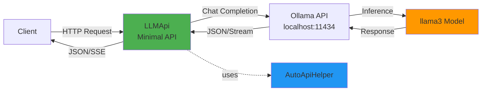
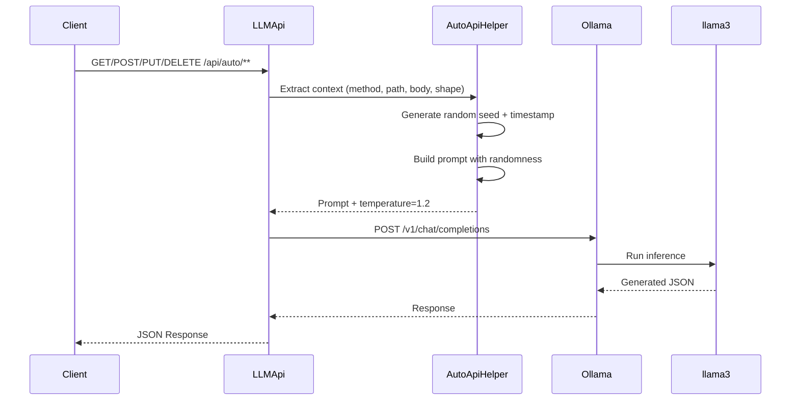
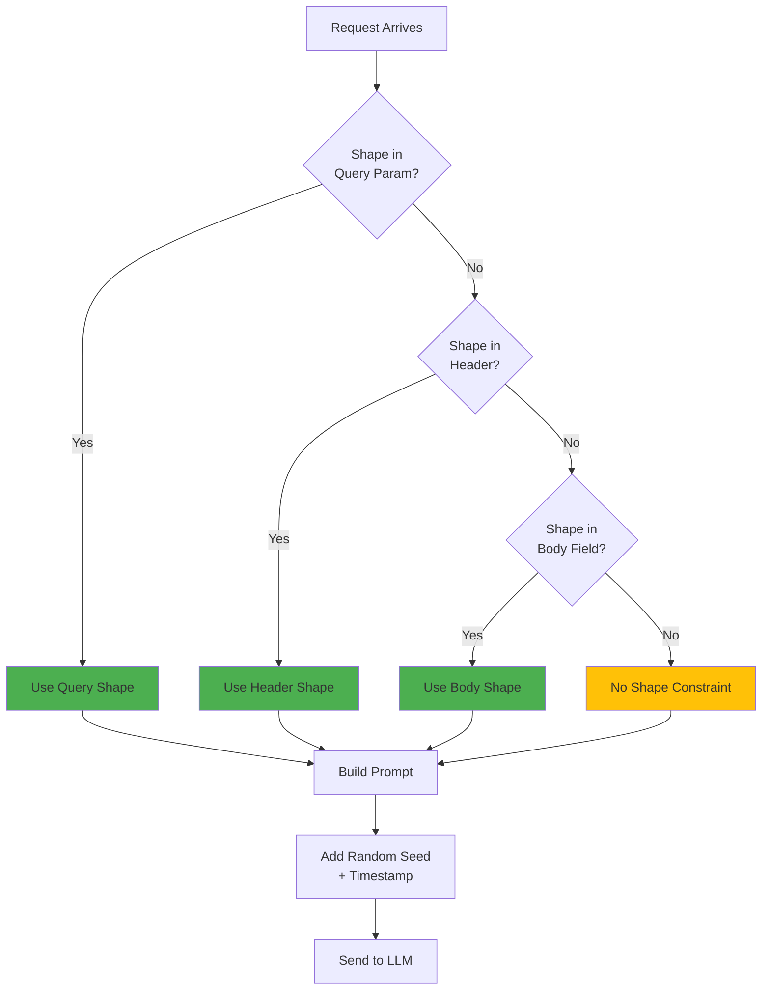

# mostlylucid.mockllmapi

A lightweight ASP.NET Core middleware for generating realistic mock API responses using local LLMs (via Ollama). Add intelligent mock endpoints to any project with just 2 lines of code!

## Features

- **🚀 Super Simple**: `Addmostlylucid.mockllmapi()` + `Mapmostlylucid.mockllmapi("/api/mock")` = instant mock API
- **⚙️ Configurable**: appsettings.json or inline configuration
- **🎨 Shape Control**: Specify exact JSON structure via header, query param, or request body
- **📡 Real-time Streaming**: Server-Sent Events (SSE) support with progressive JSON generation
- **🎲 Highly Variable Data**: Each request generates completely different realistic data
- **🔧 All HTTP Methods**: Supports GET, POST, PUT, DELETE, PATCH
- **🌐 Wildcard Routing**: Any path under your chosen endpoint works
- **📦 NuGet Package**: Easy to add to existing projects

## Quick Start

### Installation

```bash
dotnet add package mostlylucid.mockllmapi
```

### Prerequisites

1. Install [.NET 8.0 SDK](https://dotnet.microsoft.com/download/dotnet/8.0) or later
2. Install [Ollama](https://ollama.ai/) and pull a model:
   ```bash
   ollama pull llama3
   ```

### Basic Usage

**Program.cs:**
```csharp
using mostlylucid.mockllmapi;

var builder = WebApplication.CreateBuilder(args);

// Add LLMock API services
builder.Services.Addmostlylucid.mockllmapi(builder.Configuration);

var app = builder.Build();

// Map mock endpoints at /api/mock
app.Mapmostlylucid.mockllmapi("/api/mock");

app.Run();
```

**appsettings.json:**
```json
{
  "mostlylucid.mockllmapi": {
    "BaseUrl": "http://localhost:11434/v1/",
    "ModelName": "llama3",
    "Temperature": 1.2
  }
}
```

That's it! Now all requests to `/api/mock/**` return intelligent mock data.

## Configuration Options

### Via appsettings.json (Recommended)

```json
{
  "mostlylucid.mockllmapi": {
    "BaseUrl": "http://localhost:11434/v1/",
    "ModelName": "llama3",
    "Temperature": 1.2,
    "TimeoutSeconds": 30,
    "EnableVerboseLogging": false,
    "CustomPromptTemplate": null
  }
}
```

### Via Code

```csharp
builder.Services.Addmostlylucid.mockllmapi(options =>
{
    options.BaseUrl = "http://localhost:11434/v1/";
    options.ModelName = "mixtral";
    options.Temperature = 1.5;
    options.TimeoutSeconds = 60;
});
```

### Custom Endpoint Patterns

```csharp
// Default: /api/mock/** and /api/mock/stream/**
app.Mapmostlylucid.mockllmapi("/api/mock");

// Custom pattern
app.Mapmostlylucid.mockllmapi("/demo");
// Creates: /demo/** and /demo/stream/**

// Without streaming
app.Mapmostlylucid.mockllmapi("/api/mock", includeStreaming: false);
```

## Usage Examples

### Basic Request

```bash
curl http://localhost:5000/api/mock/users?limit=5
```

Returns realistic user data generated by the LLM.

### With Shape Control

```bash
curl -X POST http://localhost:5000/api/mock/orders \
  -H "X-Response-Shape: {\"orderId\":\"string\",\"total\":0.0,\"items\":[{\"sku\":\"string\",\"qty\":0}]}" \
  -H "Content-Type: application/json" \
  -d '{"customerId":"cus_123"}'
```

LLM generates data matching your exact shape specification.

### Streaming

```bash
curl -N http://localhost:5000/api/mock/stream/products?category=electronics \
  -H "Accept: text/event-stream"
```

Returns Server-Sent Events as JSON is generated:
```
data: {"chunk":"{","done":false}
data: {"chunk":"\"id\"","done":false}
...
data: {"content":"{full json here}","done":true}
```

## Advanced Features

### Custom Prompt Templates

Override the default prompts with your own:

```json
{
  "mostlylucid.mockllmapi": {
    "CustomPromptTemplate": "Generate mock data for {method} {path}. Body: {body}. Use seed: {randomSeed}"
  }
}
```

Available placeholders:
- `{method}` - HTTP method (GET, POST, etc.)
- `{path}` - Full request path with query string
- `{body}` - Request body
- `{randomSeed}` - Generated random seed (GUID)
- `{timestamp}` - Unix timestamp
- `{shape}` - Shape specification (if provided)

### Multiple Instances

Mount multiple mock APIs with different configurations:

```csharp
// Development data with high randomness
builder.Services.Addmostlylucid.mockllmapi("Dev", options =>
{
    options.Temperature = 1.5;
    options.ModelName = "llama3";
});

// Stable test data
builder.Services.Addmostlylucid.mockllmapi("Test", options =>
{
    options.Temperature = 0.3;
    options.ModelName = "llama3";
});

app.Mapmostlylucid.mockllmapi("/api/dev");
app.Mapmostlylucid.mockllmapi("/api/test");
```

## Shape Specification

Three ways to control response structure:

1. **Header** (recommended): `X-Response-Shape: {"field":"type"}`
2. **Query param**: `?shape=%7B%22field%22%3A%22type%22%7D` (URL-encoded JSON)
3. **Body field**: `{"shape": {...}, "actualData": ...}`

## Testing

Use the included `LLMApi.http` file with:
- Visual Studio / Rider HTTP client
- VS Code REST Client extension
- Any HTTP client

## Testing

The project includes comprehensive unit tests:

```bash
# Run all tests
dotnet test

# Run with detailed output
dotnet test --verbosity detailed
```

**Test Coverage:**
- ✅ Body reading (empty, JSON content)
- ✅ Shape extraction (query param, header, body field, precedence)
- ✅ Prompt generation (randomness, shape inclusion, streaming modes)
- ✅ Request building (temperature, model, messages)
- ✅ Edge cases (invalid JSON, missing data)

## Architecture



### Request Flow



### Shape Control Flow



**Projects:**
- `mostlylucid.mockllmapi`: NuGet package library
- `LLMApi`: Demo application
- `LLMApi.Tests`: xUnit test suite (13 tests)

## Why Use mostlylucid.mockllmapi?

- **🚀 Rapid Prototyping**: Frontend development without waiting for backend
- **🎭 Demos**: Show realistic data flows without hardcoded fixtures
- **🧪 Testing**: Generate varied test data for edge cases
- **📐 API Design**: Experiment with response shapes before implementing
- **🎓 Learning**: Example of LLM integration in .NET minimal APIs
- **🔌 Zero Maintenance**: No database, no state, no mock data files to maintain

## Building the NuGet Package

```bash
cd mostlylucid.mockllmapi
dotnet pack -c Release
```

Package will be in `bin/Release/mostlylucid.mockllmapi.{version}.nupkg`

## Contributing

This is a sample project demonstrating LLM-powered mock APIs. Feel free to fork and customize!

## License

MIT License - This is a sample project for demonstration purposes.
