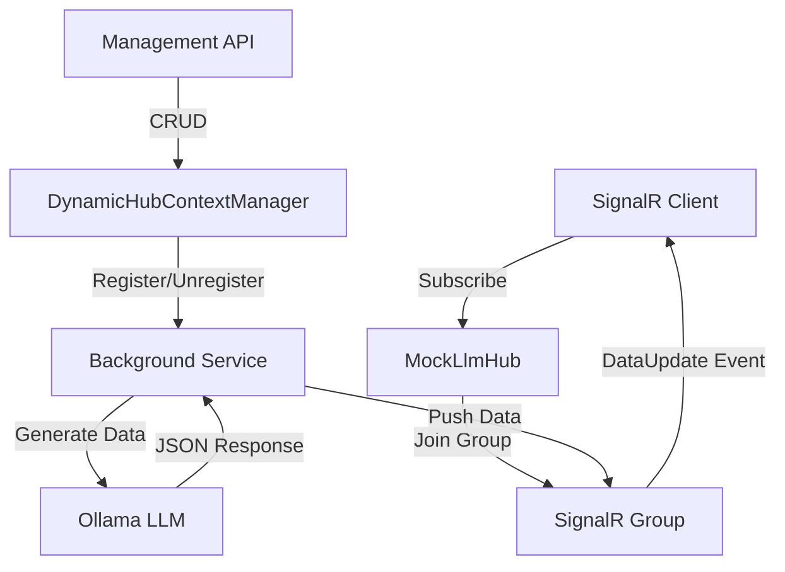
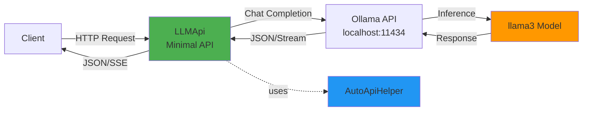
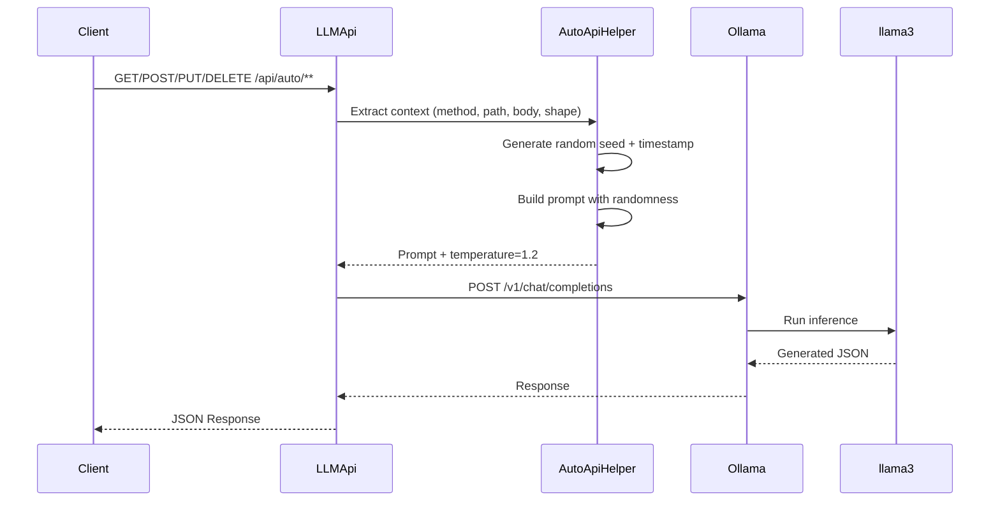
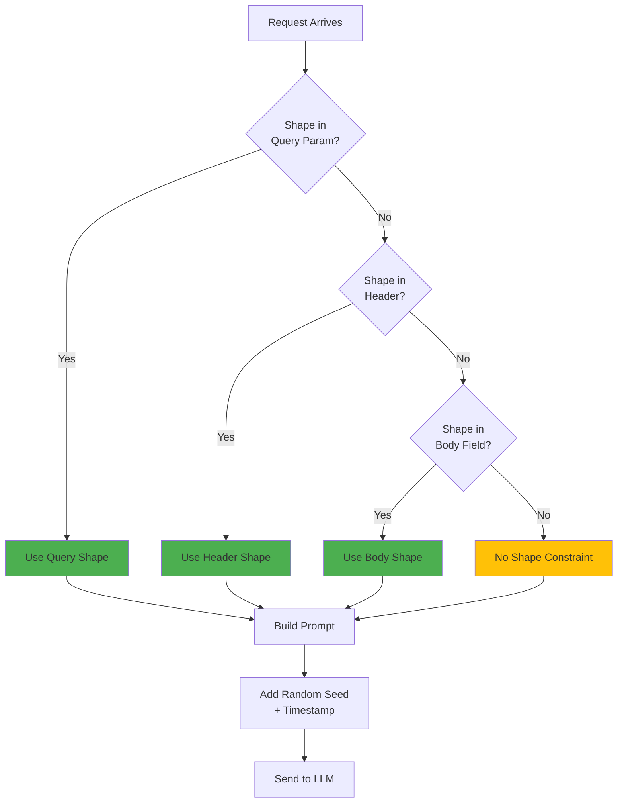

# mostlylucid.mockllmapi

A lightweight ASP.NET Core middleware for generating realistic mock API responses using local LLMs (via Ollama). Add intelligent mock endpoints to any project with just 2 lines of code!

[](https://www.nuget.org/packages/mostlylucid.mockllmapi)
[](https://www.nuget.org/packages/mostlylucid.mockllmapi)

---

## v1.2.0 Update - NO BREAKING CHANGES

**Full Backward Compatibility Guaranteed!** All existing code continues to work exactly as before.

**What's New:**
- **Native GraphQL Support** - POST to `/graphql` with standard GraphQL queries
- **Fully Modular Architecture** - Use only the protocols you need (REST, GraphQL, SSE, SignalR)
- **Polly Resilience Policies** - Built-in exponential backoff retry and circuit breaker patterns (enabled by default)
- **30-40% Reduced Memory** - When using modular setup with single protocol
- See [MODULAR_EXAMPLES.md](./MODULAR_EXAMPLES.md) for modular usage patterns

**Migration Notes:**
- Old method names (`Addmostlylucid_mockllmapi`, `Mapmostlylucid_mockllmapi`) still work but are deprecated
- Recommended: Use new names (`AddLLMockApi`, `MapLLMockApi`) - or use modular methods like `AddLLMockRest()`
- All examples below use the new recommended method names

---

## Features

This package provides **five independent features** - use any combination you need:

### 1. REST API Mocking
- **Super Simple**: `AddLLMockApi()` + `MapLLMockApi("/api/mock")` = instant mock API
- **Shape Control**: Specify exact JSON structure via header, query param, or request body
- **All HTTP Methods**: Supports GET, POST, PUT, DELETE, PATCH
- **Wildcard Routing**: Any path under your chosen endpoint works

### 2. GraphQL API Mocking
- **Native GraphQL Support**: POST to `/api/mock/graphql` with standard GraphQL queries
- **Query-Driven Shapes**: The GraphQL query itself defines the response structure
- **Variables & Operations**: Full support for variables, operation names, and fragments
- **Proper Error Handling**: Returns GraphQL-formatted errors with `data` and `errors` fields

### 3. Server-Sent Events (SSE) Streaming
- **Progressive Streaming**: SSE support with progressive JSON generation
- **Real-time Updates**: Stream data token-by-token to clients
- **Works standalone**: No REST API setup required

### 4. SignalR Real-Time Streaming
- **WebSocket Streaming**: Continuous real-time mock data via SignalR
- **Multiple Contexts**: Run multiple independent data streams simultaneously
- **Lifecycle Management**: Start/stop contexts dynamically with management API
- **Works standalone**: No REST API setup required

### 5. OpenAPI / Swagger Mock Generation
- **Automatic Endpoint Generation**: Point to any OpenAPI/Swagger spec (URL or file)
- **All Operations Mocked**: Every path and method from spec becomes a live endpoint
- **Schema-Driven Data**: LLM generates realistic data matching your schemas
- **Multiple Specs**: Load and mount multiple API specs simultaneously
- **Works standalone**: No REST API setup required

### Common Features
- **Configurable**: appsettings.json or inline configuration
- **Highly Variable Data**: Each request/update generates completely different realistic data
- **NuGet Package**: Easy to add to existing projects

## Quick Start

### Installation

```bash
dotnet add package mostlylucid.mockllmapi
```

### Prerequisites

1. Install [.NET 8.0 SDK](https://dotnet.microsoft.com/download/dotnet/8.0) or later
2. Install [Ollama](https://ollama.ai/) and pull a model:
   ```bash
   ollama pull llama3
   ```

### Choosing an LLM Model

This package was **developed and tested with `llama3`** (8B parameters), which provides excellent results for all features. However, it works with any Ollama-compatible model:

#### Recommended Models

| Model | Size | Speed | Quality | Best For |
|-------|------|-------|---------|----------|
| **llama3** (default) | 8B | Fast | Excellent | General use, production |
| **mistral:7b** | 7B | Fast | Excellent | Alternative to llama3 |
| **phi3** | 3.8B | Very Fast | Good | Quick prototyping |
| **tinyllama** | 1.1B | Ultra Fast | Basic | Resource-constrained environments |

#### Model-Specific Configuration

**For llama3 or mistral:7b (Recommended):**
```json
{
  "ModelName": "llama3",  // or "mistral:7b"
  "Temperature": 1.2      // High variety, diverse outputs
}
```

**For smaller models (phi3, tinyllama):**
```json
{
  "ModelName": "tinyllama",
  "Temperature": 0.7      // Lower temperature for stability
}
```

**Why Temperature Matters:**
- **Larger models (7B+)** can handle high temperatures (1.0-1.5) while maintaining valid JSON
- **Smaller models (<4B)** need lower temperatures (0.6-0.8) to avoid:
  - Invalid JSON syntax (missing quotes, brackets)
  - Truncated responses with ellipsis ("...")
  - Hallucinated field names or structures
- Lower temperature = more predictable output, less variety
- Higher temperature = more creative output, more variety (but riskier for small models)

#### Installation

```bash
# Recommended (best quality)
ollama pull llama3

# Alternative options
ollama pull mistral:7b
ollama pull phi3
ollama pull tinyllama
```

**Important Limitations:**
- **Smaller models** (`tinyllama`, `phi3`) work but may:
  - Generate simpler/less varied data
  - Struggle with complex GraphQL queries
  - Need more retry attempts
  - Work best with simple queries and small response sizes
- **All models** can struggle with:
  - **Very complex/deeply nested GraphQL queries** (>5 levels deep)
  - **Many fields per object** (>10 fields)
  - **Large array requests** - Limit to 2-5 items for reliability
- **If seeing errors** about truncated JSON ("...") or comments ("//"):
  - Lower temperature to 0.8 or below
  - Simplify your GraphQL query (fewer fields, less nesting)
  - Increase `MaxRetryAttempts` to 5 or more

### Basic Usage

**Program.cs:**
```csharp
using mostlylucid.mockllmapi;

var builder = WebApplication.CreateBuilder(args);

// Add LLMock API services (all protocols: REST, GraphQL, SSE)
builder.Services.AddLLMockApi(builder.Configuration);

var app = builder.Build();

// Map mock endpoints at /api/mock (includes REST, GraphQL, SSE)
app.MapLLMockApi("/api/mock");

app.Run();
```

**appsettings.json:**
```json
{
  "mostlylucid.mockllmapi": {
    "BaseUrl": "http://localhost:11434/v1/",
    "ModelName": "llama3",
    "Temperature": 1.2
  }
}
```

That's it! Now all requests to `/api/mock/**` return intelligent mock data.

## Configuration Options

### Via appsettings.json (Recommended)

```json
{
  "mostlylucid.mockllmapi": {
    "BaseUrl": "http://localhost:11434/v1/",
    "ModelName": "llama3",
    "Temperature": 1.2,
    "TimeoutSeconds": 30,
    "EnableVerboseLogging": false,
    "CustomPromptTemplate": null,

    // Resilience Policies (enabled by default)
    "EnableRetryPolicy": true,
    "MaxRetryAttempts": 3,
    "RetryBaseDelaySeconds": 1.0,
    "EnableCircuitBreaker": true,
    "CircuitBreakerFailureThreshold": 5,
    "CircuitBreakerDurationSeconds": 30
  }
}
```

### Resilience Policies

**New in v1.2.0:** Built-in Polly resilience policies protect your application from LLM service failures!

The package includes two resilience patterns enabled by default:

**Exponential Backoff Retry**
- Automatically retries failed LLM requests with exponential delays (1s, 2s, 4s...)
- Includes jitter to prevent thundering herd problems
- Handles connection errors, timeouts, and non-success status codes
- Default: 3 attempts with 1 second base delay

**Circuit Breaker**
- Opens after consecutive failures to prevent cascading failures
- Stays open for a configured duration before allowing test requests
- Three states: Closed (normal), Open (rejecting), Half-Open (testing)
- Default: Opens after 5 consecutive failures, stays open for 30 seconds

**Configuration:**

```json
{
  "mostlylucid.mockllmapi": {
    // Enable/disable retry policy
    "EnableRetryPolicy": true,
    "MaxRetryAttempts": 3,
    "RetryBaseDelaySeconds": 1.0,  // Actual delays: 1s, 2s, 4s (exponential)

    // Enable/disable circuit breaker
    "EnableCircuitBreaker": true,
    "CircuitBreakerFailureThreshold": 5,  // Open after 5 consecutive failures
    "CircuitBreakerDurationSeconds": 30   // Stay open for 30 seconds
  }
}
```

**Logging:**

The resilience policies log all retry attempts and circuit breaker state changes:

```
[Warning] LLM request failed (attempt 2/4). Retrying in 2000ms. Error: Connection refused
[Error] Circuit breaker OPENED after 5 consecutive failures. All LLM requests will be rejected for 30 seconds
[Information] Circuit breaker CLOSED. LLM requests will be attempted normally
```

**When to Adjust:**

- **Slow LLM?** Increase `MaxRetryAttempts` or `RetryBaseDelaySeconds`
- **Aggressive recovery?** Reduce `CircuitBreakerDurationSeconds`
- **Many transient errors?** Increase `CircuitBreakerFailureThreshold`
- **Disable for local testing?** Set both `EnableRetryPolicy` and `EnableCircuitBreaker` to `false`

### Via Code

```csharp
builder.Services.Addmostlylucid.mockllmapi(options =>
{
    options.BaseUrl = "http://localhost:11434/v1/";
    options.ModelName = "mixtral";
    options.Temperature = 1.5;
    options.TimeoutSeconds = 60;
});
```

### Custom Endpoint Patterns

```csharp
// Default: /api/mock/** and /api/mock/stream/**
app.Mapmostlylucid.mockllmapi("/api/mock");

// Custom pattern
app.Mapmostlylucid.mockllmapi("/demo");
// Creates: /demo/** and /demo/stream/**

// Without streaming
app.Mapmostlylucid.mockllmapi("/api/mock", includeStreaming: false);
```

## Usage Examples

### Basic Request

```bash
curl http://localhost:5000/api/mock/users?limit=5
```

Returns realistic user data generated by the LLM.

### With Shape Control

```bash
curl -X POST http://localhost:5000/api/mock/orders \
  -H "X-Response-Shape: {\"orderId\":\"string\",\"total\":0.0,\"items\":[{\"sku\":\"string\",\"qty\":0}]}" \
  -H "Content-Type: application/json" \
  -d '{"customerId":"cus_123"}'
```

LLM generates data matching your exact shape specification.

### Streaming (SSE - Server-Sent Events)

**SSE streaming is part of the REST API - just enable it when mapping endpoints:**

```csharp
// SSE streaming is automatically available at /api/mock/stream/**
app.MapLLMockApi("/api/mock", includeStreaming: true);
```

**Usage:**

```bash
curl -N http://localhost:5000/api/mock/stream/products?category=electronics \
  -H "Accept: text/event-stream"
```

Returns Server-Sent Events as JSON is generated token-by-token:
```
data: {"chunk":"{","done":false}
data: {"chunk":"\"id\"","done":false}
data: {"chunk":":","done":false}
data: {"chunk":"123","done":false}
...
data: {"content":"{\"id\":123,\"name\":\"Product\"}","done":true,"schema":"{...}"}
```

**JavaScript Example:**
```javascript
const eventSource = new EventSource('/api/mock/stream/users?limit=5');

eventSource.onmessage = (event) => {
    const data = JSON.parse(event.data);

    if (data.done) {
        console.log('Complete:', data.content);
        eventSource.close();
    } else {
        console.log('Chunk:', data.chunk);
    }
};
```

**With Shape Control:**
```bash
curl -N "http://localhost:5000/api/mock/stream/orders?shape=%7B%22id%22%3A0%2C%22items%22%3A%5B%5D%7D"
```

The streaming endpoint supports all the same features as regular endpoints:
- Shape control (query param, header, or body)
- JSON Schema support
- Custom prompts
- All HTTP methods (GET, POST, PUT, DELETE, PATCH)

## GraphQL API Mocking

**New in v1.2.0:** Native GraphQL support with query-driven mock data generation!

LLMock API includes built-in GraphQL endpoint support. Unlike REST endpoints where you specify shapes separately, GraphQL queries naturally define the exact structure they expect - the query IS the shape.

### Quick Start with GraphQL

The GraphQL endpoint is automatically available when you map the LLMock API:

```csharp
app.MapLLMockApi("/api/mock", includeGraphQL: true); // GraphQL enabled by default
```

This creates a GraphQL endpoint at `/api/mock/graphql`.

### Basic Usage

**Simple Query:**
```bash
curl -X POST http://localhost:5000/api/mock/graphql \
  -H "Content-Type: application/json" \
  -d '{"query": "{ users { id name email role } }"}'
```

**Response:**
```json
{
  "data": {
    "users": [
      { "id": 1, "name": "Alice Johnson", "email": "alice@example.com", "role": "admin" },
      { "id": 2, "name": "Bob Smith", "email": "bob@example.com", "role": "user" }
    ]
  }
}
```

### With Variables

```bash
curl -X POST http://localhost:5000/api/mock/graphql \
  -H "Content-Type: application/json" \
  -d '{
    "query": "query GetUser($userId: ID!) { user(id: $userId) { id name email } }",
    "variables": { "userId": "12345" },
    "operationName": "GetUser"
  }'
```

### Nested Queries

GraphQL's power shines with nested data:

```graphql
{
  company {
    name
    employees {
      id
      firstName
      lastName
      department {
        name
        location
      }
      projects {
        id
        title
        status
        milestones {
          title
          dueDate
          completed
        }
      }
    }
  }
}
```

The LLM generates realistic data matching your exact query structure - including all nested relationships.

### JavaScript Client Example

```javascript
async function fetchGraphQL(query, variables = {}) {
    const response = await fetch('/api/mock/graphql', {
        method: 'POST',
        headers: { 'Content-Type': 'application/json' },
        body: JSON.stringify({ query, variables })
    });

    const result = await response.json();

    if (result.errors) {
        console.error('GraphQL errors:', result.errors);
    }

    return result.data;
}

// Usage
const data = await fetchGraphQL(`
    query GetProducts($category: String) {
        products(category: $category) {
            id
            name
            price
            inStock
            reviews {
                rating
                comment
            }
        }
    }
`, { category: 'electronics' });
```

### Error Handling

GraphQL errors are returned in standard format:

```json
{
  "data": null,
  "errors": [
    {
      "message": "Invalid GraphQL request format",
      "extensions": {
        "code": "INTERNAL_SERVER_ERROR"
      }
    }
  ]
}
```

### How It Works

1. **Parse Request**: Extract GraphQL query, variables, and operation name
2. **Build Prompt**: Send the query structure to the LLM with instructions to generate matching data
3. **Generate Data**: LLM creates realistic data that exactly matches the query fields
4. **Wrap Response**: Returns data in GraphQL format: `{ "data": {...} }`

### Key Advantages

- **No Shape Specification Needed**: The GraphQL query defines the structure
- **Type Safety**: Queries explicitly request fields by name
- **Nested Relationships**: Natural support for complex, nested data structures
- **Standard Format**: Works with any GraphQL client library
- **Realistic Data**: LLM generates contextually appropriate data for each field

### Testing GraphQL

Use the included `LLMApi.http` file which contains 5 ready-to-use GraphQL examples:
- Simple user query
- Query with variables
- Nested fields with arrays
- E-commerce product catalog
- Complex organizational data

See the [GraphQL examples in LLMApi.http](LLMApi/LLMApi.http#L229-L294) for complete working examples.

### GraphQL Configuration

#### Token Limits and Model Selection

GraphQL responses can become large with deeply nested queries. To prevent JSON truncation errors, configure the `GraphQLMaxTokens` option:

```json
{
  "MockLlmApi": {
    "GraphQLMaxTokens": 300  // Recommended: 200-300 for reliability
  }
}
```

**Token Limit Guidelines:**

| Model | Recommended Max Tokens | Notes |
|-------|----------------------|-------|
| **llama3** | 300-500 | Best balance of speed and complexity |
| **mistral:7b** | 300-500 | Handles nested structures well |
| **phi3** | 200-300 | Keep queries simple |
| **tinyllama** | 150-200 | Use shallow queries only |

**Why Lower Is Better:**
- The prompt prioritizes **correctness over length**
- Lower limits force the LLM to generate simpler, complete JSON
- Higher limits risk truncated responses (invalid JSON)
- If you see "Invalid JSON from LLM" errors, **reduce GraphQLMaxTokens**

**For Complex Nested Queries:**
1. Use larger models (llama3, mistral:7b)
2. Increase GraphQLMaxTokens to 500-1000
3. Keep array sizes small (2 items max by default)
4. Monitor logs for truncation warnings

**Example configuration for complex queries:**
```json
{
  "MockLlmApi": {
    "ModelName": "llama3",           // Larger model
    "GraphQLMaxTokens": 800,          // Higher limit for nested data
    "Temperature": 1.2
  }
}
```

## SignalR Real-Time Data Streaming

LLMock API includes optional SignalR support for continuous, real-time mock data generation. This is perfect for:
- Dashboard prototypes requiring live updates
- Testing real-time UI components
- Demos with constantly changing data
- WebSocket/SignalR integration testing

### Quick Start with SignalR

**SignalR works independently - you don't need the REST API endpoints to use SignalR streaming.**

**1. Minimal SignalR-only setup:**

```csharp
using mostlylucid.mockllmapi;

var builder = WebApplication.CreateBuilder(args);

// Add SignalR services (no REST API needed!)
builder.Services.AddLLMockSignalR(builder.Configuration);

var app = builder.Build();

app.UseRouting();

// Map SignalR hub and management endpoints
app.MapLLMockSignalR("/hub/mock", "/api/mock");

app.Run();
```

**Optional: Add REST API too**

If you also want the REST API endpoints, add these lines:

```csharp
// Add core LLMock API services (optional)
builder.Services.AddLLMockApi(builder.Configuration);

// Map REST API endpoints (optional)
app.MapLLMockApi("/api/mock", includeStreaming: true);
```

**2. Configure in appsettings.json:**

```json
{
  "MockLlmApi": {
    "BaseUrl": "http://localhost:11434/v1/",
    "ModelName": "llama3",
    "Temperature": 1.2,

    "SignalRPushIntervalMs": 5000,
    "HubContexts": [
      {
        "Name": "weather",
        "Description": "Weather data with temperature, condition, humidity, and wind speed"
      },
      {
        "Name": "stocks",
        "Description": "Stock market data with symbol, current price, change percentage, and trading volume"
      }
    ]
  }
}
```

**3. Connect from client:**

```javascript
// Using @microsoft/signalr
const connection = new signalR.HubConnectionBuilder()
    .withUrl("/hub/mock")
    .withAutomaticReconnect()
    .build();

// Subscribe to a context
connection.on("DataUpdate", (message) => {
    console.log(`${message.context}:`, message.data);
    // message.data contains generated JSON matching the shape
    // message.timestamp is unix timestamp in ms
});

await connection.start();
await connection.invoke("SubscribeToContext", "weather");
```

### Hub Context Configuration

Each hub context simulates a complete API request and generates data continuously:

```json
{
  "Name": "orders",                 // Context name (SignalR group identifier)
  "Description": "Order data..."    // Plain English description (LLM generates JSON from this)
  // Optional:
  // "IsActive": true,              // Start in active/stopped state (default: true)
  // "Shape": "{...}",              // Explicit JSON shape or JSON Schema
  // "IsJsonSchema": false           // Auto-detected if not specified
}
```

**Recommended: Use Plain English Descriptions**

Let the LLM automatically generate appropriate JSON structures:

```json
{
  "Name": "sensors",
  "Description": "IoT sensor data with device ID, temperature, humidity, battery level, and last reading timestamp"
}
```

The LLM automatically generates an appropriate JSON schema from your description - no manual Shape required!

### Dynamic Context Creation API

Create and manage SignalR contexts at runtime using the management API:

#### Create Context

```bash
POST /api/mock/contexts
Content-Type: application/json

{
  "name": "crypto",
  "description": "Cryptocurrency prices with symbol, USD price, 24h change percentage, and market cap"
}
```

Response:
```json
{
  "message": "Context 'crypto' registered successfully",
  "context": {
    "name": "crypto",
    "description": "Cryptocurrency prices...",
    "method": "GET",
    "path": "/crypto",
    "shape": "{...generated JSON schema...}",
    "isJsonSchema": true
  }
}
```

#### List All Contexts

```bash
GET /api/mock/contexts
```

Response:
```json
{
  "contexts": [
    {
      "name": "weather",
      "description": "Realistic weather data with temperature, conditions, humidity, and wind speed for a single location",
      "method": "GET",
      "path": "/weather/current",
      "shape": "{...}"
    },
    {
      "name": "crypto",
      "description": "Cryptocurrency prices...",
      "shape": "{...}"
    }
  ],
  "count": 2
}
```

Note: The list endpoint merges contexts configured in appsettings.json with any dynamically created contexts at runtime. Descriptions from appsettings are included even if those contexts have not yet been dynamically registered.

#### Get Specific Context

```bash
GET /api/mock/contexts/weather
```

Response:
```json
{
  "name": "weather",
  "method": "GET",
  "path": "/weather/current",
  "shape": "{\"temperature\":0,\"condition\":\"string\"}",
  "isJsonSchema": false
}
```

#### Delete Context

```bash
DELETE /api/mock/contexts/crypto
```

Response:
```json
{
  "message": "Context 'crypto' deleted successfully"
}
```

#### Start Context (Resume Data Generation)

```bash
POST /api/mock/contexts/crypto/start
```

Response:
```json
{
  "message": "Context 'crypto' started successfully"
}
```

Starts generating data for a stopped context without affecting connected clients.

#### Stop Context (Pause Data Generation)

```bash
POST /api/mock/contexts/crypto/stop
```

Response:
```json
{
  "message": "Context 'crypto' stopped successfully"
}
```

Stops generating new data but keeps the context registered. Clients remain connected but receive no updates until started again.

### Complete Client Example

```html
<!DOCTYPE html>
<html>
<head>
    <script src="https://cdn.jsdelivr.net/npm/@microsoft/signalr@8.0.0/dist/browser/signalr.min.js"></script>
</head>
<body>
    <h1>Live Weather Data</h1>
    <div id="weather-data"></div>

    <script>
        const connection = new signalR.HubConnectionBuilder()
            .withUrl("/hub/mock")
            .withAutomaticReconnect()
            .build();

        connection.on("DataUpdate", (message) => {
            if (message.context === "weather") {
                const weatherDiv = document.getElementById("weather-data");
                weatherDiv.innerHTML = `
                    <h2>Current Weather</h2>
                    <p>Temperature: ${message.data.temperature}°F</p>
                    <p>Condition: ${message.data.condition}</p>
                    <p>Humidity: ${message.data.humidity}%</p>
                    <p>Updated: ${new Date(message.timestamp).toLocaleTimeString()}</p>
                `;
            }
        });

        connection.start()
            .then(() => {
                console.log("Connected to SignalR hub");
                return connection.invoke("SubscribeToContext", "weather");
            })
            .then(() => {
                console.log("Subscribed to weather context");
            })
            .catch(err => console.error(err));
    </script>
</body>
</html>
```

### Dynamic Context Creation from UI

```javascript
async function createDynamicContext() {
    // Create the context
    const response = await fetch("/api/mock/contexts", {
        method: "POST",
        headers: { "Content-Type": "application/json" },
        body: JSON.stringify({
            name: "stocks",
            description: "Stock market data with ticker symbol, current price, daily change percentage, and trading volume"
        })
    });

    const result = await response.json();
    console.log("Context created:", result.context);

    // Subscribe to receive data
    await connection.invoke("SubscribeToContext", "stocks");
    console.log("Now receiving live stock data!");
}
```

### SignalR Hub Methods

The `MockLlmHub` supports the following methods:

**SubscribeToContext(string context)**
- Subscribes the client to receive data updates for a specific context
- Client will receive `DataUpdate` events with generated data
- **New in v1.1.0:** Automatically increments the context's connection count

**UnsubscribeFromContext(string context)**
- Unsubscribes the client from a context
- Client will no longer receive updates for that context
- **New in v1.1.0:** Automatically decrements the context's connection count

**Events received by client:**

**DataUpdate** - Contains generated mock data
```javascript
{
    context: "weather",       // Context name
    method: "GET",            // Simulated HTTP method
    path: "/weather/current", // Simulated path
    timestamp: 1699564820000, // Unix timestamp (ms)
    data: {                   // Generated JSON matching the shape
        temperature: 72,
        condition: "Sunny",
        humidity: 45,
        windSpeed: 8
    }
}
```

**Subscribed** - Confirmation of subscription
```javascript
{
    context: "weather",
    message: "Subscribed to weather"
}
```

**Unsubscribed** - Confirmation of unsubscription
```javascript
{
    context: "weather",
    message: "Unsubscribed from weather"
}
```

### Configuration Options

```json
{
  "MockLlmApi": {
    "SignalRPushIntervalMs": 5000,  // Interval between data pushes (ms)
    "HubContexts": [...]             // Array of pre-configured contexts
  }
}
```

### JSON Schema Support

Hub contexts support both simple JSON shapes and full JSON Schema:

**Simple Shape:**
```json
{
  "Name": "users",
  "Shape": "{\"id\":0,\"name\":\"string\",\"email\":\"string\"}"
}
```

**JSON Schema:**
```json
{
  "Name": "products",
  "Shape": "{\"type\":\"object\",\"properties\":{\"id\":{\"type\":\"number\"},\"name\":{\"type\":\"string\"},\"price\":{\"type\":\"number\"}},\"required\":[\"id\",\"name\",\"price\"]}",
  "IsJsonSchema": true
}
```

The system auto-detects JSON Schema by looking for `$schema`, `type`, or `properties` fields.

### Architecture



**Components:**
- **MockLlmHub**: SignalR hub handling client connections and subscriptions
- **MockDataBackgroundService**: Hosted service continuously generating data
- **DynamicHubContextManager**: Thread-safe manager for runtime context registration
- **HubContextConfig**: Configuration model for each data context

### Use Cases

**1. Dashboard Prototyping**
```javascript
// Subscribe to multiple data sources
await connection.invoke("SubscribeToContext", "sales");
await connection.invoke("SubscribeToContext", "traffic");
await connection.invoke("SubscribeToContext", "alerts");
// Now receiving live updates for all three!
```

**2. IoT Simulation**
```json
{
  "Name": "sensors",
  "Description": "IoT temperature sensors with device ID, current temperature, battery percentage, and signal strength",
  "Path": "/iot/sensors"
}
```

**3. Financial Data**
```json
{
  "Name": "trading",
  "Description": "Real-time stock trades with timestamp, symbol, price, volume, and buyer/seller IDs",
  "Path": "/trading/live"
}
```

**4. Gaming Leaderboard**
```json
{
  "Name": "leaderboard",
  "Description": "Gaming leaderboard with player name, score, rank, level, and country",
  "Path": "/game/leaderboard"
}
```

### Context Lifecycle Management

**New in v1.1.0:** Full lifecycle control over SignalR contexts with real-time status tracking!

Each context has the following properties:
- **IsActive**: Whether the context is generating data (default: true)
- **ConnectionCount**: Number of currently connected clients (auto-tracked)

Contexts can be in two states:
- **Active**: Background service generates new data every `SignalRPushIntervalMs` (default: 5 seconds)
- **Stopped**: Context remains registered, clients stay connected, but no new data is generated

**Key Features:**
- Start/stop contexts without disconnecting clients
- Real-time connection count tracking
- Status badges showing active/stopped state
- Duplicate context prevention
- Contexts from appsettings.json automatically appear in the UI

**Response Caching for SignalR:**
**New in v1.1.0:** Intelligent caching reduces LLM load and improves consistency!

- **Batch Prefilling**: Generates 5-10 responses at once (configurable via `MaxCachePerKey`)
- **Per-Context Queues**: Each context maintains its own cache of pre-generated responses
- **Background Refilling**: Automatically refills cache when it drops below 50% capacity
- **Smart Scheduling**: Minimizes LLM calls while maintaining data freshness

This significantly reduces LLM load for high-frequency contexts, especially with multiple clients.

**Example Workflow:**
```bash
# Create a context
POST /api/mock/contexts
{ "name": "metrics", "description": "Server metrics" }

# Stop data generation (clients remain connected)
POST /api/mock/contexts/metrics/stop

# Resume data generation
POST /api/mock/contexts/metrics/start

# Remove context entirely
DELETE /api/mock/contexts/metrics
```

## OpenAPI / Swagger Mock Generation

**New Feature:** Automatically generate mock endpoints from OpenAPI/Swagger specifications! Point to any OpenAPI 3.0/Swagger 2.0 spec (URL or file) and the library will create mock endpoints for all defined operations.

### Quick Start with OpenAPI

```bash
dotnet add package mostlylucid.mockllmapi
```

**Program.cs:**
```csharp
using mostlylucid.mockllmapi;

var builder = WebApplication.CreateBuilder(args);

// Add OpenAPI mock services
builder.Services.AddLLMockOpenApi(builder.Configuration);

var app = builder.Build();
app.UseRouting();

// Map OpenAPI-based mock endpoints
app.MapLLMockOpenApi();

app.Run();
```

**appsettings.json:**
```json
{
  "MockLlmApi": {
    "BaseUrl": "http://localhost:11434/v1/",
    "ModelName": "llama3",
    "Temperature": 1.2,
    "OpenApiSpecs": [
      {
        "Name": "petstore",
        "Source": "https://petstore3.swagger.io/api/v3/openapi.json",
        "BasePath": "/petstore",
        "EnableStreaming": false
      },
      {
        "Name": "myapi",
        "Source": "./specs/my-api.yaml",
        "BasePath": "/api/v1"
      }
    ]
  }
}
```

That's it! All endpoints from your OpenAPI spec are now available as intelligent LLM-powered mocks.

### How It Works

1. **Spec Loading**: Loads OpenAPI specs from URLs or local files (JSON or YAML)
2. **Schema Conversion**: Converts OpenAPI schemas to JSON shape templates
3. **Endpoint Mapping**: Automatically maps all operations to ASP.NET Core endpoints
4. **LLM Generation**: Uses LLM to generate realistic mock data matching the schema
5. **Path Parameters**: Handles path parameters like `/users/{id}` automatically

### Configuration Options

Each OpenAPI spec supports these configuration options:

| Property | Type | Description |
|----------|------|-------------|
| `Name` | string | Unique identifier for this spec (required) |
| `Source` | string | URL or file path to OpenAPI spec (required) |
| `BasePath` | string | Override base path (default: uses spec's `servers[0].url`) |
| `EnableStreaming` | bool | Add `/stream` suffix for SSE streaming (default: false) |
| `IncludeTags` | string[] | Only generate endpoints with these tags |
| `ExcludeTags` | string[] | Skip endpoints with these tags |
| `IncludePaths` | string[] | Only generate these paths (supports wildcards like `/users/*`) |
| `ExcludePaths` | string[] | Skip these paths (supports wildcards) |

### Advanced Configuration Examples

**Filter by tags:**
```json
{
  "Name": "petstore",
  "Source": "https://petstore3.swagger.io/api/v3/openapi.json",
  "IncludeTags": ["pet", "store"]
}
```

**Filter by paths:**
```json
{
  "Name": "api",
  "Source": "./specs/api.yaml",
  "IncludePaths": ["/users/*", "/products/*"],
  "ExcludePaths": ["/admin/*"]
}
```

**Enable streaming:**
```json
{
  "Name": "api",
  "Source": "./specs/api.yaml",
  "BasePath": "/api",
  "EnableStreaming": true
}
```

### Testing OpenAPI Mocks

Given this OpenAPI spec configuration:

```json
{
  "Name": "petstore",
  "Source": "./specs/petstore.json",
  "BasePath": "/petstore"
}
```

And a spec defining `GET /pet/{petId}` that returns a `Pet` object, you can test:

```bash
# Get a pet by ID
curl http://localhost:5116/petstore/pet/123

# Response (generated by LLM based on Pet schema):
{
  "id": 123,
  "name": "Fluffy",
  "category": {
    "id": 1,
    "name": "Cats"
  },
  "photoUrls": ["https://example.com/fluffy.jpg"],
  "tags": [
    {"id": 1, "name": "cute"},
    {"id": 2, "name": "playful"}
  ],
  "status": "available"
}
```

### Modular Usage

OpenAPI mocks work independently of REST/GraphQL/SignalR:

```csharp
// Just OpenAPI mocks
builder.Services.AddLLMockOpenApi(builder.Configuration);
app.MapLLMockOpenApi();

// Or combine with other features
builder.Services.AddLLMockRest(builder.Configuration);
builder.Services.AddLLMockOpenApi(builder.Configuration);
app.MapLLMockRest("/api/mock");
app.MapLLMockOpenApi();
```

### Supported Spec Formats

- **OpenAPI 3.0** (JSON or YAML)
- **OpenAPI 3.1** (JSON or YAML)
- **Swagger 2.0** (JSON or YAML)

### Key Features

- **Automatic Endpoint Generation**: All paths and operations from spec become mock endpoints
- **Schema-Driven**: Response shapes derived from OpenAPI response schemas
- **Path Parameters**: Handles `/users/{id}`, `/posts/{postId}/comments/{commentId}`, etc.
- **Multiple Specs**: Load and mount multiple API specs simultaneously
- **Smart Filtering**: Include/exclude operations by tags or paths
- **Streaming Support**: Optional SSE streaming for any endpoint
- **LLM-Powered**: Generates realistic, varied data appropriate for each schema

### Use Cases

- **API-First Development**: Start coding against spec before backend is ready
- **Frontend Prototyping**: Develop UI while API is being built
- **Integration Testing**: Test client code without real API dependencies
- **Demo Environments**: Showcase apps without production API access
- **Contract Testing**: Verify clients handle all schema variations correctly
- **Load Testing**: Generate realistic test data at scale

### Limitations

- Currently supports response schemas only (request validation not enforced)
- Security schemes are ignored (no authentication required)
- Only application/json content type supported for responses
- Path parameter values are not validated against schema constraints

### Testing OpenAPI Management

The included `management.http` file contains comprehensive examples for all management endpoints:

**Spec Management**:
- Load spec from URL (Petstore, GitHub API, etc.)
- Load spec from local file
- Load spec from raw JSON/YAML
- List all loaded specs
- Get spec details with endpoints
- Reload spec (refresh from source)
- Delete spec

**Endpoint Testing**:
- Test GET endpoints with path parameters
- Test POST/PUT/DELETE endpoints
- Test endpoints with query parameters
- Test multiple endpoints in sequence

**Advanced Workflows**:
- Load multiple specs simultaneously
- Compare OpenAPI mocks vs regular mocks
- Batch operations
- Error handling examples

**Example from management.http**:
```http
### Load Petstore API
POST http://localhost:5116/api/openapi/specs
Content-Type: application/json

{
  "name": "petstore",
  "source": "https://petstore3.swagger.io/api/v3/openapi.json",
  "basePath": "/petstore"
}

### Test an endpoint
POST http://localhost:5116/api/openapi/test
Content-Type: application/json

{
  "specName": "petstore",
  "path": "/pet/123",
  "method": "GET"
}
```

See the complete [management.http](LLMApi/management.http) file for 20+ ready-to-use examples.

### Demo Applications

The package includes two complete demo applications with interactive web interfaces featuring full context management:

#### SignalR Demo (`/`) — Real-Time Data Streaming with Management UI

**New in v1.1.0:** Enhanced 3-column layout with full context lifecycle management!

**Features:**
- **Create Context Panel**: Enter plain English descriptions, system generates appropriate JSON schema
- **Active Contexts Panel**:
  - Live list of all contexts with status badges (Active/Stopped)
  - Automatically displays contexts from appsettings.json on startup
  - Real-time connection count for each context
  - Per-context controls: Connect, Disconnect, Start, Stop, Delete
  - Auto-refresh on changes
- **Live Data Panel**: Real-time updates from subscribed contexts (every 5 seconds)
  - **JSON Syntax Highlighting**: Beautiful dark-themed display with color-coded elements
  - Keys (red), strings (green), numbers (orange), booleans (cyan), null (purple)
  - Clean, readable format with proper timestamp display
  - No external dependencies - lightweight built-in highlighter

**Quick-Start Examples:** One-click buttons for 5 pre-configured scenarios:
- **IoT Sensors**: Temperature sensors with device ID, readings, battery percentage
- **Stock Market**: Real-time prices with ticker, price, change percentage, volume
- **E-commerce Orders**: Orders with ID, customer, items array, status, total
- **Server Metrics**: Monitoring data with hostname, CPU, memory, disk, connections
- **Gaming Leaderboard**: Player stats with name, score, rank, level, country

**Perfect for:** Dashboards, live monitoring, IoT simulations, real-time feeds, prototyping

#### SSE Streaming Demo (`/Streaming`) — Progressive JSON Generation

**New in v1.1.0:** Quick-start example buttons for instant streaming!

**Features:**
- Configure HTTP method, path, and optional JSON shape
- Watch JSON being generated token-by-token in real-time
- Live statistics: chunk count, duration, data size
- Connection status indicators

**Quick-Start Examples:** One-click buttons for 4 streaming scenarios:
- **User List**: Array of user objects with ID, name, email
- **Product Catalog**: Product inventory with SKU, name, price, stock status
- **Order Details**: Nested orders with customer info and items array
- **Weather Data**: Current conditions with temperature, humidity, wind speed

**Perfect for:** Observing LLM generation, debugging shapes, understanding streaming behavior, testing SSE

#### OpenAPI Manager Demo (`/OpenApi`) — Dynamic Spec Loading & Testing

**New Feature:** Interactive OpenAPI specification management with real-time updates!

**Features:**
- **Load Specs Dynamically**: From URL or paste raw JSON/YAML directly in browser
- **Real-Time Updates**: SignalR-powered live notifications for all actions
- **Endpoint Discovery**: Automatic extraction of all operations from spec
- **In-Browser Testing**: Test any endpoint with one click, see LLM-generated mock data
- **Lifecycle Management**: Load, reload, delete specs without restarting server
- **Beautiful UI**: Color-coded HTTP methods, syntax-highlighted JSON responses
- **Connection Status**: Live indicator shows SignalR connection state
- **Comprehensive Help**: Inline documentation and example URLs

**Quick-Start Examples:**
- Load Petstore API from URL
- Paste custom OpenAPI JSON
- View all endpoints from spec
- Test endpoints directly in page
- See realistic mock data generated by LLM

**Perfect for:** API prototyping, frontend development, contract testing, spec validation, demos

**Run the demos:**
```bash
cd LLMApi
dotnet run
```

Navigate to:
- `http://localhost:5116` - SignalR real-time data streaming with management UI
- `http://localhost:5116/Streaming` - SSE progressive generation
- `http://localhost:5116/OpenApi` - OpenAPI spec manager with dynamic loading

All demos include:
- Comprehensive inline documentation
- Interactive quick-start examples
- Code snippets for integration
- Real-time status indicators
- Full context lifecycle controls

## Advanced Features

### Response Schema Echo (Shape) Export

You can optionally have the middleware echo back the JSON shape/schema that was used to generate the mock response.

Configuration:
- Option: IncludeShapeInResponse (bool, default false)
- Per-request override: add query parameter includeSchema=true (or 1)
- Header emitted: X-Response-Schema (only when a shape was provided and size ≤ 4000 chars)
- Streaming: the final SSE event includes a schema field when enabled

Examples:

- Enable globally (appsettings.json):
```json
{
  "mostlylucid.mockllmapi": {
    "IncludeShapeInResponse": true
  }
}
```

- Enable per request (overrides config):
```bash
curl "http://localhost:5000/api/mock/users?shape=%7B%22id%22%3A0%2C%22name%22%3A%22string%22%7D&includeSchema=true"
```
Response includes header:
```
X-Response-Schema: {"id":0,"name":"string"}
```

- Streaming: final event contains schema field when enabled
```
...
data: {"content":"{full json}","done":true,"schema":{"id":0,"name":"string"}}
```

Notes:
- If no shape was provided (via query/header/body), the header is not added
- Very large shapes (> 4000 chars) are not added to the header to avoid transport issues, but normal response continues

Use cases:
- Client-side TypeScript type generation
- API documentation and schema validation
- Debugging shape parsing
- Runtime validation

### Custom Prompt Templates

Override the default prompts with your own:

```json
{
  "mostlylucid.mockllmapi": {
    "CustomPromptTemplate": "Generate mock data for {method} {path}. Body: {body}. Use seed: {randomSeed}"
  }
}
```

Available placeholders:
- `{method}` - HTTP method (GET, POST, etc.)
- `{path}` - Full request path with query string
- `{body}` - Request body
- `{randomSeed}` - Generated random seed (GUID)
- `{timestamp}` - Unix timestamp
- `{shape}` - Shape specification (if provided)

### Multiple Instances

Mount multiple mock APIs with different configurations:

```csharp
// Development data with high randomness
builder.Services.Addmostlylucid.mockllmapi("Dev", options =>
{
    options.Temperature = 1.5;
    options.ModelName = "llama3";
});

// Stable test data
builder.Services.Addmostlylucid.mockllmapi("Test", options =>
{
    options.Temperature = 0.3;
    options.ModelName = "llama3";
});

app.Mapmostlylucid.mockllmapi("/api/dev");
app.Mapmostlylucid.mockllmapi("/api/test");
```

## Shape Specification

Three ways to control response structure:

1. **Header** (recommended): `X-Response-Shape: {"field":"type"}`
2. **Query param**: `?shape=%7B%22field%22%3A%22type%22%7D` (URL-encoded JSON)
3. **Body field**: `{"shape": {...}, "actualData": ...}`

### Caching Multiple Responses via Shape

You can instruct the middleware to pre-generate and cache multiple response variants for a specific request/shape by adding a special field inside the shape object: "$cache": N.

- The cache key is derived from HTTP method + path (including query) + the sanitized shape (with $cache removed) using System.IO.Hashing XXHash64.
- Up to N responses are prefetched from the LLM and stored in-memory (capped by MaxCachePerKey in options; default 5).
- Subsequent non-streaming requests for the same key are served from a depleting queue; when exhausted, a fresh batch of N is prefetched automatically.
- Streaming endpoints are not cached.

Examples

- Header shape:
  X-Response-Shape: {"$cache":3,"orderId":"string","status":"string","items":[{"sku":"string","qty":0}]}

- Body shape:
  {
  "shape": {
  "$cache": 5,
  "invoiceId": "string",
  "customer": { "id": "string", "name": "string" },
  "items": [ { "sku": "string", "qty": 0, "price": 0.0 } ],
  "total": 0.0
  }
  }

- Query param (URL-encoded):
  ?shape=%7B%22%24cache%22%3A2%2C%22users%22%3A%5B%7B%22id%22%3A0%2C%22name%22%3A%22string%22%7D%5D%7D

Configuration

- MaxCachePerKey (int, default 5): caps the number requested by "$cache" per key.

Notes

- The "$cache" hint is removed from the shape before it is sent to the LLM.
- If "$cache" is omitted or 0, the request behaves as before (no caching/warmup).
- Cached variants are kept in-memory for the app lifetime; restart clears the cache.


## Testing

Use the included `LLMApi.http` file with:
- Visual Studio / Rider HTTP client
- VS Code REST Client extension
- Any HTTP client

## Testing

The project includes comprehensive unit tests:

```bash
# Run all tests
dotnet test

# Run with detailed output
dotnet test --verbosity detailed
```

**Test Coverage:**
-  Body reading (empty, JSON content)
-  Shape extraction (query param, header, body field, precedence)
-  Prompt generation (randomness, shape inclusion, streaming modes)
-  Request building (temperature, model, messages)
-  Edge cases (invalid JSON, missing data)

## Architecture



### Request Flow



### Shape Control Flow



**Projects:**
- `mostlylucid.mockllmapi`: NuGet package library
- `LLMApi`: Demo application
- `LLMApi.Tests`: xUnit test suite (13 tests)

## Why Use mostlylucid.mockllmapi?

- **Rapid Prototyping**: Frontend development without waiting for backend
- **Demos**: Show realistic data flows without hardcoded fixtures
- **Testing**: Generate varied test data for edge cases
- **API Design**: Experiment with response shapes before implementing
- **Learning**: Example of LLM integration in .NET minimal APIs
- **Zero Maintenance**: No database, no state, no mock data files to maintain

## Building the NuGet Package

```bash
cd mostlylucid.mockllmapi
dotnet pack -c Release
```

Package will be in `bin/Release/mostlylucid.mockllmapi.{version}.nupkg`

## Contributing

This is a sample project demonstrating LLM-powered mock APIs. Feel free to fork and customize!

## License

This is free and unencumbered software released into the public domain. See [LICENSE](LICENSE) for details or visit [unlicense.org](https://unlicense.org).


