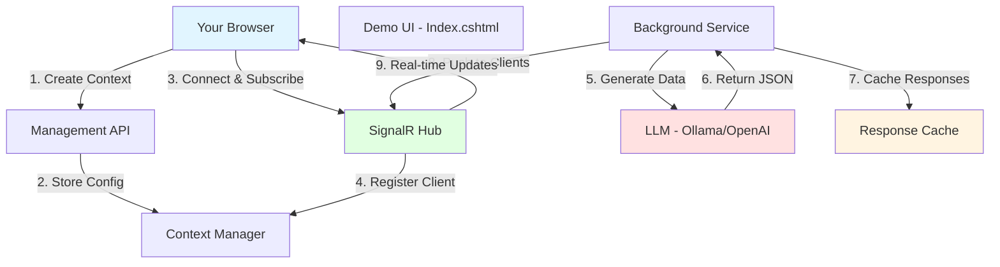
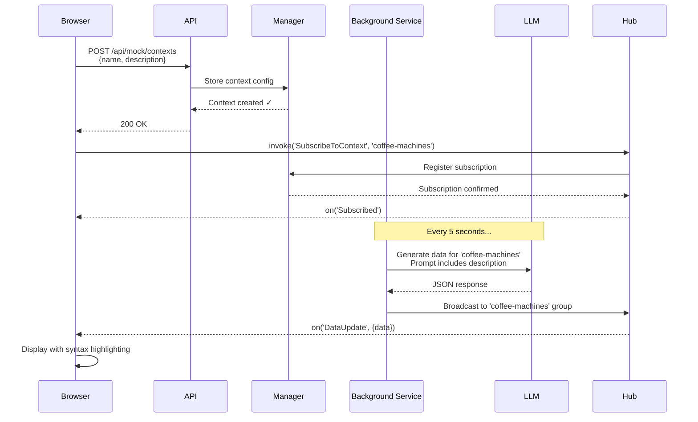
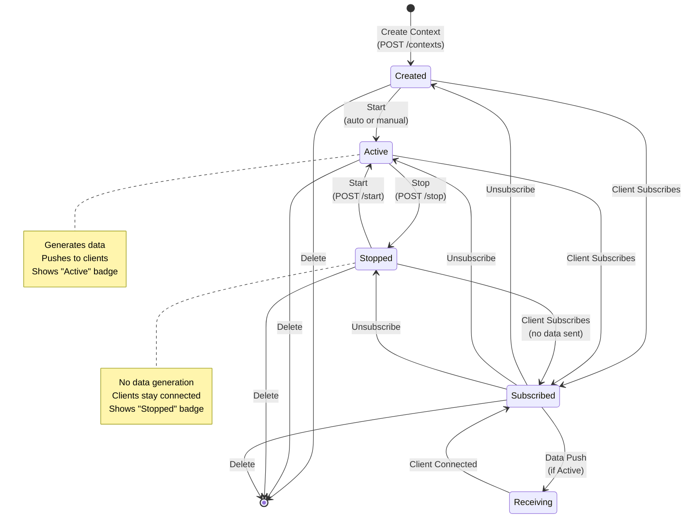
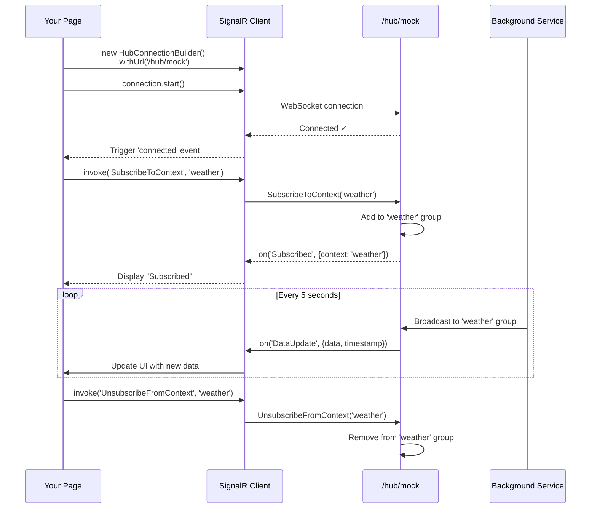
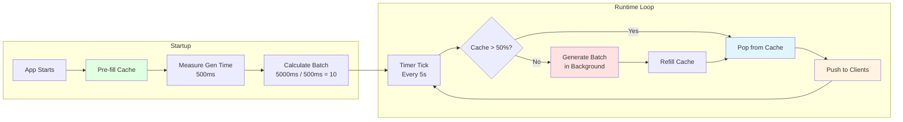

# Real-Time Mock Data with LLMs and SignalR: A Practical Guide

If you've ever needed to build a dashboard or real-time UI before the actual data source exists, you know the challenge. You end up writing hardcoded JSON fixtures or elaborate `setInterval()` loops that rotate through the same handful of objects.

I built this SignalR demo to solve that problem in a more flexible way. You describe what data you need in plain English, and a local LLM generates realistic, varied JSON that streams to your browser in real-time. No fixtures to maintain, no seed files to update, just describe what you want and watch it flow.

Let me show you how it works and how to get the most out of it.

## What This Tool Does

The SignalR demo page (`Index.cshtml`) is a control panel for managing real-time data streams. Here's the basic flow:

1. You create a "context" (a named data stream)
2. You describe what kind of data you want in plain English
3. An LLM generates appropriate JSON based on your description
4. SignalR pushes fresh data to your browser every 5 seconds
5. You see the results with syntax highlighting in real-time

It's particularly useful when you're prototyping, building demos, or working on frontend features while waiting for backend APIs to be ready. The data looks realistic because the LLM understands context and generates appropriate values.

### The Big Picture



## Why SignalR for Real-Time Updates?

SignalR maintains a persistent WebSocket connection between your browser and the server. Instead of polling an endpoint every few seconds with HTTP requests, the server pushes data when it's ready. This gives you truly real-time updates with minimal overhead.

The connection stays open, data flows instantly, and your UI feels much more responsive. It's the same technology used in chat applications, live dashboards, and collaborative tools where instant updates matter.

## Quick Start: Get Running in 5 Minutes

Let's start with the fastest path to see this working. I'll show you a stock market data example.

**Step 1: Start the application**
```bash
dotnet run --project LLMApi/LLMApi.csproj
```

Navigate to `http://localhost:5116` (check the console output for the actual port).

**Step 2: Use a Quick Start example**

You'll see five pre-configured examples with green "Launch" buttons. Click "Stock Market" and you're done. The page automatically:
- Creates a stock market data context
- Subscribes your browser to receive updates
- Starts displaying live stock data with prices, volumes, and changes

**Step 3: Watch the data stream**

Every 5 seconds, new data appears with syntax highlighting. Each update shows different stocks with realistic prices and trading volumes. The LLM generates fresh data each time, so you see variety while maintaining consistent structure.

That's it! You're now streaming mock stock market data. Feel free to explore the other quick start examples to see different data patterns.

## Creating Your Own Custom Data Streams

The quick start buttons are handy, but the real power comes from describing exactly what you need. Let's create a custom example.

**Example: Coffee machine telemetry**

Say you're building an IoT dashboard and need simulated coffee machine data. Here's how:

```
Context Name: coffee-machines
Description: Coffee machine telemetry with machine ID, beans remaining percentage,
             water temperature in Celsius, cups brewed today, and last maintenance timestamp
```

Click "Create & Subscribe" and you're off.

### What Happens Behind the Scenes



The system:
1. Creates the context in the backend
2. Subscribes your browser to receive updates via SignalR
3. Starts generating data based on your description
4. Pushes updates every 5 seconds

You'll see output like this:

```json
{
  "machineId": "CM-2847",
  "beansRemaining": 67,
  "waterTemp": 94.5,
  "cupsBrewed": 142,
  "lastMaintenance": "2025-01-03T08:23:00Z"
}
```

Each update has different values but maintains the structure. The LLM understands "coffee machine telemetry" and generates numbers that make sense in that context.

## Understanding Contexts

A **context** is a named data stream configuration. Think of it as a channel or topic.

When you create one, you specify:
- **Name**: A unique identifier (e.g., `weather`, `stock-market`, `sensors`)
- **Description**: The data structure you want, in plain English

The backend then:
- Creates a SignalR group with that name
- Builds a prompt for the LLM based on your description
- Generates fresh data periodically (every 5 seconds by default)
- Broadcasts it to all subscribed clients

Multiple browsers can subscribe to the same context and they all receive the same data simultaneously. This is great for testing dashboards that need to show synchronized updates across different screens or components.

### Context Lifecycle State Machine



## Understanding the UI Layout

The interface has three panels to keep things organized:

### Left: Create Context

This is where you define new data streams. You'll need:
- **Context Name**: Make it unique and descriptive. Using lowercase-with-dashes works well.
- **Description**: Be specific about what you want. The LLM works best with clear descriptions like "user profiles with name, email, age, and premium status boolean."

You don't need to write JSON schemas or explain data types. The LLM infers structure from natural language descriptions surprisingly well.

### Middle: Active Contexts

Shows all your running contexts with:
- Name and status badge (Active/Stopped)
- Connection count (how many clients are currently subscribed)
- Control buttons: Connect, Disconnect, Start, Stop, Delete

**Connect/Disconnect** controls your browser's subscription. Click Connect to start receiving data, Disconnect to stop without deleting the context.

**Start/Stop** controls backend data generation. This is useful when you want to pause a stream without destroying the context configuration.

**Delete** removes the context entirely. Use this to clean up when you're done with a particular data stream.

### Right: Live Data

This is where you see real-time updates:
- Connection status indicator (Connected/Disconnected)
- Currently subscribed context name
- Last 10 messages with timestamps and syntax highlighting

Data appears newest-first at the top, so you always see the latest updates without scrolling.

## The JavaScript Connection Pattern

The page uses HTMX for form submission and SignalR for real-time connectivity. If you're building your own client, here's the SignalR pattern you'll need:

### Client Connection Flow



**Setting up the connection:**
```javascript
const connection = new signalR.HubConnectionBuilder()
    .withUrl('/hub/mock')
    .withAutomaticReconnect()
    .build();

connection.on('DataUpdate', (message) => {
    // message.context: which context sent this
    // message.data: the actual JSON payload
    // message.timestamp: Unix timestamp in milliseconds
});

await connection.start();
```

**Subscribing to receive data:**
```javascript
await connection.invoke('SubscribeToContext', 'my-context-name');
```

**Unsubscribing when finished:**
```javascript
await connection.invoke('UnsubscribeFromContext', 'my-context-name');
```

The demo page handles all this automatically, but these three patterns are all you need for a custom implementation.

## Practical Use Cases

Here are some scenarios where this tool really shines:

**1. Building UIs Before APIs Exist**

You're working on a dashboard and the backend team is still designing the API schema. Instead of blocking on their work, describe the data structure you expect and build your UI against the mock stream. When the real API is ready, you'll just swap the endpoint.

**2. Client Demonstrations**

You're demoing a live monitoring dashboard to a client, but the actual data pipeline isn't ready yet. Create contexts that match your planned data structure and show realistic, changing data during the presentation. It looks professional and helps the client visualize the final product.

**3. Frontend Development and Testing**

You need realistic, varied data to test how your charts, tables, and components handle updates. Create contexts with the structures you need and develop your UI with confidence that it handles real-world data patterns.

**4. Load Testing Real-Time Features**

You want to see how your UI performs under rapid updates. Create a high-frequency context and watch how your components handle the data flow. This helps identify performance issues before production.

**5. Teaching WebSockets and Real-Time Concepts**

You're teaching SignalR or WebSocket concepts and want students to see real-time updates without building a complete backend. The demo provides a working example they can experiment with and learn from.

## Quick Start Examples Explained

The five pre-configured examples demonstrate different common data patterns:

**IoT Sensors**: Numeric sensor readings with device metadata
**Stock Market**: Financial data with prices, volumes, and percentage changes
**E-commerce Orders**: Nested objects with order items arrays
**Server Metrics**: System monitoring with multiple performance metrics
**Gaming Leaderboard**: Player rankings with stats and statuses

These examples are ready to go. Click Launch, watch the data, and use them as templates for your own contexts.

## API Endpoints for Integration

If you're building a custom client or integrating this into another application, here are the HTTP endpoints:

**Create a context:**
```bash
curl -X POST http://localhost:5116/api/mock/contexts \
  -H "Content-Type: application/json" \
  -d '{"name": "sensors", "description": "Temperature sensors with device ID and readings"}'
```

**List all contexts:**
```bash
curl http://localhost:5116/api/mock/contexts
```

**Get a specific context:**
```bash
curl http://localhost:5116/api/mock/contexts/sensors
```

**Start or stop data generation:**
```bash
curl -X POST http://localhost:5116/api/mock/contexts/sensors/start
curl -X POST http://localhost:5116/api/mock/contexts/sensors/stop
```

**Delete a context:**
```bash
curl -X DELETE http://localhost:5116/api/mock/contexts/sensors
```

After creating a context, connect to the SignalR hub at `/hub/mock` and subscribe to start receiving updates.

## How LLM Generation Works

When you create a context, the system:

1. Takes your description
2. Builds a prompt that includes randomness (GUID seed + timestamp for variety)
3. Asks the LLM to generate appropriate JSON matching your description
4. Validates the response is actual JSON (strips markdown if needed)
5. Caches multiple responses for quick delivery
6. Generates more in the background to keep the cache filled

The temperature is set to 1.2 (relatively high) to ensure variety. When you ask for "user data," you get different names and values each time, not the same few recycled endlessly. The data stays structurally consistent while varying realistically.

## Performance and Smart Caching

Data generation happens in the background, not on-demand per push. This keeps updates consistent and reduces LLM load.

Here's how it works:
- On startup, the system pre-fills a cache with responses for each active context
- It measures how long generation takes (say, 500ms per request)
- It calculates optimal batch size: push interval ÷ generation time (5000ms ÷ 500ms = 10 items)
- It generates batches in the background to keep the cache topped up
- When it's time to push, it pulls from cache immediately

Result: Your first message arrives instantly, subsequent messages come consistently every 5 seconds, and the LLM isn't being hammered continuously.

### The Smart Caching Flow



## Troubleshooting Common Issues

**Connection shows "Disconnected" and won't reconnect**
- Check that your LLM service (Ollama/OpenAI) is running
- Default configuration expects Ollama at `http://localhost:11434`
- Run `ollama list` to verify you have models installed
- Check the browser console for SignalR connection errors

**Context created but no data appearing**
- Look at the Active Contexts panel—is the context showing "Active"?
- Click the Connect button if you haven't subscribed yet
- Verify the connection status shows green (Connected) in the Live Data panel
- Check server logs to see if LLM generation is working

**Data structure doesn't match what you expected**
- Make your description more specific and concrete
- Example: "temperature as a number between 0 and 100" works better than just "temperature"
- Try rephrasing your description—this is prompt engineering at work
- Check the generated data and refine your description based on what you see

**Browser console shows SignalR reconnection attempts**
- The backend might not be running—check your terminal
- You might have changed the port—update the SignalR hub URL if needed
- Check for firewall or network issues (especially in Docker/WSL environments)

## Configuration Options

You can customize behavior in `appsettings.json`:

```json
{
  "MockLlmApi": {
    "SignalRPushIntervalMs": 5000,  // How often to push data (milliseconds)
    "ModelName": "llama3",           // Which LLM model to use
    "Temperature": 1.2,              // Creativity level (0.0-2.0, higher = more varied)
    "BaseUrl": "http://localhost:11434",  // LLM service URL
    "HubContexts": [                 // Optional: pre-configured contexts
      {
        "Name": "weather",
        "Description": "Weather data with temperature, humidity, wind speed",
        "IsActive": true
      }
    ]
  }
}
```

**SignalRPushIntervalMs**: Set lower for faster updates, higher to reduce LLM load
**Temperature**: Higher values give more creative/random data, lower gives more consistent results
**HubContexts**: Define contexts that start automatically when the application launches

## Integrating With Your Application

If you're building an actual dashboard and want to use this during development, here's a React example:

```javascript
import * as signalR from '@microsoft/signalr';

const connection = new signalR.HubConnectionBuilder()
  .withUrl('http://localhost:5116/hub/mock')
  .withAutomaticReconnect()
  .build();

connection.on('DataUpdate', (message) => {
  if (message.context === 'stock-market') {
    updateStockChart(message.data);
  }
});

await connection.start();
await connection.invoke('SubscribeToContext', 'stock-market');
```

When you're ready to switch to production, just change the hub URL. The SignalR interface (`on()` and `invoke()`) works the same way with real backends.

## Why Build This?

There are good mock data libraries out there. Faker.js is excellent. Mockaroo does great work. So why build another tool?

This tool solves specific challenges:
1. **Real-time streaming**: Most tools give you static datasets or REST endpoints, not live WebSocket streams
2. **Natural language interface**: Describe what you want instead of writing JSON schemas
3. **Contextually appropriate data**: LLMs generate realistic values that make sense together, not just random strings that happen to fit a type
4. **Self-documenting**: The description is the documentation for your data structure
5. **Flexible structure**: Change your data model mid-development without updating fixtures

It's designed for a specific workflow: building real-time UIs when you need varied, realistic data without configuration overhead.

## Getting Started

The best way to understand this tool is to use it:

1. Start the application: `dotnet run --project LLMApi`
2. Open your browser to `http://localhost:5116`
3. Click one of the green "Launch" buttons
4. Watch the data stream in

From there, try creating your own context with a description that matches your project's needs. The tool is most valuable when you use it for real development work.

I built this because I kept running into the same problem: needing realistic, changing data for demos and development. If you face that challenge too, I hope this tool helps your workflow.

---

## Quick Reference

**Starting up:**
```bash
dotnet run --project LLMApi
```

**Default URL:** `http://localhost:5116`

**SignalR Hub:** `/hub/mock`

**Key Methods:**
- `SubscribeToContext(name)` - Start receiving data
- `UnsubscribeFromContext(name)` - Stop receiving data

**Key Events:**
- `DataUpdate` - New data arrived
- `Subscribed` - Subscription confirmed
- `Unsubscribed` - Unsubscription confirmed

That's everything you need to know. The rest is just exploring what you can build with it.
