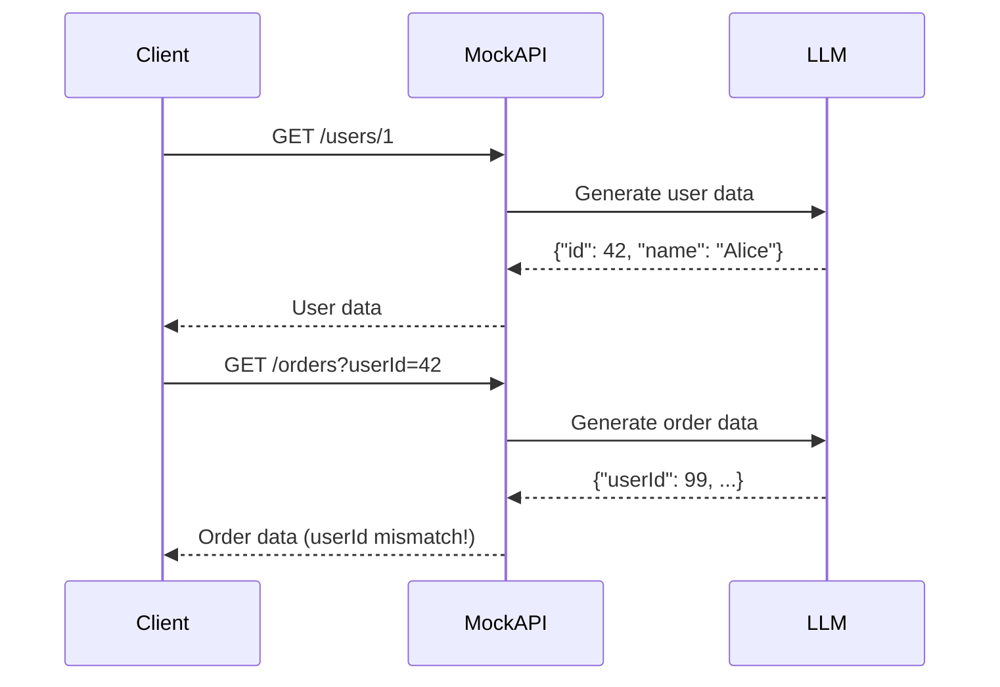
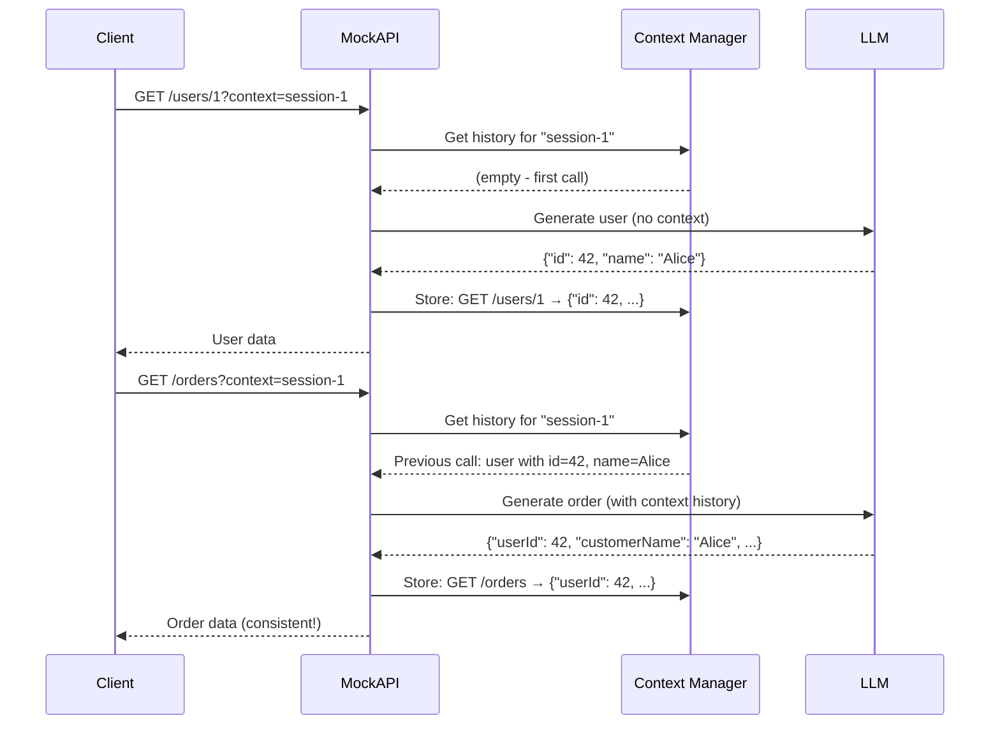
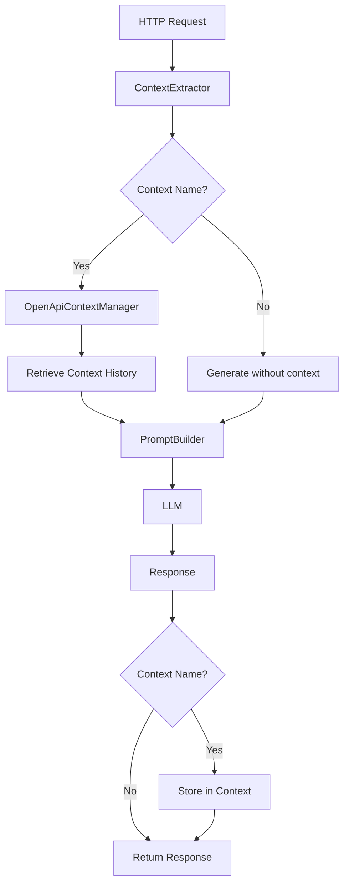
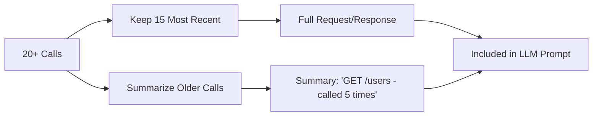

# API Contexts: Maintaining Consistency Across Mock API Calls

When building and testing applications, one of the biggest challenges with traditional mock APIs is their stateless nature. Each request returns completely random data with no relationship to previous calls. If you fetch a user with ID 123, then fetch their orders, there's no guarantee the order will reference that same user ID.

**API Contexts** solve this problem by giving your mock API a memory.

## The Problem: Stateless Chaos

Traditional mock APIs generate data independently for each request:



Notice the problem? The user had ID 42, but the order came back with userId 99. There's no consistency between related calls.

## The Solution: Contextual Memory

With API Contexts, the mock API maintains a shared context across related requests:



Now the LLM sees the previous user call and generates orders that reference the same user ID and name. The data forms a coherent story.

## How It Works

### Architecture

The context system consists of three main components:



**1. ContextExtractor** - Extracts the context name from the request
**2. OpenApiContextManager** - Manages context storage and retrieval
**3. PromptBuilder** - Includes context history in LLM prompts

### Context Storage

Contexts are stored in-memory using a thread-safe `ConcurrentDictionary`:

```csharp
public class OpenApiContextManager
{
    private readonly ConcurrentDictionary<string, ApiContext> _contexts;
    private const int MaxRecentCalls = 15;
    private const int SummarizeThreshold = 20;

    public void AddToContext(
        string contextName,
        string method,
        string path,
        string? requestBody,
        string responseBody)
    {
        var context = _contexts.GetOrAdd(contextName, _ => new ApiContext
        {
            Name = contextName,
            CreatedAt = DateTimeOffset.UtcNow,
            RecentCalls = new List<RequestSummary>(),
            SharedData = new Dictionary<string, string>(),
            TotalCalls = 0
        });

        context.RecentCalls.Add(new RequestSummary
        {
            Timestamp = DateTimeOffset.UtcNow,
            Method = method,
            Path = path,
            RequestBody = requestBody,
            ResponseBody = responseBody
        });

        ExtractSharedData(context, responseBody);

        if (context.RecentCalls.Count > MaxRecentCalls)
        {
            SummarizeOldCalls(context);
        }
    }
}
```

### Automatic Summarization

To prevent context from growing indefinitely and exceeding LLM token limits, the system automatically summarizes old calls when the count exceeds 15:



```csharp
private void SummarizeOldCalls(ApiContext context)
{
    var toSummarize = context.RecentCalls
        .Take(context.RecentCalls.Count - MaxRecentCalls)
        .ToList();

    var summary = new StringBuilder();
    summary.AppendLine($"Earlier calls ({toSummarize.Count}):");

    var groupedByPath = toSummarize
        .GroupBy(c => $"{c.Method} {c.Path.Split('?')[0]}");

    foreach (var group in groupedByPath)
    {
        summary.AppendLine($"  {group.Key} - called {group.Count()} time(s)");
    }

    context.ContextSummary = summary.ToString();
    context.RecentCalls.RemoveRange(0, toSummarize.Count);
}
```

### Shared Data Extraction

The context manager automatically extracts common identifiers from responses to make them easily accessible:

```csharp
private void ExtractSharedData(ApiContext context, string responseBody)
{
    using var doc = JsonDocument.Parse(responseBody);
    var root = doc.RootElement;

    if (root.ValueKind == JsonValueKind.Array && root.GetArrayLength() > 0)
    {
        var firstItem = root[0];
        ExtractValueIfExists(context, firstItem, "id", "lastId");
        ExtractValueIfExists(context, firstItem, "userId", "lastUserId");
        ExtractValueIfExists(context, firstItem, "name", "lastName");
        ExtractValueIfExists(context, firstItem, "email", "lastEmail");
    }
    else if (root.ValueKind == JsonValueKind.Object)
    {
        ExtractValueIfExists(context, root, "id", "lastId");
        ExtractValueIfExists(context, root, "userId", "lastUserId");
        ExtractValueIfExists(context, root, "name", "lastName");
        // ... more common patterns
    }
}
```

This allows the system to track the most recent user ID, order ID, etc., making them available in the context history.

## Using Contexts

### Three Ways to Specify Context

You can pass the context name in three different ways, with this precedence order:

**1. Query Parameter** (highest priority)
```http
GET /api/mock/users?context=my-session
GET /api/mock/users?api-context=my-session
```

**2. HTTP Header**
```http
GET /api/mock/users
X-Api-Context: my-session
```

**3. Request Body**
```http
POST /api/mock/orders
Content-Type: application/json

{
  "context": "my-session",
  "shape": {"orderId": 0, "userId": 0}
}
```

### Supported Endpoint Types

Contexts work across **all** endpoint types:

#### REST APIs
```http
GET /api/mock/users/123?context=session-1
```

#### Streaming APIs
```http
GET /api/mock/stream/stock-prices?context=trading-session
Accept: text/event-stream
```

#### GraphQL
```http
POST /graphql?context=my-app
Content-Type: application/json

{
  "query": "{ users { id name } }"
}
```

#### SignalR (via configuration)
```json
{
  "mostlylucid.mockllmapi": {
    "HubContexts": [
      {
        "Name": "stock-ticker",
        "Description": "Real-time stock prices",
        "ApiContextName": "stocks-session",
        "Shape": "{\"symbol\":\"string\",\"price\":0}"
      }
    ]
  }
}
```

## Real-World Use Cases

### Use Case 1: E-Commerce Flow

Simulate a complete shopping experience with consistent user and order data:

```http
### 1. Create user
POST /api/mock/users?context=checkout-flow
{
  "shape": {
    "userId": 0,
    "name": "string",
    "email": "string",
    "address": {"street": "string", "city": "string"}
  }
}

### Response: {"userId": 42, "name": "Alice", ...}

### 2. Create cart (will reference same user)
POST /api/mock/cart?context=checkout-flow
{
  "shape": {
    "cartId": 0,
    "userId": 0,
    "items": [{"productId": 0, "quantity": 0}]
  }
}

### Response: {"cartId": 123, "userId": 42, ...}

### 3. Create order (consistent user and cart)
POST /api/mock/orders?context=checkout-flow
{
  "shape": {
    "orderId": 0,
    "userId": 0,
    "cartId": 0,
    "total": 0
  }
}

### Response: {"orderId": 789, "userId": 42, "cartId": 123, ...}
```

### Use Case 2: Stock Price Simulation

Generate realistic stock price movements instead of random values:

```http
### First call - establishes baseline
GET /api/mock/stocks?context=market-data
    &shape={"symbol":"string","price":0,"volume":0}

### Response: {"symbol": "ACME", "price": 145.50, "volume": 10000}

### Second call - price changes realistically
GET /api/mock/stocks?context=market-data
    &shape={"symbol":"string","price":0,"volume":0}

### Response: {"symbol": "ACME", "price": 146.20, "volume": 12000}
### Notice: Same symbol, price increased by $0.70 (realistic)

### Third call - continues the trend
GET /api/mock/stocks?context=market-data
    &shape={"symbol":"string","price":0,"volume":0}

### Response: {"symbol": "ACME", "price": 145.80, "volume": 11500}
### Notice: Price fluctuates but stays in realistic range
```

Without context, each call would return a completely random symbol and price. With context, the LLM maintains the same stock and adjusts prices realistically.

### Use Case 3: Game State Progression

Track player progress through game sessions:

```http
### Start game
POST /api/mock/game/start?context=game-session-123
{
  "shape": {
    "playerId": 0,
    "level": 0,
    "health": 0,
    "score": 0,
    "inventory": []
  }
}

### Response: {"playerId": 42, "level": 1, "health": 100, "score": 0}

### Complete quest
POST /api/mock/game/quest?context=game-session-123
{
  "shape": {
    "playerId": 0,
    "level": 0,
    "score": 0,
    "reward": {"item": "string", "value": 0}
  }
}

### Response: {"playerId": 42, "level": 2, "score": 500,
###           "reward": {"item": "Sword", "value": 100}}
### Notice: Same player, level increased, score increased

### Get stats
GET /api/mock/game/player?context=game-session-123
    &shape={"playerId":0,"level":0,"health":0,"score":0}

### Response: {"playerId": 42, "level": 2, "health": 100, "score": 500}
### Notice: Consistent with quest completion
```

## Context Management API

### List All Contexts

```http
GET /api/openapi/contexts

### Response:
{
  "contexts": [
    {
      "name": "session-1",
      "totalCalls": 5,
      "recentCallCount": 5,
      "sharedDataCount": 3,
      "createdAt": "2025-01-15T10:00:00Z",
      "lastUsedAt": "2025-01-15T10:05:00Z",
      "hasSummary": false
    }
  ],
  "count": 1
}
```

### Get Context Details

```http
GET /api/openapi/contexts/session-1

### Response shows full context including:
### - All recent calls with timestamps
### - Extracted shared data (IDs, names, emails)
### - Summary of older calls (if any)
```

### Clear a Specific Context

```http
DELETE /api/openapi/contexts/session-1
```

### Clear All Contexts

```http
DELETE /api/openapi/contexts
```

## Implementation Details

### Integration in Request Handlers

Each request handler (REST, Streaming, GraphQL, SignalR) follows the same pattern:

```csharp
public async Task<string> HandleRequestAsync(
    string method,
    string fullPathWithQuery,
    string? body,
    HttpRequest request,
    HttpContext context,
    CancellationToken cancellationToken = default)
{
    // 1. Extract context name from request
    var contextName = _contextExtractor.ExtractContextName(request, body);

    // 2. Get context history if context specified
    var contextHistory = !string.IsNullOrWhiteSpace(contextName)
        ? _contextManager.GetContextForPrompt(contextName)
        : null;

    // 3. Build prompt with context history
    var prompt = _promptBuilder.BuildPrompt(
        method, fullPathWithQuery, body, shapeInfo,
        streaming: false, contextHistory: contextHistory);

    // 4. Get response from LLM
    var response = await _llmClient.GetCompletionAsync(prompt, cancellationToken);

    // 5. Store in context if context name provided
    if (!string.IsNullOrWhiteSpace(contextName))
    {
        _contextManager.AddToContext(
            contextName, method, fullPathWithQuery, body, response);
    }

    return response;
}
```

### Context in LLM Prompts

When a context exists, its history is included in the LLM prompt:

```
TASK: Generate a varied mock API response.
RULES: Output ONLY valid JSON. No markdown, no comments.

API Context: session-1
Total calls in session: 3

Shared data to maintain consistency:
  lastId: 42
  lastName: Alice
  lastEmail: alice@example.com

Recent API calls:
  [10:00:05] GET /users/42
    Response: {"id": 42, "name": "Alice", "email": "alice@example.com"}
  [10:00:12] GET /orders?userId=42
    Response: {"orderId": 123, "userId": 42, "items": [...]}

Generate a response that maintains consistency with the above context.

Method: POST
Path: /shipping/123
Body: {"orderId": 123}
```

The LLM sees all previous calls and generates responses that reference the same IDs, names, and other data, maintaining consistency.

## Best Practices

### 1. Use Descriptive Context Names

```http
BAD:  ?context=test1
GOOD: ?context=user-checkout-flow-jan15
```

### 2. Clear Contexts When Done

Contexts persist in memory until explicitly cleared or the server restarts:

```http
### After completing your test scenario
DELETE /api/openapi/contexts/user-checkout-flow-jan15
```

### 3. Share Contexts Across Related Endpoints

Use the same context name for all related calls:

```http
GET /api/mock/users?context=demo-session
GET /api/mock/orders?context=demo-session
GET /api/mock/shipping?context=demo-session
```

### 4. Monitor Context Size

Check context details to see how many calls are stored:

```http
GET /api/openapi/contexts/demo-session
```

If you have many calls (>100), consider clearing and starting fresh to avoid prompt length issues.

### 5. Combine with OpenAPI Specs

For maximum realism, use contexts with OpenAPI specs:

```http
### Load spec with context
POST /api/openapi/specs
{
  "name": "petstore",
  "source": "https://petstore3.swagger.io/api/v3/openapi.json",
  "basePath": "/petstore",
  "contextName": "petstore-session"
}

### All petstore endpoints will share the same context
```

## Performance Considerations

### Memory Usage

Each context stores:
- Up to 15 recent calls (full request/response)
- Summary of older calls (compressed)
- Extracted shared data (small dictionary)

**Typical memory per context**: ~50-200 KB depending on response sizes

### Thread Safety

`OpenApiContextManager` uses `ConcurrentDictionary` for thread-safe storage. Multiple requests can safely read/write contexts concurrently.

### LLM Token Limits

Context history is included in every prompt. If you have very large responses or many calls, you may approach token limits. The automatic summarization helps prevent this, but for very long sessions, consider periodically clearing the context.

## Limitations

1. **In-Memory Only** - Contexts are lost on server restart
2. **No Persistence** - Not suitable for production data storage
3. **Single Server** - Contexts don't sync across multiple server instances
4. **LLM Dependent** - Consistency quality depends on the LLM's ability to follow instructions

## Conclusion

API Contexts transform stateless mock APIs into stateful simulations that maintain consistency across related calls. Whether you're testing an e-commerce flow, simulating real-time data feeds, or building game state progression, contexts ensure your mock data tells a coherent story.

The automatic extraction of shared data, intelligent summarization, and seamless integration across all endpoint types make contexts a powerful tool for realistic API testing and development.

For more advanced scenarios, combine contexts with OpenAPI specifications to create fully-featured mock APIs that behave like the real thing.
