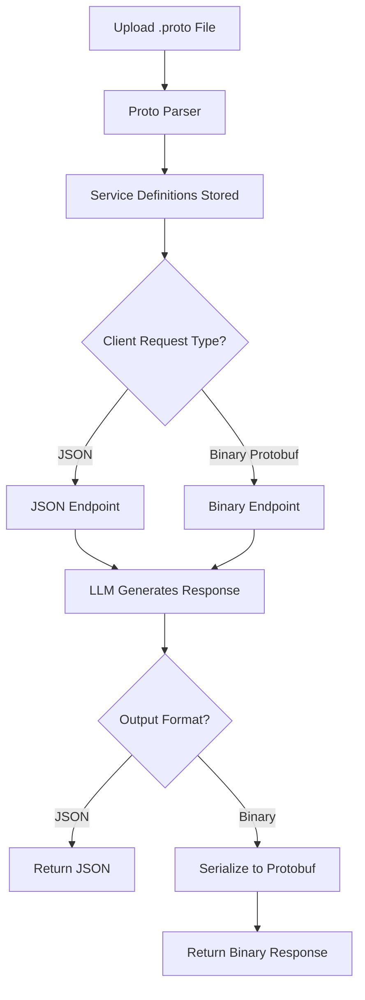
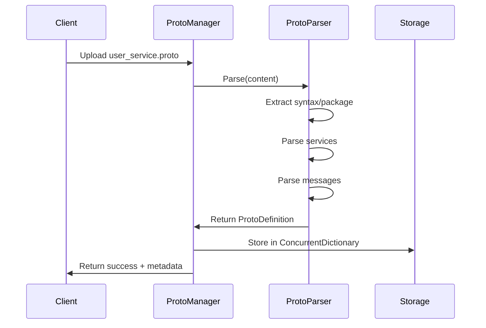
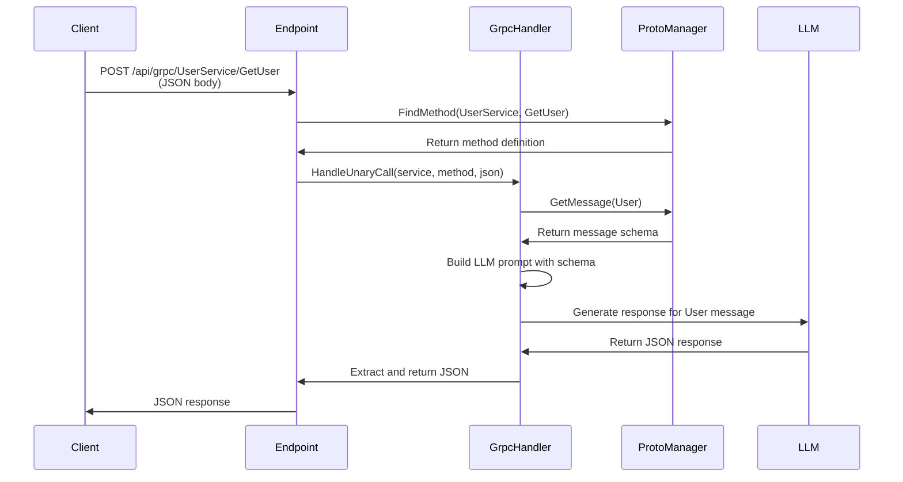
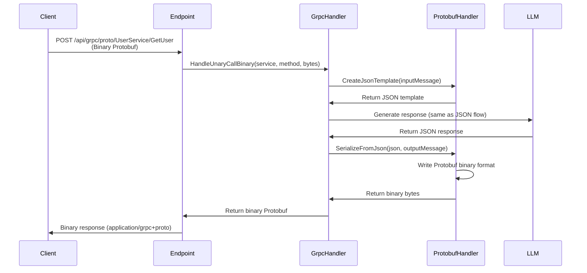

# gRPC Mock API Support with Protocol Buffers

LLMock API now provides comprehensive gRPC support, allowing you to mock gRPC services dynamically without writing any service implementations. Upload your `.proto` files, and the mock server handles the rest - generating realistic responses based on your Protobuf message definitions.

## Overview

The gRPC feature supports two complementary approaches:

1. **JSON over HTTP** - Perfect for browser-based testing and quick prototyping
2. **Binary Protocol Buffers** - True gRPC wire protocol for production-like testing with real gRPC clients

Both approaches use the same uploaded `.proto` definitions and LLM-generated responses, giving you flexibility in how you test.



## Quick Start

### 1. Upload a Proto File

First, define your gRPC service in a `.proto` file:

```protobuf
syntax = "proto3";

package userservice;

service UserService {
  rpc GetUser (GetUserRequest) returns (User);
  rpc ListUsers (ListUsersRequest) returns (UserList);
  rpc CreateUser (CreateUserRequest) returns (User);
}

message GetUserRequest {
  int32 user_id = 1;
}

message ListUsersRequest {
  int32 page = 1;
  int32 page_size = 2;
  optional string filter = 3;
}

message CreateUserRequest {
  string name = 1;
  string email = 2;
  optional string phone = 3;
}

message User {
  int32 id = 1;
  string name = 2;
  string email = 3;
  optional string phone = 4;
  string created_at = 5;
  bool is_active = 6;
}

message UserList {
  repeated User users = 1;
  int32 total_count = 2;
  int32 page = 3;
}
```

Upload this proto file to the mock server:

```bash
# Upload via plain text body
curl -X POST http://localhost:5116/api/grpc-protos \
  -H "Content-Type: text/plain" \
  --data-binary "@user_service.proto"

# Or upload as multipart form
curl -X POST http://localhost:5116/api/grpc-protos \
  -F "file=@user_service.proto"
```

The response shows your service structure:

```json
{
  "message": "Proto definition uploaded successfully",
  "name": "user_service.proto",
  "package": "userservice",
  "services": [
    {
      "name": "UserService",
      "methods": [
        {
          "name": "GetUser",
          "type": "Unary",
          "input": "GetUserRequest",
          "output": "User"
        },
        {
          "name": "ListUsers",
          "type": "Unary",
          "input": "ListUsersRequest",
          "output": "UserList"
        },
        {
          "name": "CreateUser",
          "type": "Unary",
          "input": "CreateUserRequest",
          "output": "User"
        }
      ]
    }
  ]
}
```

### 2. Call Methods - JSON Over HTTP

For quick testing and browser-based clients, use the JSON endpoints:

```bash
# Get a user (JSON request/response)
curl -X POST http://localhost:5116/api/grpc/UserService/GetUser \
  -H "Content-Type: application/json" \
  -d '{"user_id": 12345}'
```

The LLM generates a realistic response matching your proto definition:

```json
{
  "id": 12345,
  "name": "Sarah Chen",
  "email": "sarah.chen@techcorp.com",
  "phone": "+1-555-0142",
  "created_at": "2024-03-15T10:30:00Z",
  "is_active": true
}
```

### 3. Call Methods - Binary Protocol Buffers

For production-like testing with true gRPC wire protocol:

```bash
# Create a binary Protobuf request (example using protoc)
echo '{"user_id": 12345}' | \
  protoc --encode=userservice.GetUserRequest user_service.proto > request.bin

# Send binary request, get binary response
curl -X POST http://localhost:5116/api/grpc/proto/UserService/GetUser \
  -H "Content-Type: application/grpc+proto" \
  --data-binary "@request.bin" \
  --output response.bin

# Decode binary response
protoc --decode=userservice.User user_service.proto < response.bin
```

Output:

```protobuf
id: 12345
name: "Sarah Chen"
email: "sarah.chen@techcorp.com"
phone: "+1-555-0142"
created_at: "2024-03-15T10:30:00Z"
is_active: true
```

## How It Works

### Proto File Parsing

When you upload a `.proto` file, the mock server parses it to extract:

- Service definitions
- RPC method signatures
- Message type definitions
- Field types and numbers



The parser uses regex-based extraction to identify proto elements:

```csharp
// Service extraction
var serviceRegex = new Regex(
    @"service\s+([a-zA-Z0-9_]+)\s*\{([^}]+)\}",
    RegexOptions.Singleline);

// Method extraction
var methodRegex = new Regex(
    @"rpc\s+([a-zA-Z0-9_]+)\s*\(\s*(stream\s+)?([a-zA-Z0-9_.]+)\s*\)" +
    @"\s*returns\s*\(\s*(stream\s+)?([a-zA-Z0-9_.]+)\s*\)");

// Message extraction
var messageRegex = new Regex(
    @"message\s+([a-zA-Z0-9_]+)\s*\{([^}]+)\}",
    RegexOptions.Singleline);
```

### Request Handling Flow

#### JSON Endpoints



The handler builds a detailed prompt for the LLM:

```csharp
var prompt = $@"You are a gRPC service mock. Generate realistic data for this response.

Service: {serviceName}
Method: {methodName}
Request: {requestJson}

Generate a response matching this structure:
{jsonShape}

Return ONLY valid JSON matching the structure above. Be creative with realistic values.";
```

#### Binary Protobuf Endpoints



### Protocol Buffers Serialization

The `DynamicProtobufHandler` converts JSON to binary Protobuf format using field definitions:

```csharp
public byte[] SerializeFromJson(
    string json,
    ProtoMessage messageDefinition,
    List<ProtoMessage> allMessages)
{
    var jsonDoc = JsonDocument.Parse(json);
    using var stream = new MemoryStream();
    using var writer = new CodedOutputStream(stream);

    // Write each field according to proto definition
    foreach (var field in messageDefinition.Fields.OrderBy(f => f.Number))
    {
        if (!jsonDoc.RootElement.TryGetProperty(field.Name, out var fieldValue))
            continue; // Skip missing fields

        WriteField(writer, field, fieldValue, allMessages);
    }

    writer.Flush();
    return stream.ToArray();
}
```

Wire types are determined by the field type:

```csharp
private WireFormat.WireType GetWireType(string fieldType)
{
    return fieldType switch
    {
        "string" or "bytes" => WireFormat.WireType.LengthDelimited,
        "int32" or "int64" or "uint32" or "uint64" or
        "sint32" or "sint64" or "bool" => WireFormat.WireType.Varint,
        "fixed32" or "sfixed32" or "float" => WireFormat.WireType.Fixed32,
        "fixed64" or "sfixed64" or "double" => WireFormat.WireType.Fixed64,
        _ => WireFormat.WireType.LengthDelimited // Complex/nested types
    };
}
```

## Management API

The gRPC feature includes a full management API for working with proto definitions:

### List All Protos

```bash
curl http://localhost:5116/api/grpc-protos
```

Response:

```json
{
  "definitions": [
    {
      "name": "user_service.proto",
      "package": "userservice",
      "syntax": "proto3",
      "uploadedAt": "2025-01-05T20:30:00Z",
      "serviceCount": 1,
      "messageCount": 5,
      "services": ["UserService"]
    }
  ],
  "count": 1
}
```

### Get Proto Details

```bash
curl http://localhost:5116/api/grpc-protos/user_service.proto
```

Returns full details including all services, methods, messages, and field definitions.

### Delete Proto

```bash
curl -X DELETE http://localhost:5116/api/grpc-protos/user_service.proto
```

### Clear All Protos

```bash
curl -X DELETE http://localhost:5116/api/grpc-protos
```

## API Endpoints Reference

### Proto Management Endpoints

| Method | Endpoint | Description |
|--------|----------|-------------|
| `POST` | `/api/grpc-protos` | Upload a .proto file (plain text or multipart form) |
| `GET` | `/api/grpc-protos` | List all uploaded proto definitions |
| `GET` | `/api/grpc-protos/{name}` | Get details of a specific proto |
| `DELETE` | `/api/grpc-protos/{name}` | Delete a specific proto definition |
| `DELETE` | `/api/grpc-protos` | Clear all proto definitions |

### gRPC Service Call Endpoints

| Method | Endpoint | Description |
|--------|----------|-------------|
| `POST` | `/api/grpc/{service}/{method}` | Invoke method with JSON request/response |
| `POST` | `/api/grpc/proto/{service}/{method}` | Invoke method with binary Protobuf request/response |

## Advanced Examples

### Complex Nested Messages

```protobuf
syntax = "proto3";

package orderservice;

service OrderService {
  rpc CreateOrder (OrderRequest) returns (Order);
}

message OrderRequest {
  string customer_id = 1;
  repeated OrderItem items = 2;
  Address shipping_address = 3;
  PaymentInfo payment = 4;
}

message OrderItem {
  string product_id = 1;
  int32 quantity = 2;
  double unit_price = 3;
}

message Address {
  string street = 1;
  string city = 2;
  string state = 3;
  string postal_code = 4;
  string country = 5;
}

message PaymentInfo {
  string method = 1;
  string last_four_digits = 2;
}

message Order {
  string order_id = 1;
  string customer_id = 2;
  repeated OrderItem items = 3;
  Address shipping_address = 4;
  string status = 5;
  double total_amount = 6;
  string created_at = 7;
}
```

Call with nested JSON:

```bash
curl -X POST http://localhost:5116/api/grpc/OrderService/CreateOrder \
  -H "Content-Type: application/json" \
  -d '{
    "customer_id": "CUST-12345",
    "items": [
      {
        "product_id": "PROD-001",
        "quantity": 2,
        "unit_price": 29.99
      },
      {
        "product_id": "PROD-042",
        "quantity": 1,
        "unit_price": 149.99
      }
    ],
    "shipping_address": {
      "street": "123 Main Street",
      "city": "San Francisco",
      "state": "CA",
      "postal_code": "94102",
      "country": "USA"
    },
    "payment": {
      "method": "credit_card",
      "last_four_digits": "4242"
    }
  }'
```

The LLM generates a realistic order response with all nested fields populated.

### Repeated Fields and Arrays

The proto parser handles repeated fields automatically:

```protobuf
message ProductList {
  repeated Product products = 1;
  int32 total_count = 2;
}

message Product {
  string id = 1;
  string name = 2;
  double price = 3;
  repeated string tags = 4;
}
```

Response with multiple nested arrays:

```json
{
  "products": [
    {
      "id": "PROD-001",
      "name": "Wireless Mouse",
      "price": 29.99,
      "tags": ["electronics", "peripherals", "wireless"]
    },
    {
      "id": "PROD-002",
      "name": "Mechanical Keyboard",
      "price": 149.99,
      "tags": ["electronics", "peripherals", "gaming"]
    }
  ],
  "total_count": 47
}
```

## Configuration

Add gRPC support to your ASP.NET Core application:

```csharp
using mostlylucid.mockllmapi;

var builder = WebApplication.CreateBuilder(args);

// Add LLMock API services (includes gRPC)
builder.Services.AddLLMockApi(builder.Configuration);

var app = builder.Build();

// Map proto management endpoints
app.MapLLMockGrpcManagement("/api/grpc-protos");

// Map gRPC service call endpoints (both JSON and binary)
app.MapLLMockGrpc("/api/grpc");

app.Run();
```

The `AddLLMockApi()` method automatically registers:

- `ProtoDefinitionManager` - Manages uploaded proto definitions
- `ProtoParser` - Parses .proto files
- `DynamicProtobufHandler` - Handles binary Protobuf serialization
- `GrpcRequestHandler` - Processes gRPC method calls

## Current Limitations

### Unary Calls Only

The current implementation supports **unary RPC calls only** (simple request-response). Streaming methods are parsed but not yet implemented:

```protobuf
service DataService {
  // Supported
  rpc GetData (Request) returns (Response);

  // Not yet supported
  rpc StreamData (Request) returns (stream Response);
  rpc UploadData (stream Request) returns (Response);
  rpc BidirectionalStream (stream Request) returns (stream Response);
}
```

Attempting to call a streaming method returns an error:

```json
{
  "error": "Method StreamData is not a unary call. Type: ServerStreaming"
}
```

### Simplified Protobuf Parsing

The binary Protobuf implementation is simplified:

- **Request parsing**: Currently uses a JSON template rather than parsing the actual binary Protobuf request. This works for generating realistic responses but doesn't validate the incoming binary data.

- **Response serialization**: Properly serializes JSON to binary Protobuf format according to wire types and field numbers.

Full request parsing would require additional complexity to handle variable-length encoding, nested messages, and proto3 defaults.

### Proto File Format Support

The parser supports common proto3 features but has limitations:

**Supported:**
- Basic field types (string, int32, int64, uint32, uint64, bool, float, double, bytes)
- Repeated fields
- Optional fields
- Nested messages
- Services with unary methods

**Not supported:**
- Enums (parsed but not validated)
- Maps (not yet implemented)
- Oneofs (not parsed)
- Extensions (not parsed)
- Options and annotations (ignored)
- Import statements (not resolved)

### gRPC Server Reflection (Partial Support)

Standard gRPC clients expect servers to support the [gRPC Server Reflection Protocol](https://github.com/grpc/grpc/blob/master/doc/server-reflection.md).

**Current Status:**
- gRPC reflection package (`Grpc.AspNetCore.Server.Reflection`) is installed
- Full reflection implementation is in progress

**What Works:**
- Use management API (`GET /api/grpc-protos`) to list uploaded proto files
- Use JSON endpoint for service discovery and testing
- Demo page shows all available services and methods

**What Doesn't Work Yet:**
- Standard grpc reflection endpoints (`ServerReflection` service)
- Tools like `grpcurl` can't use `list` or `describe` commands without `-proto` flag

**Why Not Fully Implemented:**
gRPC reflection requires `FileDescriptor` objects from the Protocol Buffer compiler. Our regex-based parser doesn't generate these. Full implementation requires either:

1. Running `protoc` at runtime to compile .proto files to descriptors
2. Manually constructing `FileDescriptor` objects from parsed data
3. Using `Google.Protobuf.Reflection` to build descriptors dynamically

**Workarounds:**
```bash
# Provide proto file manually to grpcurl
grpcurl -proto yourfile.proto localhost:5116 list

# Or use the JSON endpoint for testing
curl http://localhost:5116/api/grpc/UserService/GetUser \
  -H "Content-Type: application/json" \
  -d '{"user_id": 123}'

# Or check available services via management API
curl http://localhost:5116/api/grpc-protos
```

Future versions will implement full reflection support for seamless integration with standard gRPC tooling.

## Testing Strategies

### Browser Testing with JSON

For quick iteration during development:

```javascript
// Fetch API in browser
async function getUser(userId) {
  const response = await fetch(`http://localhost:5116/api/grpc/UserService/GetUser`, {
    method: 'POST',
    headers: { 'Content-Type': 'application/json' },
    body: JSON.stringify({ user_id: userId })
  });

  return await response.json();
}

const user = await getUser(12345);
console.log(user);
```

### Integration Testing with Binary

For more realistic testing that matches production:

```bash
#!/bin/bash

# Generate binary request
echo '{"user_id": 12345}' | \
  protoc --encode=userservice.GetUserRequest user_service.proto > request.bin

# Call binary endpoint
curl -X POST http://localhost:5116/api/grpc/proto/UserService/GetUser \
  -H "Content-Type: application/grpc+proto" \
  --data-binary "@request.bin" \
  --output response.bin

# Decode and verify
protoc --decode=userservice.User user_service.proto < response.bin

# Clean up
rm request.bin response.bin
```

### Automated Testing

Example xUnit test:

```csharp
[Fact]
public async Task GrpcService_GetUser_ReturnsValidUser()
{
    // Arrange
    var protoContent = File.ReadAllText("user_service.proto");
    await _client.PostAsync("/api/grpc-protos",
        new StringContent(protoContent, Encoding.UTF8, "text/plain"));

    var request = new { user_id = 12345 };

    // Act
    var response = await _client.PostAsJsonAsync(
        "/api/grpc/UserService/GetUser", request);

    // Assert
    Assert.Equal(HttpStatusCode.OK, response.StatusCode);

    var user = await response.Content.ReadFromJsonAsync<JsonElement>();
    Assert.True(user.TryGetProperty("id", out _));
    Assert.True(user.TryGetProperty("name", out _));
    Assert.True(user.TryGetProperty("email", out _));
}
```

## Troubleshooting

### Proto Upload Fails

**Symptom**: Error when uploading .proto file

```json
{
  "error": "No proto content provided"
}
```

**Solution**: Ensure you're sending the proto file content correctly:

- As plain text: `Content-Type: text/plain`
- As multipart form: `Content-Type: multipart/form-data`

### Method Not Found

**Symptom**:

```json
{
  "error": "Method UserService/GetUser not found. Upload proto file first."
}
```

**Solution**:

1. Verify proto was uploaded: `GET /api/grpc-protos`
2. Check service and method names match exactly (case-sensitive)
3. Ensure method type is unary (not streaming)

### Invalid JSON in Response

**Symptom**: LLM returns malformed JSON

This can occur occasionally with complex nested structures. The mock server attempts to extract JSON from the LLM response, but sometimes the LLM includes extra text or formatting.

**Solution**:

- Retry the request (LLM responses vary)
- Simplify the message structure
- Check the LLM is configured correctly in appsettings

### Binary Protobuf Errors

**Symptom**: Binary endpoint returns errors or malformed data

**Solution**:

- Verify you're encoding the request correctly with `protoc`
- Check the Content-Type header is `application/grpc+proto`
- Ensure the proto file matches the message structure

## Performance Considerations

### Proto Parsing

Proto files are parsed once on upload and stored in memory. Subsequent calls don't re-parse:

```csharp
// Singleton storage
private readonly ConcurrentDictionary<string, ProtoDefinition> _definitions = new();
```

### LLM Call Overhead

Each gRPC method call triggers an LLM request. For high-volume testing:

- Consider caching responses for identical requests
- Use the context feature to maintain consistency
- Adjust LLM timeout settings if needed

### Binary Serialization

Binary Protobuf serialization adds minimal overhead compared to JSON. The trade-off:

- **JSON**: Faster serialization, easier debugging
- **Binary**: More realistic, smaller payloads, true wire protocol

## Future Enhancements

### Planned Features

1. **Server Streaming** - Support for `returns (stream Response)` methods
2. **Client Streaming** - Support for `(stream Request) returns` methods
3. **Bidirectional Streaming** - Full duplex streaming
4. **gRPC Reflection** - Standard reflection protocol for tool compatibility
5. **Request Validation** - Parse and validate incoming binary Protobuf requests
6. **Enhanced Proto Support** - Enums, maps, oneofs, imports
7. **Response Caching** - Optional caching for deterministic responses

### Contributing

Found a bug or want to contribute? Check the GitHub repository for contribution guidelines.

## Summary

The gRPC mock API feature provides a powerful way to test gRPC services without implementing them. Key benefits:

- Upload .proto files and immediately get working mock services
- Choose between JSON (convenience) or binary Protobuf (realism)
- LLM-generated responses match your message schemas
- Full management API for proto definitions
- Integrates seamlessly with existing LLMock API features

Whether you're doing quick browser-based testing or building comprehensive integration test suites, the dual JSON and binary support gives you the flexibility to work however suits your workflow best.
