# Building a Multi-LLM Synthetic Decision Engine with LLMockApi

**Version:** 2.0.0+
**Status:** Tutorial
**Updated:** November 2025

## Introduction

A **synthetic decision engine** uses multiple LLM backends in sequence to refine, validate, and enhance data through progressive stages. Each LLM brings different strengths—speed, creativity, accuracy, or cost-effectiveness—creating a pipeline where the output of one model becomes refined input for the next.

This pattern is particularly powerful for:
- **Data quality enhancement** - Start with fast generation, refine with sophisticated models
- **Multi-stage validation** - Generate data, validate structure, enrich with context
- **Cost optimization** - Use expensive models only where quality matters most
- **Specialized processing** - Route different data types to appropriate models

LLMockApi's multi-backend architecture makes this trivially easy to implement.

### The Big Picture: How It All Fits Together

Here's a complete view of a multi-LLM synthetic decision engine in action:


**What This Diagram Shows:**

1. **Application Layer** - Your code decides what pattern to use
2. **Decision Layer** - Route to the right pattern based on requirements
3. **Pattern Execution** - Each pattern orchestrates backends differently
4. **Backend Pool** - Shared pool of LLM models with different capabilities
5. **Final Output** - All patterns converge to produce the result

**The Mind-Bending Part:** The SAME backend models can be used in DIFFERENT patterns. It's not about having specialized models for each pattern—it's about how you ORCHESTRATE them.

## Why Use Multiple LLMs?

### The Complementary Strengths Principle

Different LLM models excel at different tasks:

| Model Type | Strength | Use Case in Pipeline |
|------------|----------|---------------------|
| **Local Small Models** (Gemma 3, Llama 3) | Fast, cheap, high variety | Initial data generation, bulk processing |
| **Local Large Models** (Mistral-Nemo) | Quality, context retention | Data refinement, relationship building |
| **Cloud Models** (GPT-4, Claude) | Superior reasoning, validation | Final quality check, edge case handling |

### Real-World Example: E-Commerce Product Data

**Stage 1 - Rapid Generation (Gemma 3:4B)**
```json
{
  "name": "Wireless Mouse",
  "price": 29.99,
  "category": "Electronics"
}
```

**Stage 2 - Enrichment (Mistral-Nemo)**
```json
{
  "name": "Wireless Mouse",
  "price": 29.99,
  "category": "Electronics",
  "description": "Ergonomic 2.4GHz wireless mouse with precision tracking",
  "specs": {
    "dpi": 1600,
    "connectivity": "2.4GHz USB receiver",
    "battery": "2 AA batteries"
  },
  "tags": ["wireless", "ergonomic", "office", "productivity"]
}
```

**Stage 3 - Validation & Enhancement (GPT-4)**
```json
{
  "id": "PROD-WM-2024-1158",
  "name": "Wireless Mouse",
  "price": 29.99,
  "msrp": 39.99,
  "category": "Electronics",
  "subcategory": "Computer Peripherals",
  "description": "Ergonomic 2.4GHz wireless mouse with precision tracking",
  "specs": {
    "dpi": 1600,
    "connectivity": "2.4GHz USB receiver",
    "battery": "2 AA batteries",
    "dimensions": "4.7 x 2.5 x 1.6 inches",
    "weight": "3.2 oz"
  },
  "tags": ["wireless", "ergonomic", "office", "productivity"],
  "inventory": {
    "sku": "WM-16-BLK",
    "inStock": true,
    "quantity": 247,
    "warehouse": "US-WEST-1"
  },
  "shipping": {
    "freeShipping": true,
    "estimatedDays": 3
  }
}
```

## Architecture Patterns

Understanding these patterns is key to building effective multi-LLM systems. Each pattern solves different problems and has distinct trade-offs.

### Pattern 1: Sequential Enhancement Pipeline

**Concept:** Data flows through a series of LLMs, where each stage adds more detail, validation, or refinement.

**The Mind-Bending Part:** The output of one LLM becomes the input to the next. Each model "sees" what the previous one created and builds upon it.


**Real Example Flow:**

1. **Input:** `{ "generateUser": true }`
2. **After Fast Model (100ms):** `{ "name": "John", "age": 30 }`
3. **After Quality Model (400ms):** `{ "name": "John", "age": 30, "email": "john@example.com", "address": {...}, "preferences": {...} }`
4. **After Validator (800ms):** Same as above + validated formatting + consistency checks + business logic applied

**When to use:**
- You need progressively richer data
- Quality matters more than speed
- You want to build complexity gradually

**Best for:** Test data generation, mock API responses, data migration

---

### Pattern 2: Parallel Divergent Processing

**Concept:** Multiple LLMs work on the SAME input simultaneously, each specializing in different aspects. Results are merged at the end.

**The Mind-Bending Part:** Instead of sequential refinement, you're getting different "expert opinions" at the same time, then combining them into a cohesive whole.


**Real Example Flow (All Parallel, ~400ms total):**

Request to all three backends simultaneously:
- **Backend A generates:** `{ "name": "Wireless Mouse", "category": "Electronics" }`
- **Backend B generates:** `{ "price": 29.99, "msrp": 39.99, "discount": 25 }`
- **Backend C generates:** `{ "inStock": true, "quantity": 247, "warehouse": "US-WEST" }`

Your code merges them:
```javascript
const result = {
  ...productDetails,  // from Backend A
  pricing: pricingData,  // from Backend B
  inventory: inventoryInfo  // from Backend C
}
```

**When to use:**
- Different aspects require different processing
- Speed is critical (parallel is faster than sequential)
- You want diverse perspectives on the same problem

**Best for:** Comprehensive data generation, A/B testing, consensus systems

---

### Pattern 3: Validation & Correction Loop

**Concept:** Generate data with one model, check it with another, and fix issues if found. Repeat until quality threshold met.

**The Mind-Bending Part:** The validator model acts as a "quality gate" that can send data back for refinement. It's a feedback loop where models collaborate to iteratively improve output.


**Real Example Flow:**

**Iteration 1:**
- Generate: `{ "email": "invalid-email", "age": -5 }`
- Validate: ❌ Found issues: ["Invalid email format", "Age must be positive"]
- Correct: `{ "email": "user@example.com", "age": 25 }`

**Iteration 2:**
- Validate: ✅ All checks passed
- Output: Final data

**When to use:**
- Data quality is critical
- You need to catch edge cases
- You want to ensure compliance with rules

**Best for:** Production test data, regulatory compliance testing, schema validation

---

### Pattern 4: Hierarchical Specialist Routing

**Concept:** Analyze the request first, then route to the appropriate model based on complexity, cost, or requirements.

**The Mind-Bending Part:** The system "thinks" about which model to use BEFORE processing. It's meta-decision making—deciding how to decide.


**Complexity Scoring Example:**

```javascript
function analyzeComplexity(request) {
  let score = 0;

  // Factor 1: Field count
  const fieldCount = Object.keys(request.shape || {}).length;
  score += Math.min(fieldCount / 5, 3);  // 0-3 points

  // Factor 2: Nesting depth
  const depth = getMaxDepth(request.shape);
  score += Math.min(depth, 3);  // 0-3 points

  // Factor 3: Array requirements
  const hasArrays = JSON.stringify(request.shape).includes('[');
  score += hasArrays ? 2 : 0;  // 0-2 points

  // Factor 4: Custom validation rules
  score += (request.validationRules?.length || 0);  // 0-N points

  return Math.min(score, 10);
}

// Examples:
// { "name": "string" } → Score: 1 → Fast Model
// { "user": { "name": "string", "address": {...}, "orders": [...] } } → Score: 6 → Quality Model
// Complex nested with validation rules → Score: 10 → Premium Model
```

**When to use:**
- Budget constraints are important
- Request complexity varies widely
- You want to optimize cost/quality trade-off

**Best for:** Production systems, cost-sensitive applications, varied workloads

---

### Decision Flow: Choosing the Right Pattern

Use this flowchart to determine which pattern fits your needs:


**Decision Examples:**

| Your Requirement | Questions to Ask | Recommended Pattern |
|------------------|------------------|---------------------|
| "Generate user profiles with addresses, preferences, and order history" | Do I need address before preferences? → YES<br/>Multiple stages? → YES | Pattern 1: Sequential |
| "Generate product with specs, pricing, and inventory" | Does pricing depend on specs? → NO<br/>Multiple aspects? → YES | Pattern 2: Parallel |
| "Generate test data that must pass schema validation" | Need to check and fix? → YES<br/>Might need multiple attempts? → YES | Pattern 3: Validation Loop |
| "Handle mix of simple and complex requests" | Complexity varies? → YES<br/>Want to optimize costs? → YES | Pattern 4: Smart Routing |
| "Generate simple mock responses" | Single aspect? → YES<br/>No dependencies? → YES | Single Backend |

**Pro Tip:** You can COMBINE patterns! For example:
- Use **Pattern 4** to route simple vs. complex requests
- Complex requests use **Pattern 1** (sequential pipeline)
- Each pipeline stage can use **Pattern 2** (parallel processing) internally

## Configuration: Multi-Backend Setup

### Basic Configuration

Configure all backends you'll use in your pipeline:

```json
{
  "MockLlmApi": {
    "Temperature": 1.2,
    "TimeoutSeconds": 60,
    "MaxContextWindow": 8192,

    "LlmBackends": [
      {
        "Name": "generator",
        "Provider": "ollama",
        "BaseUrl": "http://localhost:11434/v1/",
        "ModelName": "gemma3:4b",
        "MaxTokens": 2048,
        "Enabled": true,
        "Weight": 1
      },
      {
        "Name": "enricher",
        "Provider": "ollama",
        "BaseUrl": "http://localhost:11434/v1/",
        "ModelName": "mistral-nemo",
        "MaxTokens": 4096,
        "Enabled": true,
        "Weight": 1
      },
      {
        "Name": "validator",
        "Provider": "openai",
        "BaseUrl": "https://api.openai.com/v1/",
        "ModelName": "gpt-4",
        "ApiKey": "sk-your-api-key",
        "MaxTokens": 4096,
        "Enabled": false,
        "Weight": 1
      }
    ],

    "EnableRetryPolicy": true,
    "MaxRetryAttempts": 3,
    "EnableCircuitBreaker": true
  }
}
```

### Cost-Optimized Configuration

Use expensive models sparingly:

```json
{
  "MockLlmApi": {
    "LlmBackends": [
      {
        "Name": "bulk-generator",
        "Provider": "ollama",
        "ModelName": "gemma3:4b",
        "Enabled": true,
        "Weight": 10
      },
      {
        "Name": "quality-refiner",
        "Provider": "ollama",
        "ModelName": "mistral-nemo",
        "Enabled": true,
        "Weight": 3
      },
      {
        "Name": "premium-validator",
        "Provider": "openai",
        "ModelName": "gpt-4",
        "ApiKey": "${OPENAI_API_KEY}",
        "Enabled": false,
        "Weight": 1
      }
    ]
  }
}
```

## Implementation Examples

### Example 1: Three-Stage Enhancement Pipeline

**Scenario:** Generate realistic user profiles with progressive enrichment

**Visual Overview:**


**What's Happening:**

1. **Stage 1** - Client asks for basic data → Fast model generates quickly
2. **Stage 2** - Client takes that output, asks for enrichment → Quality model adds details
3. **Stage 3** - Client takes enriched output, asks for validation → Premium model ensures quality

**Key Insight:** Each request is independent, but the CLIENT orchestrates the pipeline by feeding outputs as inputs.

#### Stage 1: Rapid Generation (Gemma 3)

Generate basic user data quickly:

```http
POST http://localhost:5116/api/mock/users/generate
Content-Type: application/json
X-LLM-Backend: generator

{
  "count": 10,
  "shape": {
    "users": [{
      "firstName": "string",
      "lastName": "string",
      "email": "string",
      "age": 0
    }]
  }
}
```

**Response:**
```json
{
  "users": [
    {
      "firstName": "Sarah",
      "lastName": "Chen",
      "email": "sarah.chen@example.com",
      "age": 34
    }
  ]
}
```

#### Stage 2: Enrichment (Mistral-Nemo)

Add demographic and behavioral data:

```http
POST http://localhost:5116/api/mock/users/enrich
Content-Type: application/json
X-LLM-Backend: enricher

{
  "users": [
    {
      "firstName": "Sarah",
      "lastName": "Chen",
      "email": "sarah.chen@example.com",
      "age": 34
    }
  ],
  "shape": {
    "users": [{
      "firstName": "string",
      "lastName": "string",
      "email": "string",
      "age": 0,
      "demographics": {
        "city": "string",
        "state": "string",
        "occupation": "string",
        "income": 0
      },
      "preferences": {
        "interests": ["string"],
        "communicationChannel": "string"
      }
    }]
  }
}
```

**Response:**
```json
{
  "users": [
    {
      "firstName": "Sarah",
      "lastName": "Chen",
      "email": "sarah.chen@example.com",
      "age": 34,
      "demographics": {
        "city": "Seattle",
        "state": "WA",
        "occupation": "Software Engineer",
        "income": 125000
      },
      "preferences": {
        "interests": ["technology", "hiking", "photography"],
        "communicationChannel": "email"
      }
    }
  ]
}
```

#### Stage 3: Validation & Enhancement (GPT-4)

Add business context and validate consistency:

```http
POST http://localhost:5116/api/mock/users/validate
Content-Type: application/json
X-LLM-Backend: validator

{
  "users": [...],
  "shape": {
    "users": [{
      "userId": "string",
      "firstName": "string",
      "lastName": "string",
      "email": "string",
      "age": 0,
      "demographics": {
        "city": "string",
        "state": "string",
        "zipCode": "string",
        "occupation": "string",
        "income": 0,
        "educationLevel": "string"
      },
      "preferences": {
        "interests": ["string"],
        "communicationChannel": "string",
        "marketingConsent": true
      },
      "account": {
        "created": "ISO-8601",
        "status": "active|inactive|suspended",
        "tier": "free|premium|enterprise",
        "lastLogin": "ISO-8601"
      },
      "validation": {
        "emailVerified": true,
        "phoneVerified": true,
        "identityVerified": true
      }
    }]
  }
}
```

### Example 2: Parallel Processing with Merge

**Scenario:** Generate comprehensive product catalog by merging parallel specializations

**Visual Overview:**


**The Key Difference from Sequential:**

```
Sequential Pipeline (Example 1):
  Request 1 → Wait → Response 1 → Request 2 → Wait → Response 2 → Request 3 → Wait → Response 3
  Total Time: 100ms + 400ms + 800ms = 1,300ms

Parallel Processing (Example 2):
  ┌─ Request 1 → Wait → Response 1
  ├─ Request 2 → Wait → Response 2  (ALL AT ONCE)
  └─ Request 3 → Wait → Response 3
  Total Time: Max(400ms, 100ms, 400ms) = 400ms

  SPEED UP: 3.25x faster!
```

**When Each Pattern Makes Sense:**

| Pattern | When to Use | Example |
|---------|-------------|---------|
| **Sequential** | Each stage needs previous output | Generate user → Add address based on user's city → Add preferences based on demographics |
| **Parallel** | Each aspect is independent | Generate product specs + pricing + inventory (none depend on each other) |

#### Client-Side Orchestration

```javascript
async function generateEnhancedProduct(baseSku) {
  // Parallel requests to different backends
  const [productDetails, pricing, inventory] = await Promise.all([
    // Product specs from quality model
    fetch('http://localhost:5116/api/mock/products/details', {
      method: 'POST',
      headers: {
        'Content-Type': 'application/json',
        'X-LLM-Backend': 'enricher'
      },
      body: JSON.stringify({
        sku: baseSku,
        shape: {
          name: "string",
          description: "string",
          specs: {
            dimensions: "string",
            weight: "string",
            material: "string"
          }
        }
      })
    }).then(r => r.json()),

    // Pricing from fast model
    fetch('http://localhost:5116/api/mock/products/pricing', {
      method: 'POST',
      headers: {
        'Content-Type': 'application/json',
        'X-LLM-Backend': 'generator'
      },
      body: JSON.stringify({
        sku: baseSku,
        shape: {
          price: 0.0,
          msrp: 0.0,
          discount: 0,
          currency: "USD"
        }
      })
    }).then(r => r.json()),

    // Inventory from fast model
    fetch('http://localhost:5116/api/mock/products/inventory', {
      method: 'POST',
      headers: {
        'Content-Type': 'application/json',
        'X-LLM-Backend': 'generator'
      },
      body: JSON.stringify({
        sku: baseSku,
        shape: {
          inStock: true,
          quantity: 0,
          warehouse: "string",
          nextRestock: "ISO-8601"
        }
      })
    }).then(r => r.json())
  ]);

  // Merge results
  return {
    sku: baseSku,
    ...productDetails,
    pricing,
    inventory,
    generated: new Date().toISOString()
  };
}
```

### Example 3: Quality Gate Pattern

**Scenario:** Generate data with a fast model, validate with premium model only when needed

```javascript
async function generateWithQualityGate(request, complexityThreshold = 5) {
  // Stage 1: Generate with fast model
  const generated = await fetch('http://localhost:5116/api/mock/data', {
    method: 'POST',
    headers: {
      'Content-Type': 'application/json',
      'X-LLM-Backend': 'generator'
    },
    body: JSON.stringify(request)
  }).then(r => r.json());

  // Assess complexity (example: count nested objects)
  const complexity = assessComplexity(generated);

  // Stage 2: If complex, validate with premium model
  if (complexity > complexityThreshold) {
    console.log('Complex data detected, validating with premium model...');

    const validated = await fetch('http://localhost:5116/api/mock/validate', {
      method: 'POST',
      headers: {
        'Content-Type': 'application/json',
        'X-LLM-Backend': 'validator'
      },
      body: JSON.stringify({
        data: generated,
        validationRules: [
          "Ensure all dates are valid ISO-8601",
          "Verify email formats",
          "Check for logical consistency"
        ]
      })
    }).then(r => r.json());

    return validated;
  }

  // Simple data passes through
  return generated;
}

function assessComplexity(data) {
  // Simple heuristic: count nested levels and array sizes
  const str = JSON.stringify(data);
  const nestedObjects = (str.match(/\{/g) || []).length;
  const arrays = (str.match(/\[/g) || []).length;
  return nestedObjects + (arrays * 2);
}
```

### Example 4: Iterative Refinement Loop

**Scenario:** Generate content, validate, and refine until quality threshold met

```javascript
async function generateUntilQuality(request, maxIterations = 3) {
  let iteration = 0;
  let data = null;
  let quality = 0;

  while (iteration < maxIterations && quality < 0.8) {
    iteration++;

    // Generate or refine
    const backend = iteration === 1 ? 'generator' : 'enricher';
    const endpoint = iteration === 1 ? '/generate' : '/refine';

    data = await fetch(`http://localhost:5116/api/mock${endpoint}`, {
      method: 'POST',
      headers: {
        'Content-Type': 'application/json',
        'X-LLM-Backend': backend
      },
      body: JSON.stringify({
        ...(data ? { previous: data } : {}),
        ...request
      })
    }).then(r => r.json());

    // Assess quality
    quality = await assessQuality(data);

    console.log(`Iteration ${iteration}: Quality score ${quality}`);

    if (quality >= 0.8) {
      console.log('Quality threshold met!');
      break;
    }
  }

  // Final validation pass with premium model if enabled
  if (quality < 0.8) {
    console.log('Max iterations reached, final validation pass...');

    data = await fetch('http://localhost:5116/api/mock/validate', {
      method: 'POST',
      headers: {
        'Content-Type': 'application/json',
        'X-LLM-Backend': 'validator'
      },
      body: JSON.stringify(data)
    }).then(r => r.json());
  }

  return data;
}

async function assessQuality(data) {
  // Implement quality metrics:
  // - Completeness (all required fields present)
  // - Validity (formats correct)
  // - Realism (values make sense)
  // Returns score 0.0-1.0
  return 0.85; // Simplified example
}
```

## Real-World Use Cases

### Use Case 1: Test Data Generation at Scale

**Challenge:** Generate 10,000 realistic customer records for load testing

**Solution:** Multi-stage pipeline with cost optimization

```javascript
async function generateTestDataset(count = 10000) {
  const batchSize = 100;
  const batches = Math.ceil(count / batchSize);
  const results = [];

  for (let i = 0; i < batches; i++) {
    console.log(`Processing batch ${i + 1}/${batches}...`);

    // Stage 1: Bulk generation with fast model
    const basicData = await fetch('http://localhost:5116/api/mock/customers', {
      method: 'POST',
      headers: {
        'Content-Type': 'application/json',
        'X-LLM-Backend': 'generator'  // Fast model
      },
      body: JSON.stringify({
        count: batchSize,
        shape: {
          customers: [{
            id: "string",
            name: "string",
            email: "string",
            phone: "string"
          }]
        }
      })
    }).then(r => r.json());

    // Stage 2: Enrich every 10th record with quality model
    // (Spot-checking approach)
    if (i % 10 === 0) {
      const enriched = await fetch('http://localhost:5116/api/mock/customers/enrich', {
        method: 'POST',
        headers: {
          'Content-Type': 'application/json',
          'X-LLM-Backend': 'enricher'  // Quality model
        },
        body: JSON.stringify(basicData)
      }).then(r => r.json());

      results.push(enriched);
    } else {
      results.push(basicData);
    }
  }

  return results.flat();
}
```

**Result:** 10,000 records generated in ~5 minutes, 90% fast model (cheap), 10% quality model (enriched)

### Use Case 2: API Contract Testing

**Challenge:** Generate valid and invalid test cases for API endpoint validation

**Solution:** Parallel generation of positive and negative test cases

```javascript
async function generateApiTestCases(endpoint, schema) {
  const [validCases, edgeCases, invalidCases] = await Promise.all([
    // Valid cases: fast model, high volume
    fetch('http://localhost:5116/api/mock/testcases/valid', {
      method: 'POST',
      headers: {
        'Content-Type': 'application/json',
        'X-LLM-Backend': 'generator'
      },
      body: JSON.stringify({
        endpoint,
        schema,
        count: 20,
        type: 'valid'
      })
    }).then(r => r.json()),

    // Edge cases: quality model for tricky scenarios
    fetch('http://localhost:5116/api/mock/testcases/edge', {
      method: 'POST',
      headers: {
        'Content-Type': 'application/json',
        'X-LLM-Backend': 'enricher'
      },
      body: JSON.stringify({
        endpoint,
        schema,
        count: 10,
        type: 'edge',
        scenarios: [
          'boundary values',
          'null/empty fields',
          'special characters',
          'unicode handling'
        ]
      })
    }).then(r => r.json()),

    // Invalid cases: premium model for realistic error scenarios
    fetch('http://localhost:5116/api/mock/testcases/invalid', {
      method: 'POST',
      headers: {
        'Content-Type': 'application/json',
        'X-LLM-Backend': 'validator'
      },
      body: JSON.stringify({
        endpoint,
        schema,
        count: 15,
        type: 'invalid',
        errorTypes: [
          'type mismatch',
          'missing required fields',
          'constraint violations',
          'malformed data'
        ]
      })
    }).then(r => r.json())
  ]);

  return {
    valid: validCases,
    edge: edgeCases,
    invalid: invalidCases,
    total: validCases.length + edgeCases.length + invalidCases.length
  };
}
```

### Use Case 3: Progressive Data Quality Enhancement

**Challenge:** Migrate legacy data to new schema with enhanced quality

**Solution:** Sequential enhancement pipeline with validation gates

```javascript
async function migrateLegacyData(legacyRecords) {
  const results = {
    migrated: [],
    failed: [],
    warnings: []
  };

  for (const record of legacyRecords) {
    try {
      // Stage 1: Transform schema with fast model
      let transformed = await fetch('http://localhost:5116/api/mock/transform', {
        method: 'POST',
        headers: {
          'Content-Type': 'application/json',
          'X-LLM-Backend': 'generator'
        },
        body: JSON.stringify({
          legacyRecord: record,
          targetSchema: NEW_SCHEMA
        })
      }).then(r => r.json());

      // Stage 2: Enrich missing fields with quality model
      if (hasMissingFields(transformed)) {
        transformed = await fetch('http://localhost:5116/api/mock/enrich', {
          method: 'POST',
          headers: {
            'Content-Type': 'application/json',
            'X-LLM-Backend': 'enricher'
          },
          body: JSON.stringify(transformed)
        }).then(r => r.json());
      }

      // Stage 3: Validate critical records with premium model
      if (record.importance === 'critical') {
        const validation = await fetch('http://localhost:5116/api/mock/validate', {
          method: 'POST',
          headers: {
            'Content-Type': 'application/json',
            'X-LLM-Backend': 'validator'
          },
          body: JSON.stringify({
            record: transformed,
            rules: CRITICAL_VALIDATION_RULES
          })
        }).then(r => r.json());

        if (!validation.passed) {
          results.warnings.push({
            originalId: record.id,
            issues: validation.issues
          });
        }
      }

      results.migrated.push(transformed);

    } catch (error) {
      results.failed.push({
        originalId: record.id,
        error: error.message
      });
    }
  }

  return results;
}
```

## Best Practices

### 1. Start Cheap, Refine Selectively

Use expensive models only where they add value:

```javascript
// ✅ GOOD: Selective use of premium models
async function smartGeneration(complexity) {
  if (complexity === 'simple') {
    return generateWith('generator');  // Fast model
  } else if (complexity === 'medium') {
    return generateWith('enricher');   // Quality model
  } else {
    return generateWith('validator');  // Premium model
  }
}

// ❌ BAD: Always using premium models
async function expensiveGeneration() {
  return generateWith('validator');  // Wastes money on simple tasks
}
```

### 2. Cache Aggressively Between Stages

Use LLMockApi's built-in caching:

```json
{
  "shape": {
    "$cache": 10,
    "users": [{"id": 0, "name": "string"}]
  }
}
```

This primes the cache with variants, avoiding regeneration in subsequent pipeline stages.

### 3. Implement Quality Gates

Don't blindly pipeline—validate at each stage:

```javascript
async function pipelineWithGates(data) {
  // Stage 1
  let result = await stage1(data);
  if (!validate(result, STAGE1_RULES)) {
    throw new Error('Stage 1 validation failed');
  }

  // Stage 2
  result = await stage2(result);
  if (!validate(result, STAGE2_RULES)) {
    // Attempt correction
    result = await correctWith('enricher', result);
  }

  return result;
}
```

### 4. Monitor Backend Performance

Track which backends are used and their performance:

```javascript
class BackendMonitor {
  constructor() {
    this.stats = new Map();
  }

  async callWithTracking(backend, endpoint, body) {
    const start = Date.now();

    try {
      const response = await fetch(endpoint, {
        method: 'POST',
        headers: {
          'Content-Type': 'application/json',
          'X-LLM-Backend': backend
        },
        body: JSON.stringify(body)
      });

      const duration = Date.now() - start;
      this.recordSuccess(backend, duration);

      return await response.json();

    } catch (error) {
      const duration = Date.now() - start;
      this.recordFailure(backend, duration, error);
      throw error;
    }
  }

  recordSuccess(backend, duration) {
    const stats = this.getStats(backend);
    stats.calls++;
    stats.successes++;
    stats.totalDuration += duration;
    stats.avgDuration = stats.totalDuration / stats.calls;
  }

  recordFailure(backend, duration, error) {
    const stats = this.getStats(backend);
    stats.calls++;
    stats.failures++;
    stats.totalDuration += duration;
    stats.avgDuration = stats.totalDuration / stats.calls;
    stats.lastError = error.message;
  }

  getStats(backend) {
    if (!this.stats.has(backend)) {
      this.stats.set(backend, {
        calls: 0,
        successes: 0,
        failures: 0,
        totalDuration: 0,
        avgDuration: 0,
        lastError: null
      });
    }
    return this.stats.get(backend);
  }

  report() {
    console.log('Backend Performance Report:');
    for (const [backend, stats] of this.stats) {
      console.log(`\n${backend}:`);
      console.log(`  Calls: ${stats.calls}`);
      console.log(`  Success Rate: ${(stats.successes / stats.calls * 100).toFixed(1)}%`);
      console.log(`  Avg Duration: ${stats.avgDuration.toFixed(0)}ms`);
      if (stats.lastError) {
        console.log(`  Last Error: ${stats.lastError}`);
      }
    }
  }
}

// Usage
const monitor = new BackendMonitor();
const result = await monitor.callWithTracking('generator', 'http://...', data);
monitor.report();
```

### 5. Design for Fallbacks

Always have a backup plan:

```javascript
async function generateWithFallback(data) {
  // Try primary backend
  try {
    return await fetch('http://localhost:5116/api/mock/generate', {
      method: 'POST',
      headers: { 'X-LLM-Backend': 'enricher' },
      body: JSON.stringify(data)
    }).then(r => r.json());
  } catch (error) {
    console.warn('Primary backend failed, falling back to generator');

    // Fallback to faster model
    return await fetch('http://localhost:5116/api/mock/generate', {
      method: 'POST',
      headers: { 'X-LLM-Backend': 'generator' },
      body: JSON.stringify(data)
    }).then(r => r.json());
  }
}
```

### 6. Batch Strategically

Balance latency vs. throughput:

```javascript
// For sequential pipelines: small batches for lower latency
async function sequentialPipeline(items) {
  const batchSize = 10;  // Small batches
  for (let i = 0; i < items.length; i += batchSize) {
    const batch = items.slice(i, i + batchSize);
    await processBatch(batch);  // Process and continue
  }
}

// For parallel pipelines: larger batches for higher throughput
async function parallelPipeline(items) {
  const batchSize = 50;  // Larger batches
  const batches = [];
  for (let i = 0; i < items.length; i += batchSize) {
    const batch = items.slice(i, i + batchSize);
    batches.push(processBatch(batch));
  }
  await Promise.all(batches);  // All at once
}
```

## Performance Considerations

### Latency vs. Quality Trade-offs

Understanding the trade-offs between speed, quality, and cost is crucial for designing effective multi-LLM systems.

```mermaid
graph LR
    subgraph "Performance Triangle"
        A[⚡ Speed<br/>Low Latency]
        B[💎 Quality<br/>High Accuracy]
        C[💰 Cost<br/>Low Expense]

        A ---|Can't have<br/>all three| B
        B ---|Pick two| C
        C ---|at once| A
    end

    subgraph "Pattern Positioning"
        D[Single Fast Model<br/>⚡⚡⚡ 💰<br/>💎💎]
        E[2-Stage Pipeline<br/>⚡⚡ 💰💰<br/>💎💎💎]
        F[3-Stage Pipeline<br/>⚡ 💰💰💰<br/>💎💎💎💎💎]
        G[Parallel 3-Model<br/>⚡⚡ 💰💰💰<br/>💎💎💎💎]
    end

    style A fill:#d4edda
    style B fill:#fff3cd
    style C fill:#f8d7da
    style D fill:#cce5ff
    style E fill:#d1ecf1
    style F fill:#d4edda
    style G fill:#fff3cd
```



**Detailed Breakdown:**

| Pattern | Latency | Quality | Cost | Best For |
|---------|---------|---------|------|----------|
| **Single fast model** | ⚡⚡⚡ Low (100-300ms) | 💎💎 Medium | 💰 Low ($0.0001/request) | High volume, simple data |
| **Sequential 2-stage** | ⚡⚡ Medium (500ms-1s) | 💎💎💎 High | 💰💰 Medium ($0.0003/request) | Balanced quality/speed |
| **Sequential 3-stage** | ⚡ High (1-2s) | 💎💎💎💎💎 Very High | 💰💰💰 High ($0.001/request) | Critical data quality |
| **Parallel 3-model** | ⚡⚡ Medium (300-600ms) | 💎💎💎💎 High | 💰💰💰 High ($0.001/request) | Comprehensive coverage |

**Real-World Cost Analysis:**

```mermaid
graph TD
    A[10,000 requests] --> B{Which Pattern?}

    B --> C[Single Model<br/>Gemma 3]
    B --> D[2-Stage Pipeline<br/>Gemma 3 → Mistral]
    B --> E[3-Stage Pipeline<br/>Gemma 3 → Mistral → GPT-4]
    B --> F[Parallel 3-Model<br/>Gemma + Mistral + Mistral]

    C --> C1[Total Cost: ~$1<br/>Total Time: ~30 min<br/>Quality: 6/10]

    D --> D1[Total Cost: ~$3<br/>Total Time: ~1.5 hrs<br/>Quality: 8/10]

    E --> E1[Total Cost: ~$10<br/>Total Time: ~3 hrs<br/>Quality: 10/10]

    F --> F1[Total Cost: ~$10<br/>Total Time: ~1 hr<br/>Quality: 9/10]

    style C1 fill:#d4edda
    style D1 fill:#fff3cd
    style E1 fill:#f8d7da
    style F1 fill:#d1ecf1
```



**Key Insights:**

1. **Parallel is faster than sequential** when using same models, but costs same
2. **Adding GPT-4 significantly increases cost** but maximizes quality
3. **2-stage pipelines offer best balance** for most use cases
4. **Single model is best** when you have 100k+ requests and quality can be medium

### Optimization Strategies

1. **Parallel where possible** - Run independent stages concurrently
2. **Cache extensively** - Reuse results across pipeline stages
3. **Batch smartly** - Group similar requests to same backend
4. **Monitor and tune** - Track actual performance and adjust
5. **Use appropriate models** - Don't over-engineer simple tasks

## Troubleshooting

### Issue: Pipeline Takes Too Long

**Symptoms:** Multi-stage pipeline exceeds timeout

**Solutions:**
- Reduce `MaxTokens` in configuration
- Use parallel processing instead of sequential
- Implement selective processing (quality gates)
- Increase `TimeoutSeconds` for complex pipelines

### Issue: Inconsistent Quality Between Stages

**Symptoms:** Each stage produces conflicting data

**Solutions:**
- Pass previous stage output as context
- Use explicit validation rules
- Implement quality scoring
- Add correction loops

### Issue: High Costs with Cloud Models

**Symptoms:** OpenAI/Anthropic bills are high

**Solutions:**
- Use cloud models only for final validation
- Implement smart routing (complexity-based)
- Cache aggressively
- Batch requests to reduce overhead

### Issue: Backend Selection Not Working

**Symptoms:** Always using same backend despite headers

**Solutions:**
- Verify backend name matches configuration
- Check backend is enabled (`"Enabled": true`)
- Ensure header syntax: `X-LLM-Backend: backend-name`
- Check logs for "Using requested backend" message

## Advanced Topics

### Dynamic Backend Selection

Route based on request characteristics:

```javascript
function selectBackend(request) {
  const complexity = analyzeComplexity(request);
  const budget = request.budget || 'low';

  if (budget === 'unlimited' && complexity > 8) {
    return 'validator';  // Premium model
  } else if (complexity > 5) {
    return 'enricher';   // Quality model
  } else {
    return 'generator';  // Fast model
  }
}

async function smartGenerate(request) {
  const backend = selectBackend(request);

  return await fetch('http://localhost:5116/api/mock/generate', {
    method: 'POST',
    headers: {
      'Content-Type': 'application/json',
      'X-LLM-Backend': backend
    },
    body: JSON.stringify(request)
  }).then(r => r.json());
}
```

### Consensus Voting Pattern

Use multiple models and vote on best result:

```javascript
async function generateWithConsensus(request, backends = ['generator', 'enricher']) {
  // Generate with multiple backends
  const results = await Promise.all(
    backends.map(backend =>
      fetch('http://localhost:5116/api/mock/generate', {
        method: 'POST',
        headers: {
          'Content-Type': 'application/json',
          'X-LLM-Backend': backend
        },
        body: JSON.stringify(request)
      }).then(r => r.json())
    )
  );

  // Score each result
  const scores = results.map(result => ({
    result,
    score: scoreQuality(result)
  }));

  // Return highest scoring result
  scores.sort((a, b) => b.score - a.score);
  return scores[0].result;
}
```

### Self-Healing Pipelines

Automatically detect and fix quality issues:

```javascript
async function selfHealingPipeline(data, maxAttempts = 3) {
  let attempt = 0;
  let result = data;

  while (attempt < maxAttempts) {
    attempt++;

    // Process with current stage
    result = await processStage(result, attempt);

    // Validate result
    const issues = validateResult(result);

    if (issues.length === 0) {
      break;  // Success!
    }

    console.log(`Attempt ${attempt}: Found ${issues.length} issues, healing...`);

    // Use quality model to fix issues
    result = await fetch('http://localhost:5116/api/mock/heal', {
      method: 'POST',
      headers: {
        'Content-Type': 'application/json',
        'X-LLM-Backend': 'enricher'
      },
      body: JSON.stringify({
        data: result,
        issues: issues
      })
    }).then(r => r.json());
  }

  return result;
}
```

## Conclusion

Multi-LLM synthetic decision engines unlock powerful capabilities:

- **Progressive Enhancement** - Build quality incrementally
- **Cost Optimization** - Use expensive models strategically
- **Specialized Processing** - Route to appropriate models
- **Quality Assurance** - Validate and refine automatically

LLMockApi's multi-backend architecture makes these patterns simple to implement with zero infrastructure overhead. Start with basic sequential pipelines, then evolve to sophisticated parallel and validation patterns as your needs grow.

## Getting Started: Your First Multi-LLM Pipeline

Let's build a simple two-stage pipeline in 5 minutes to see the concepts in action.

### Step 1: Configure Your Backends

Add to your `appsettings.json`:

```json
{
  "MockLlmApi": {
    "Temperature": 1.2,
    "TimeoutSeconds": 30,
    "LlmBackends": [
      {
        "Name": "fast",
        "Provider": "ollama",
        "BaseUrl": "http://localhost:11434/v1/",
        "ModelName": "gemma3:4b",
        "Enabled": true
      },
      {
        "Name": "quality",
        "Provider": "ollama",
        "BaseUrl": "http://localhost:11434/v1/",
        "ModelName": "mistral-nemo",
        "Enabled": true
      }
    ]
  }
}
```

### Step 2: Write Your First Pipeline

```javascript
async function generateEnhancedUser() {
  // Stage 1: Fast generation
  console.log('Stage 1: Generating basic user...');
  const basicUser = await fetch('http://localhost:5116/api/mock/users', {
    method: 'POST',
    headers: {
      'Content-Type': 'application/json',
      'X-LLM-Backend': 'fast'  // Use fast model
    },
    body: JSON.stringify({
      shape: {
        firstName: "string",
        lastName: "string",
        email: "string"
      }
    })
  }).then(r => r.json());

  console.log('Basic user:', basicUser);
  // Output: { firstName: "Alice", lastName: "Johnson", email: "alice.j@example.com" }

  // Stage 2: Quality enrichment
  console.log('Stage 2: Enriching with demographics...');
  const enrichedUser = await fetch('http://localhost:5116/api/mock/users/enrich', {
    method: 'POST',
    headers: {
      'Content-Type': 'application/json',
      'X-LLM-Backend': 'quality'  // Use quality model
    },
    body: JSON.stringify({
      user: basicUser,  // Pass previous output
      shape: {
        firstName: "string",
        lastName: "string",
        email: "string",
        demographics: {
          age: 0,
          city: "string",
          occupation: "string"
        },
        preferences: {
          interests: ["string"],
          newsletter: true
        }
      }
    })
  }).then(r => r.json());

  console.log('Enriched user:', enrichedUser);
  return enrichedUser;
}

// Run it!
generateEnhancedUser().then(result => {
  console.log('Final result:', JSON.stringify(result, null, 2));
});
```

### Step 3: See the Magic

```
Stage 1: Generating basic user...
Basic user: {
  firstName: "Alice",
  lastName: "Johnson",
  email: "alice.j@example.com"
}

Stage 2: Enriching with demographics...
Enriched user: {
  firstName: "Alice",
  lastName: "Johnson",
  email: "alice.j@example.com",
  demographics: {
    age: 32,
    city: "Portland",
    occupation: "UX Designer"
  },
  preferences: {
    interests: ["design", "hiking", "coffee"],
    newsletter: true
  }
}

✅ Done! Generated high-quality user data in 2 stages
```

### What Just Happened?


**Key Takeaway:** You orchestrated two different LLM models to work together—first for speed, then for quality. That's the essence of a multi-LLM synthetic decision engine!

### Try It Yourself

1. **Experiment with backends** - Try different combinations
2. **Add a third stage** - Add validation or business logic
3. **Go parallel** - Split stage 2 into multiple parallel requests
4. **Add routing** - Use Pattern 4 to choose backends dynamically

## Next Steps

1. **Start Simple** - Try the two-stage pipeline above
2. **Measure Performance** - Track latency and quality metrics
3. **Optimize Incrementally** - Add caching, batching, parallel processing
4. **Scale Up** - Expand to more complex patterns as needed
5. **Mix Patterns** - Combine sequential, parallel, and routing patterns

## See Also

- [Multiple LLM Backend Configuration](MULTIPLE_LLM_BACKENDS.md) - Backend setup details
- [Chunking and Caching](../CHUNKING_AND_CACHING.md) - Performance optimization
- [Configuration Reference](CONFIGURATION_REFERENCE.md) - All config options
- [API Context Management](API-CONTEXTS.md) - Context persistence across requests
