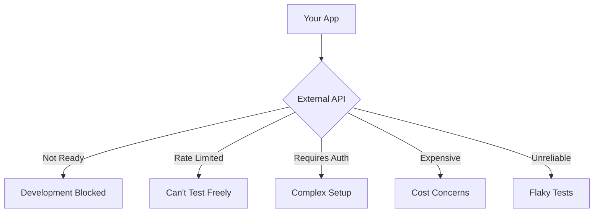
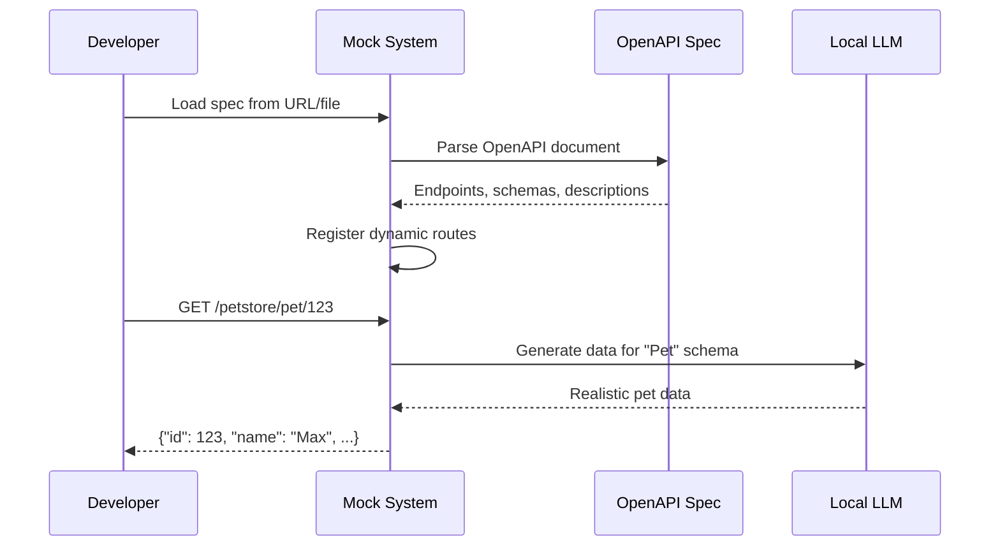
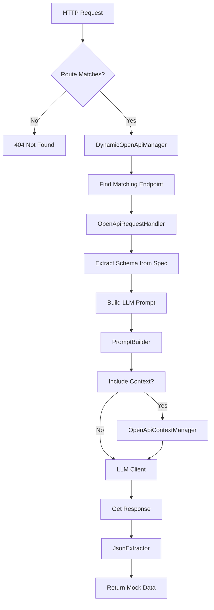
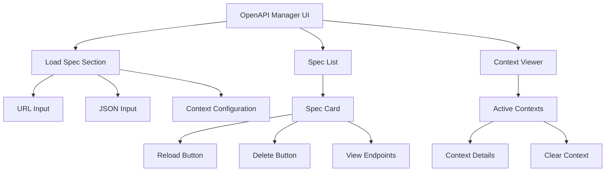

# OpenAPI Dynamic Mock Generator: Load Any Spec, Mock Any API

Have you ever needed to test against an API that wasn't ready yet? Or wanted to develop offline without hitting rate limits? The OpenAPI Dynamic Mock Generator lets you load any OpenAPI specification and instantly creates a fully-functional mock API with realistic, LLM-generated data.

No configuration files. No manual endpoint creation. Just point it at an OpenAPI spec and start making requests.

## The Problem: API Dependencies Block Development

Modern applications depend on dozens of external APIs. During development, you face several challenges:



Traditional solutions involve:
- Manually writing mock responses (tedious, becomes outdated)
- Recording/replaying HTTP traffic (brittle, hard to maintain)
- Using hardcoded fixtures (unrealistic, doesn't cover edge cases)

## The Solution: Dynamic OpenAPI Mocking

Point the system at any OpenAPI spec, and it automatically:
1. Parses the specification
2. Discovers all endpoints
3. Generates realistic mock data using an LLM
4. Serves the mock API on your local machine



## How It Works

### Architecture Overview

The OpenAPI system consists of several coordinated components:



**Key Components:**

1. **DynamicOpenApiManager** - Manages loaded specs and route matching
2. **OpenApiSpecLoader** - Fetches and parses OpenAPI documents
3. **OpenApiRequestHandler** - Generates responses for matched endpoints
4. **PromptBuilder** - Creates LLM prompts from OpenAPI schemas
5. **OpenApiContextManager** - Maintains consistency across calls (optional)

### Loading Specifications

Specs can be loaded from three sources:

**1. Remote URL**
```http
POST /api/openapi/specs
Content-Type: application/json

{
  "name": "petstore",
  "source": "https://petstore3.swagger.io/api/v3/openapi.json",
  "basePath": "/petstore"
}
```

**2. Local File**
```http
POST /api/openapi/specs
Content-Type: application/json

{
  "name": "my-api",
  "source": "./specs/my-api.yaml",
  "basePath": "/api/v1"
}
```

**3. Data URL (Base64 Encoded)**
```http
POST /api/openapi/specs
Content-Type: application/json

{
  "name": "inline-api",
  "source": "data:application/json;base64,eyJvcGVuYXBpIjoiMy...",
  "basePath": "/api"
}
```

### Spec Loading Process

Here's what happens when you load a spec:

```csharp
public async Task<SpecLoadResult> LoadSpecAsync(
    string name,
    string source,
    string? basePath = null,
    string? contextName = null)
{
    // 1. Use scoped service factory for OpenApiSpecLoader
    using var scope = _scopeFactory.CreateScope();
    var specLoader = scope.ServiceProvider
        .GetRequiredService<OpenApiSpecLoader>();

    // 2. Load the OpenAPI document
    var document = await specLoader.LoadSpecAsync(source);

    // 3. Determine base path from spec or parameter
    var effectiveBasePath = basePath
        ?? document.Servers?.FirstOrDefault()?.Url
        ?? "/api";

    // 4. Store spec with configuration
    var config = new OpenApiSpecConfig
    {
        Name = name,
        Source = source,
        Document = document,
        BasePath = effectiveBasePath,
        ContextName = contextName,
        LoadedAt = DateTimeOffset.UtcNow
    };

    _specs.AddOrUpdate(name, config, (_, __) => config);

    // 5. Notify listeners via SignalR
    await NotifySpecLoaded(name, effectiveBasePath);

    return new SpecLoadResult
    {
        Name = name,
        BasePath = effectiveBasePath,
        EndpointCount = CountEndpoints(document),
        Success = true
    };
}
```

### Dynamic Route Matching

When a request arrives, the system matches it against all loaded specs:

```csharp
public OpenApiEndpointMatch? FindMatchingEndpoint(string path, string method)
{
    // Try each loaded spec
    foreach (var spec in _specs.Values)
    {
        // Remove base path prefix
        var relativePath = path;
        if (path.StartsWith(spec.BasePath))
        {
            relativePath = path.Substring(spec.BasePath.Length);
        }

        // Find matching path in OpenAPI document
        var (pathTemplate, operation) = FindOperation(
            spec.Document,
            relativePath,
            method);

        if (operation != null)
        {
            return new OpenApiEndpointMatch
            {
                Spec = spec,
                PathTemplate = pathTemplate,
                Operation = operation,
                Method = ParseMethod(method)
            };
        }
    }

    return null;
}
```

### Request Handling

Once a matching endpoint is found, the handler generates a response:

```csharp
public async Task<string> HandleRequestAsync(
    HttpContext context,
    OpenApiDocument document,
    string path,
    OperationType method,
    OpenApiOperation operation,
    string? contextName = null,
    CancellationToken cancellationToken = default)
{
    // 1. Extract request body
    var requestBody = await ReadRequestBodyAsync(context.Request);

    // 2. Get success response schema
    var shape = ExtractResponseSchema(operation);

    // 3. Get context history if using contexts
    var contextHistory = !string.IsNullOrWhiteSpace(contextName)
        ? _contextManager.GetContextForPrompt(contextName)
        : null;

    // 4. Build prompt from OpenAPI metadata
    var description = operation.Summary ?? operation.Description;
    var prompt = _promptBuilder.BuildPrompt(
        method.ToString(),
        path,
        requestBody,
        new ShapeInfo { Shape = shape },
        streaming: false,
        description: description,
        contextHistory: contextHistory);

    // 5. Get response from LLM
    var rawResponse = await _llmClient.GetCompletionAsync(
        prompt,
        cancellationToken);

    // 6. Extract clean JSON
    var jsonResponse = JsonExtractor.ExtractJson(rawResponse);

    // 7. Store in context if configured
    if (!string.IsNullOrWhiteSpace(contextName))
    {
        _contextManager.AddToContext(
            contextName,
            method.ToString(),
            path,
            requestBody,
            jsonResponse);
    }

    return jsonResponse;
}
```

### Schema Extraction

The system extracts response schemas from OpenAPI definitions:

```csharp
private string? ExtractResponseSchema(OpenApiOperation operation)
{
    // Look for successful response (2xx)
    var successResponse = operation.Responses
        .FirstOrDefault(r => r.Key.StartsWith("2"))
        .Value;

    if (successResponse == null)
        return null;

    // Get JSON content
    var jsonContent = successResponse.Content
        .FirstOrDefault(c => c.Key.Contains("json"))
        .Value;

    if (jsonContent?.Schema == null)
        return null;

    // Convert OpenAPI schema to JSON Schema
    return ConvertToJsonSchema(jsonContent.Schema);
}

private string ConvertToJsonSchema(OpenApiSchema schema)
{
    // Recursively build JSON Schema representation
    var builder = new StringBuilder();
    builder.Append("{");

    if (schema.Type != null)
    {
        builder.Append($"\"type\":\"{schema.Type}\"");
    }

    if (schema.Properties?.Count > 0)
    {
        builder.Append(",\"properties\":{");
        var props = schema.Properties
            .Select(p => $"\"{p.Key}\":{ConvertToJsonSchema(p.Value)}");
        builder.Append(string.Join(",", props));
        builder.Append("}");
    }

    if (schema.Items != null)
    {
        builder.Append(",\"items\":");
        builder.Append(ConvertToJsonSchema(schema.Items));
    }

    builder.Append("}");
    return builder.ToString();
}
```

## Real-World Usage

### Example: Petstore API

Let's walk through mocking the classic Petstore API:

**Step 1: Load the Spec**

```http
POST /api/openapi/specs
Content-Type: application/json

{
  "name": "petstore",
  "source": "https://petstore3.swagger.io/api/v3/openapi.json",
  "basePath": "/petstore"
}
```

**Response:**
```json
{
  "name": "petstore",
  "basePath": "/petstore",
  "endpointCount": 19,
  "endpoints": [
    {"path": "/petstore/pet", "method": "POST"},
    {"path": "/petstore/pet/{petId}", "method": "GET"},
    {"path": "/petstore/pet/findByStatus", "method": "GET"},
    ...
  ],
  "success": true
}
```

**Step 2: Use the Mock Endpoints**

Now all 19 endpoints are available:

```http
### Get a pet by ID
GET /petstore/pet/123

### Response (auto-generated):
{
  "id": 123,
  "name": "Max",
  "category": {
    "id": 1,
    "name": "Dogs"
  },
  "photoUrls": [
    "https://example.com/max1.jpg"
  ],
  "tags": [
    {"id": 1, "name": "friendly"},
    {"id": 2, "name": "trained"}
  ],
  "status": "available"
}
```

```http
### Find pets by status
GET /petstore/pet/findByStatus?status=available

### Response (auto-generated array):
[
  {
    "id": 42,
    "name": "Buddy",
    "status": "available",
    ...
  },
  {
    "id": 43,
    "name": "Luna",
    "status": "available",
    ...
  }
]
```

**Step 3: Inspect the Spec**

```http
GET /api/openapi/specs/petstore

### Shows full details:
### - All endpoints
### - Load time
### - Context configuration
### - Base path
```

**Step 4: Reload if Spec Changes**

```http
POST /api/openapi/specs/petstore/reload
```

**Step 5: Remove When Done**

```http
DELETE /api/openapi/specs/petstore
```

### Multiple Specs Simultaneously

You can load multiple specs at once, each with its own base path:

```http
### Load Petstore at /petstore
POST /api/openapi/specs
{"name": "petstore", "source": "...", "basePath": "/petstore"}

### Load GitHub API at /github
POST /api/openapi/specs
{"name": "github", "source": "...", "basePath": "/github"}

### Load Stripe API at /stripe
POST /api/openapi/specs
{"name": "stripe", "source": "...", "basePath": "/stripe"}

### All three APIs now available simultaneously:
GET /petstore/pet/123
GET /github/users/octocat
GET /stripe/customers/cus_123
```

### Specs with Contexts

For even more realism, assign a context to a spec:

```http
POST /api/openapi/specs
Content-Type: application/json

{
  "name": "petstore",
  "source": "https://petstore3.swagger.io/api/v3/openapi.json",
  "basePath": "/petstore",
  "contextName": "petstore-session"
}
```

Now all petstore endpoints share the same context:

```http
### Create a pet
POST /petstore/pet
{"name": "Max", "status": "available"}

### Response: {"id": 42, "name": "Max", "status": "available"}

### Get the pet (will reference same ID and name)
GET /petstore/pet/42

### Response: {"id": 42, "name": "Max", "status": "available"}
### Notice: Consistent ID and name from context
```

## Testing Endpoint

The test endpoint lets you try an endpoint without making a real request:

```http
POST /api/openapi/test
Content-Type: application/json

{
  "specName": "petstore",
  "path": "/pet/123",
  "method": "GET"
}

### Returns mock response without affecting routes
```

This is useful for:
- Previewing responses before integration
- Testing specific endpoints in isolation
- Debugging schema issues

## Management UI

For visual management, visit `http://localhost:5116/OpenApi`:



**Features:**
- **Drag-and-drop** spec file upload
- **Live endpoint discovery** - See all endpoints instantly
- **One-click testing** - Test any endpoint with a button
- **Real-time notifications** - SignalR updates when specs load
- **Syntax highlighting** - Beautiful JSON response display
- **Context management** - View and clear contexts

## Advanced Features

### Path Parameters

Path parameters are automatically extracted:

```yaml
# OpenAPI Spec
/pet/{petId}:
  get:
    parameters:
      - name: petId
        in: path
        schema:
          type: integer
```

```http
GET /petstore/pet/123
### LLM receives: "Generate data for Pet with petId=123"
### Response: {"id": 123, ...}
```

### Query Parameters

Query parameters influence the response:

```yaml
/pet/findByStatus:
  get:
    parameters:
      - name: status
        in: query
        schema:
          type: string
          enum: [available, pending, sold]
```

```http
GET /petstore/pet/findByStatus?status=available
### LLM receives: "Generate array of Pets with status=available"
### Response: [{"status": "available", ...}, ...]
```

### Request Bodies

POST/PUT bodies are included in the prompt:

```yaml
/pet:
  post:
    requestBody:
      content:
        application/json:
          schema:
            $ref: '#/components/schemas/Pet'
```

```http
POST /petstore/pet
Content-Type: application/json

{"name": "Max", "status": "available"}

### LLM receives: "Generate response for creating Pet with name=Max, status=available"
### Response: {"id": 42, "name": "Max", "status": "available"}
```

### Descriptions and Summaries

OpenAPI descriptions guide the LLM:

```yaml
/pet/{petId}:
  get:
    summary: Find pet by ID
    description: Returns a single pet based on the ID provided
```

These are included in the prompt, helping the LLM understand the endpoint's purpose.

### Response Status Codes

The system uses the first successful (2xx) response:

```yaml
responses:
  '200':
    description: Successful operation
    content:
      application/json:
        schema:
          $ref: '#/components/schemas/Pet'
  '404':
    description: Pet not found
```

Only the 200 schema is used for mock generation (404s are not currently simulated).

## SignalR Real-Time Updates

When specs are loaded/deleted, the UI receives real-time notifications via SignalR:

```csharp
public async Task NotifySpecLoaded(string name, string basePath)
{
    await _hubContext.Clients.All.SendAsync("SpecLoaded", new
    {
        name,
        basePath,
        timestamp = DateTimeOffset.UtcNow
    });
}

public async Task NotifySpecDeleted(string name)
{
    await _hubContext.Clients.All.SendAsync("SpecDeleted", new
    {
        name,
        timestamp = DateTimeOffset.UtcNow
    });
}
```

JavaScript UI code:

```javascript
const connection = new signalR.HubConnectionBuilder()
    .withUrl('/hubs/openapi')
    .build();

connection.on('SpecLoaded', (data) => {
    showNotification(`Spec "${data.name}" loaded at ${data.basePath}`, 'success');
    refreshSpecList();
});

connection.on('SpecDeleted', (data) => {
    showNotification(`Spec "${data.name}" deleted`, 'info');
    refreshSpecList();
});
```

## Format Support

The system supports:
- ✅ OpenAPI 3.0.x
- ✅ OpenAPI 3.1.x
- ✅ Swagger 2.0
- ✅ JSON format
- ✅ YAML format

Both JSON and YAML specs are automatically detected and parsed.

## Best Practices

### 1. Use Descriptive Spec Names

```http
❌ Bad:  {"name": "spec1", ...}
✅ Good: {"name": "github-v3", ...}
```

### 2. Set Appropriate Base Paths

Avoid conflicts by using unique base paths:

```http
### Good separation
/petstore/...
/github/...
/stripe/...

### Bad (conflicts!)
/api/... (multiple specs)
```

### 3. Reload When Specs Change

If your OpenAPI spec is updated, reload it:

```http
POST /api/openapi/specs/my-api/reload
```

### 4. Use Contexts for Related Calls

```http
POST /api/openapi/specs
{
  "name": "petstore",
  "source": "...",
  "contextName": "test-session"
}

### Now all petstore calls maintain consistency
```

### 5. Clean Up After Testing

Remove specs you're no longer using:

```http
DELETE /api/openapi/specs/old-spec
```

## Limitations

1. **Response Status Codes** - Only successful (2xx) responses are mocked
2. **Authentication** - Auth headers are accepted but not validated
3. **Validation** - Request validation against schemas is not enforced
4. **State** - No actual database; data is generated fresh each time (unless using contexts)
5. **Performance** - LLM generation adds latency (~100-500ms per request)

## Integration with Regular Mock Endpoints

OpenAPI specs work alongside regular `/api/mock` endpoints:

```http
### OpenAPI-based (from spec)
GET /petstore/pet/123
### Uses Pet schema from OpenAPI spec

### Regular mock (shape-based)
GET /api/mock/custom?shape={"id":0,"name":"string"}
### Uses explicit shape parameter
```

Both use the same underlying LLM but differ in how the schema is provided.

## Performance Optimization

### Caching

Loaded specs are cached in memory:

```csharp
private readonly ConcurrentDictionary<string, OpenApiSpecConfig> _specs = new();
```

### Service Lifetime

`DynamicOpenApiManager` is a singleton, so specs remain loaded for the application lifetime.

### Parallel Spec Loading

Multiple specs can be loaded in parallel:

```http
### Send these simultaneously
POST /api/openapi/specs {"name": "spec1", ...}
POST /api/openapi/specs {"name": "spec2", ...}
POST /api/openapi/specs {"name": "spec3", ...}
```

All three will load in parallel, not sequentially.

## Troubleshooting

### Spec Won't Load

**Problem:** Spec loading fails

**Solutions:**
- Check the URL is accessible
- Verify the file exists (for local paths)
- Ensure the JSON/YAML is valid
- Look for CORS issues (for remote URLs)

### Endpoint Not Found

**Problem:** 404 on expected endpoint

**Solutions:**
- Verify the base path: `/petstore` + `/pet/123` = `/petstore/pet/123`
- Check the spec actually defines that path
- Ensure the HTTP method matches (GET vs POST)

### Response Doesn't Match Schema

**Problem:** Generated data doesn't match expected schema

**Solutions:**
- Check if the schema in the spec is correct
- Verify you're looking at the right response (200 vs 201)
- Remember: LLM generation is probabilistic, not deterministic

## Conclusion

The OpenAPI Dynamic Mock Generator turns any OpenAPI specification into a fully-functional mock API in seconds. No manual configuration, no hardcoded responses, no maintenance overhead.

Simply load a spec and start making requests. The LLM generates realistic, varied data that conforms to your schemas, making it perfect for:
- **Frontend development** while the backend is being built
- **Integration testing** without hitting real APIs
- **Offline development** when connectivity is limited
- **Load testing** without quota concerns
- **Prototyping** new features quickly

Combined with API Contexts, you get stateful mock APIs that maintain consistency across calls, providing an even more realistic simulation of production systems.

The future of mock APIs is dynamic, intelligent, and driven by the same LLMs that power modern development tools. Welcome to the new era of API mocking.
