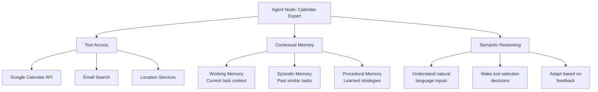
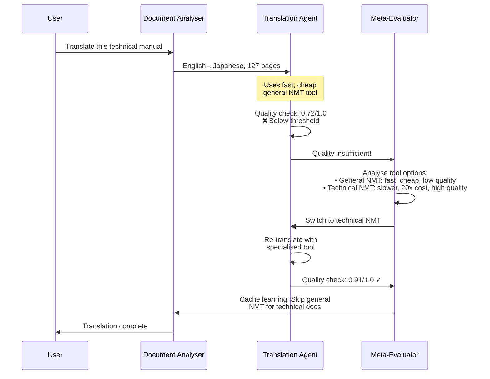
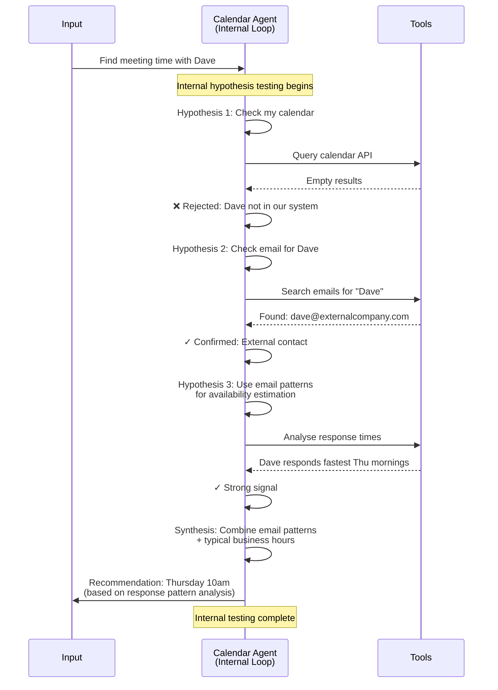
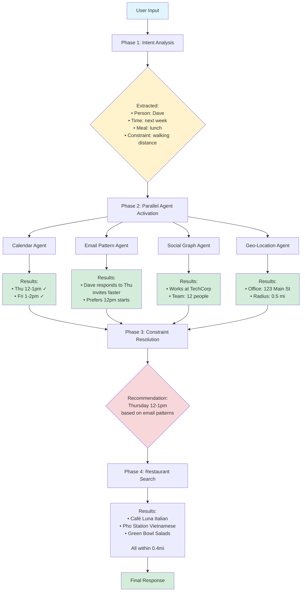
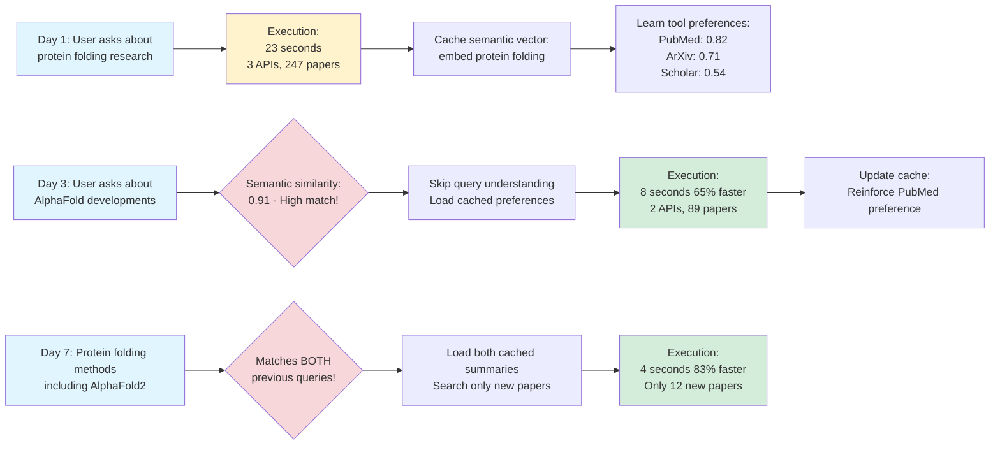
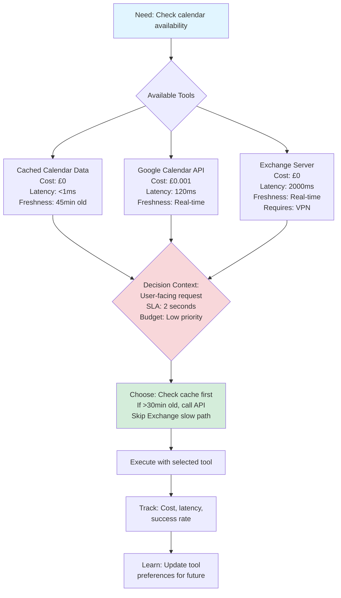
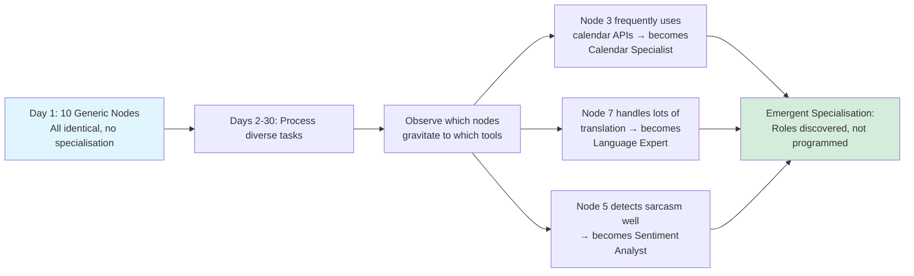
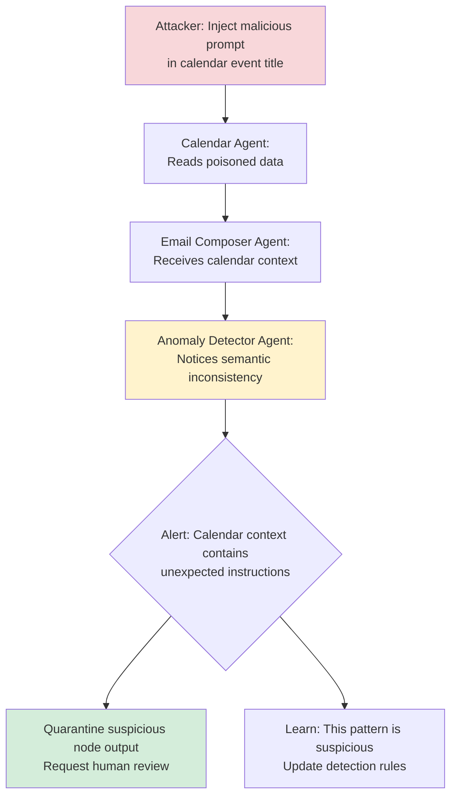
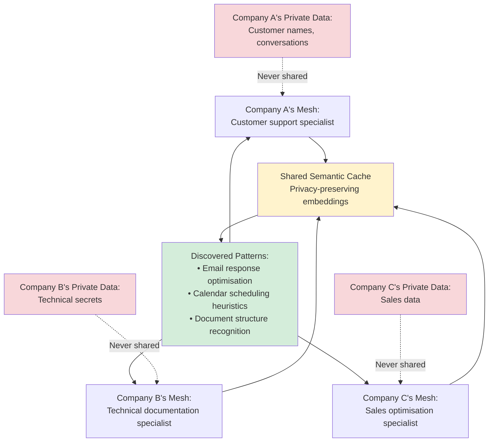

# Semantic Cognition Meshes: When Every Neuron is an AI

Right, so here's a properly mental idea that's been rattling around: What if we stopped thinking about neural networks as passive mathematical constructs and started treating them as **societies of intelligent agents**?

I'm talking about replacing those simple neurons—you know, the ones doing weighted sums and activation functions—with actual LLMs. Each "neuron" becomes an autonomous agent with its own reasoning, memory, tools, and the ability to talk back to its neighbours.

Sounds barmy? Perhaps. But bear with me whilst we explore where this could go.

## The Problem with Passive Neurons

Traditional neural networks are brilliant at what they do, but they're fundamentally **passive**. Data flows forward through layers, gradients flow backward during training, and individual neurons are completely oblivious to their role in the larger computation—they just crunch numbers.

Here's the thing though: what if each node in your network looked more like this?

Each node becomes a proper AI system that can:
- Read and understand natural language
- Decide which tools to use based on cost, latency, and reliability
- Remember what worked in the past
- Evaluate its own performance and adjust accordingly
- Send feedback upstream to change how earlier nodes behave

This isn't just anthropomorphising computers for the sake of it. By using LLMs as the computational substrate for individual nodes, we're operating at a fundamentally different level of abstraction—where the basic unit of computation is **semantic reasoning** rather than numeric transformation.

## How Data Flows Through the Mesh

In a traditional neural network, you've got fixed layers. In a **semantic cognition mesh**, the topology emerges from the input itself. No hardcoded workflows—the structure adapts to what you're asking it to do.

Notice what's happened here:
1. **No explicit orchestration** - The mesh decided to activate 4 agents in parallel
2. **Semantic routing** - It understood "lunch" meant restaurants, "next week" meant calendar checks
3. **Tool diversity** - Calendar APIs, email analysis, social graphs, geolocation—all coordinated
4. **Context synthesis** - The final answer integrated insights from multiple sources

Nobody programmed this workflow. It emerged from the semantic properties of the input. Rather clever, that.

## Nodes That Talk Backwards (Reflex Arcs)

Here's where it gets properly interesting. Traditional neural networks only pass information forward (and gradients backward during training). But what if nodes could send **semantic feedback** upstream during execution?

The translation agent **evaluated its own output**, decided it wasn't up to scratch, and triggered a tool switch. The system adapted mid-execution without any explicit error handling logic.

Next time someone requests a technical translation, the mesh will remember: "Don't waste time with the cheap tool—start with the good one." Bob's your uncle.

## The Really Mental Bit: Nodes Talking to Themselves

Right, this is where it gets properly wild. What if nodes didn't just execute once and return a result? What if they could **run internal experiments** before committing to an answer?

Think about how you tackle a tricky problem. You don't immediately respond—you think through multiple approaches, test an idea mentally, realise it won't work, pivot to something else. That's what we want nodes to do.

A cognition mesh node could operate like this:

**The key difference from current LLM tool use:**

Most LLM agents today:
1. Get input
2. Decide which tool to call
3. Call tool
4. Return result

But a self-deliberating node:
1. Gets input
2. **Forms multiple hypotheses**
3. **Tests hypothesis A** → calls tool → evaluates result → weak signal
4. **Pivots to hypothesis B** → calls different tool → strong signal
5. **Maybe tests hypothesis C** for validation
6. **Synthesises** findings from internal exploration
7. Returns high-confidence result

This is **hypothesis-driven tool use** rather than reactive tool calling. Proper scientific method, if you will.

### An Internal Monologue

Imagine a research agent processing "summarise recent advances in protein folding":

> "Right, let me think through this...
>
> **Hypothesis 1:** 'Recent' probably means last 6 months
> - Query PubMed with 6-month filter
> - Only 3 papers? That seems too narrow
> - **Rejected**
>
> **Hypothesis 2:** 'Recent' in this field means ~2 years (AlphaFold era)
> - Query with 2-year window
> - 247 papers, looks reasonable
> - But let me validate...
>
> **Hypothesis 3:** User said 'advances'—are these review papers or novel methods?
> - Filter for paper types
> - Mix of 12 reviews and 235 research articles
> - User probably wants the reviews plus key research
>
> **Synthesis:** Fetch 12 review papers + top 20 cited research articles
>
> Confidence: 0.87 (high)"

**Why this matters:**

1. **Higher quality results** - Node self-validates before committing
2. **Fewer wasted API calls** - Bad hypotheses caught internally before burning through your API budget
3. **Explainable reasoning** - Node can show its working
4. **Cost optimisation** - Tests cheap hypotheses before expensive ones
5. **Emergent expertise** - Nodes learn which hypothesis patterns actually work

### The Scalability Challenge

Here's the catch: This kind of self-deliberation requires:
- **Persistent memory** across the internal loop
- **Multiple tool invocations** per task (higher cost)
- **Hypothesis tracking** and evaluation
- **Meta-cognition** about what's worth testing

You can't do this with stateless LLM API calls. You need nodes that maintain **working context** across their internal iterations. That's a fundamentally different architecture from what we've got today.

## A Proper Complex Example

Right, let's walk through a scheduling request that triggers a cascade of agents:

**Input**: *"When can I meet Dave for lunch next week? Somewhere walking distance from his office."*

**What's actually happened here:**

1. **Four agents activated in parallel** - The mesh didn't wait for Calendar to finish before checking email patterns
2. **Email patterns influenced the decision** - Thursday was prioritised over Friday because the mesh noticed Dave's behaviour
3. **Geo-aware filtering** - Restaurant search used the office location from Social Graph Agent
4. **No orchestration logic** - This entire workflow emerged from semantic understanding

The human didn't say "check calendar AND email AND social graph AND location." The mesh figured that out on its own. Rather brilliant, really.

## Learning Through Semantic Caching

After completing a task, agents could cache a **semantic fingerprint**:

The mesh got **exponentially faster** as it recognised similar queries: 23s → 8s → 4s.

It learnt that for biology literature reviews:
- PubMed is more useful than Google Scholar
- Previous summaries can be reused and extended
- Most queries are incremental refinements

Nobody programmed these optimisations. They emerged from tracking what actually worked.

## Tool Selection: The Economic Game

Here's where it gets economically interesting. Each tool would have metadata about its characteristics. When an agent needs to check availability, it could **reason about tradeoffs**:

The agent is making proper economic decisions based on:
- **Cost** - Is the API fee worth it?
- **Latency** - Can we meet the SLA?
- **Freshness** - Is cached data acceptable?
- **Reliability** - What's the success rate?

Over time, it learns patterns like:
- "For this user, calendar data is stable—check cache aggressively"
- "Meeting invites require real-time data—always hit the API"
- "Exchange is too slow for interactive requests—only use for batch jobs"

## Open Questions That Keep Me Up at Night

### 1. Can Nodes Discover Their Own Specialisations?

What if instead of pre-defining "Calendar Agent" and "Email Agent," we started with **generic nodes** and let them evolve roles?

Could a mesh **invent its own node types** based on usage patterns? Maybe after handling 1000 customer service requests, it discovers it needs a "Sarcasm Detector" node because the generic sentiment analysis keeps making a hash of it.

### 2. What About Adversarial Attacks?

Traditional prompt injection targets a single LLM. But in a mesh:

Could the mesh topology itself provide **distributed immunity**? If one node gets compromised, neighbouring nodes might notice the anomalous output and quarantine it. Like white blood cells for AI.

### 3. Cross-Mesh Knowledge Sharing?

Imagine 1000 companies each running their own cognition mesh. Can they share learnings without leaking private data?

Maybe through **federated learning on semantic vectors**? Mesh A discovers that PubMed is better than Google Scholar for biology questions. Can Mesh B benefit from that without seeing Mesh A's actual queries?

### 4. Hardware Co-Design?

Current LLMs run on GPUs designed for matrix maths. What if we designed chips specifically for semantic routing?

Could we get 10x speedups with custom silicon? Probably, yeah.

## The Practical Challenges

Right, let's be honest about what makes this difficult:

### Cost

Running hundreds of LLM-powered nodes would be **expensive**. Even with weight sharing (all nodes using the same base model, just different system prompts), you're looking at significant compute costs. Current LLM inference is measured in tens of milliseconds per call—multiply that by dozens of nodes per request and the costs add up quickly.

### Latency

If one agent calls a slow API, it could block everything. You'd need:
- **Async execution** - Fast nodes don't wait for slow ones
- **Timeouts** - Every tool has a deadline
- **Graceful degradation** - Partial results with confidence scores
- **Circuit breakers** - If a tool fails repeatedly, temporarily disable it

Standard resilience patterns, really, but critical when you've got this many moving parts.

### Debugging Nightmares

When a 50-node mesh with internal deliberation produces a wrong answer, how do you trace causality through hundreds of hypothesis tests? Traditional stack traces won't cut it. You'd need:
- Distributed tracing for semantic flows
- Visualisation tools for node activation graphs
- Ability to replay decisions with different parameters
- Understanding of why semantic routing made specific choices

### Eventual Consistency

There's no getting around it—nodes operating in parallel on eventually-consistent data will sometimes make decisions based on slightly stale information. For some applications that's fine. For others (financial transactions, medical decisions) it's completely unacceptable.

## How Is This Different from What We've Already Got?

### vs. Traditional Neural Networks

| Traditional DNN | Cognition Mesh |
|-----------------|----------------|
| Passive neurons (maths) | Active agents (reasoning) |
| Fixed topology | Dynamic, emergent topology |
| No memory beyond weights | Working + episodic + procedural memory |
| Opaque decisions | Natural language reasoning traces |
| Can't use tools | Native API integration |
| Gradient-based learning | Semantic caching + reflexive adaptation |

### vs. LangChain/Orchestration Frameworks

| LangChain | Cognition Mesh |
|-----------|----------------|
| Hardcoded workflows | Emergent workflows from semantics |
| Try/catch error handling | Reflexive self-correction |
| Manual optimisation | Automatic semantic caching |
| Centralised orchestrator | Distributed node autonomy |
| Static tool selection | Cost-aware, metadata-driven routing |

### vs. Multi-Agent Systems

Cognition meshes share DNA with multi-agent systems but differ in key ways:

**Similarities:**
- Autonomous agents with specialised roles
- Inter-agent communication
- Emergent collective behaviour

**Differences:**
- **Granularity** - MAS agents are coarse-grained (entire services), mesh nodes are fine-grained (single reasoning steps)
- **Communication** - MAS uses message passing, mesh uses semantic context propagation
- **Topology** - MAS often has fixed agent populations, mesh topology is fluid and input-dependent
- **Memory** - Mesh nodes share semantic vector space, enabling cross-node optimisation

## Should You Actually Build This?

**Good use cases:**
- Multi-modal tasks requiring lots of different tools/APIs
- Fluid workflows with no fixed sequence
- Cost/latency optimisation matters
- Continuous learning is valuable
- You need explainable AI (natural language reasoning traces)

**Bad use cases:**
- Simple, fixed workflows (just write normal code, mate)
- Single-tool scenarios (just call the bloody API)
- Real-time requirements <100ms (too much overhead)
- Deterministic outputs required (LLMs are probabilistic)
- Small team without deep AI/systems experience

**The big question:** Is the added complexity worth it?

For most applications, probably not yet. But as LLMs get faster and cheaper, and as our problems get more complex and multi-modal, this architecture starts making proper sense.

## Where Does This Lead?

Maybe the future of AI isn't **one giant brain**, but **societies of specialised intelligences** that:
- Discover their own roles
- Learn from each other's successes
- Adapt to changing environments
- Develop emergent strategies nobody programmed

Imagine deploying a mesh with 100 generic nodes and coming back a month later to find it's reorganised itself into:
- 20 data retrieval specialists
- 15 analysis experts
- 10 synthesis coordinators
- 5 quality evaluators
- 50 hybrid agents with unpredictable but effective specialisations

You didn't design that hierarchy. It emerged.

**That's** the properly mental bit.

Think about the implications: We're not just building tools that execute our instructions. We're building **ecosystems** that develop their own division of labour, their own communication protocols, their own optimisation strategies.

It's less like programming and more like... gardening? You set up the initial conditions, provide the right nutrients (training data, tool access, feedback mechanisms), and let the system grow into something you didn't explicitly design.

## Questions for Further Exploration

1. **How deep should internal deliberation go?** If a node can test hypotheses, should it test 2? 5? 10? What's the ROI curve? When does more deliberation give diminishing returns?

2. **Can we prove convergence?** Does a cognition mesh always stabilise, or can it get stuck in infinite hypothesis loops? What are the mathematical properties of these systems?

3. **What's the minimum viable mesh?** How few nodes do you need before emergent behaviour appears? Is there a critical mass?

4. **Can nodes vote?** Should important decisions require consensus from multiple agents testing different hypotheses? How do we prevent groupthink in AI?

5. **How do we debug this?** When a 50-node mesh produces a wrong answer, how do you trace causality? Do we need entirely new debugging tools?

6. **Privacy boundaries:** If nodes share semantic caches of their hypothesis-testing patterns, what information leaks between tasks? Can you infer private data from optimisation patterns?

7. **Mesh merging:** Can two independently-trained meshes be combined? What happens when their learned deliberation strategies conflict? Do they fight for resources?

8. **Evolutionary pressure:** If we had 1000 meshes compete, would the best hypothesis-testing strategies spread like genes? Could we evolve better architectures?

9. **Meta-learning:** Can nodes learn WHEN to deliberate versus when to answer immediately? Some queries don't need hypothesis testing—how do nodes develop that intuition?

10. **Control and alignment:** If nodes develop emergent strategies you didn't programme, how do you ensure they remain aligned with your goals? This is the alignment problem at a different scale.

---

## Final Thoughts

This is a thought experiment extending the LLMApi project's concepts to their logical extreme. **None of this is implemented.** We don't even know if it's implementable with current technology. But it's fun to think about where things could go.

The core insight is simple: What if intelligence isn't about building bigger models, but about building societies of smaller, specialised models that can reason, remember, use tools, and coordinate?

Current AI development is focused on making individual models more capable. GPT-4 is better than GPT-3. Claude Sonnet 4.5 is better than Claude 3. We're in an arms race of model size and capability.

But maybe that's not the only path. Maybe the next breakthrough isn't a smarter neuron—it's a **smarter network topology**. Not because we designed it, but because it **emerged** from the way intelligent agents coordinate.

Just a thought.

---

*Document Version: 1.2*
*Last Updated: 2025-01-13*
*Status: Speculative architecture exploration*
*New in v1.2: Removed all implementation code—pure conceptual discussion*
*Licence: Unlicense (Public Domain)*
