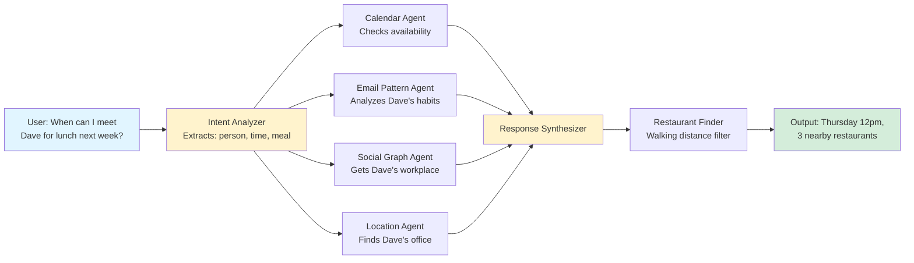
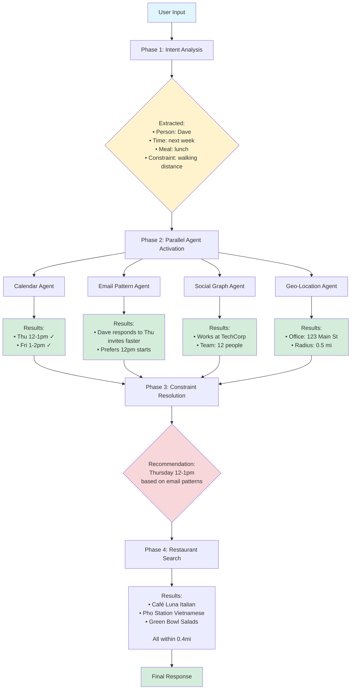
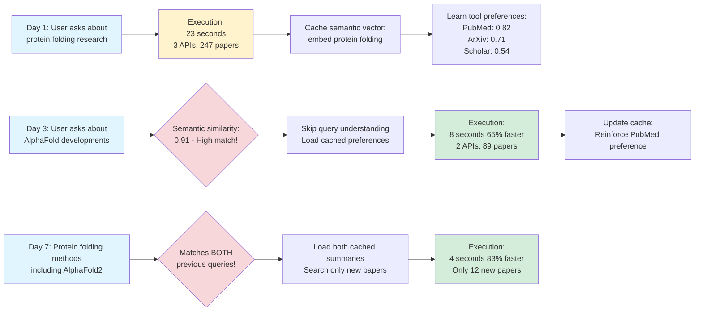
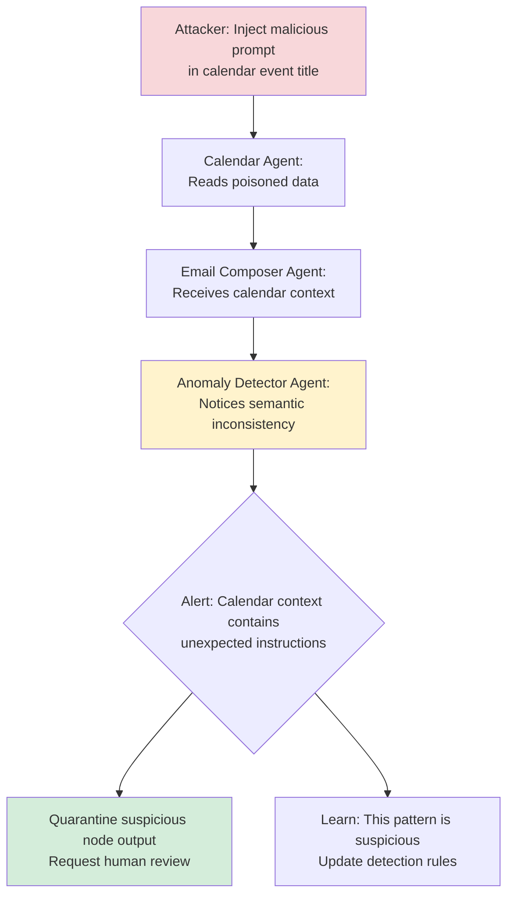
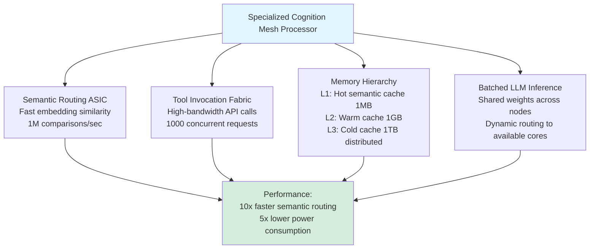
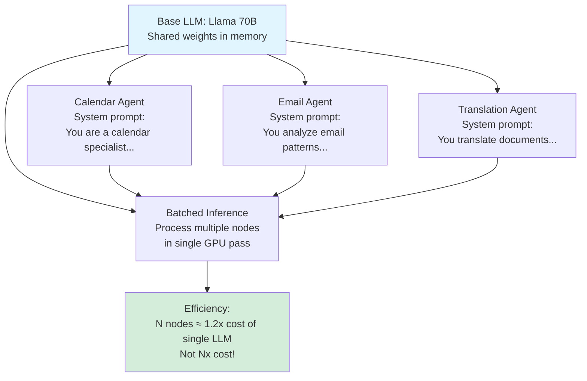
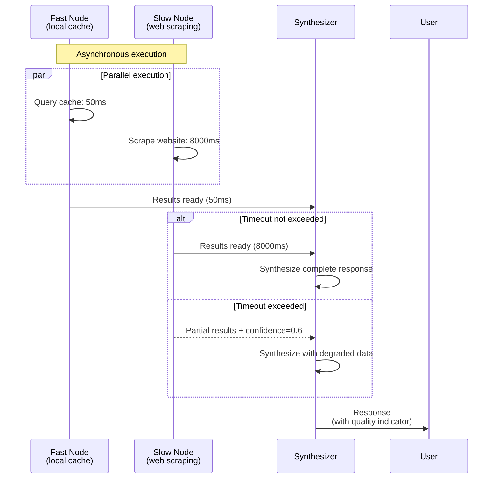

# What if Every Neuron Was an AI?

Here's a wild idea: What if we stopped thinking about neural networks as layers of math and started thinking about them as **societies of intelligent agents**?

I'm talking about replacing passive neurons—those simple `sum(weights * inputs) + activation_function` things—with actual LLMs. Each "neuron" would be an autonomous agent with its own reasoning, memory, tools, and the ability to talk back to its neighbors.

Sound absurd? Maybe. But let's explore what this could look like.

## The Core Idea

Traditional neural networks are amazing, but they're fundamentally **passive**. Data flows forward through layers, gradients flow backward during training, and individual neurons have no idea what they're doing—they just compute weighted sums.

What if instead, each node in your network was more like this:

```mermaid
graph TB
    Node[Agent Node: "Calendar Expert"]

    Node --> Tools[Tool Access]
    Node --> Memory[Contextual Memory]
    Node --> Reasoning[Semantic Reasoning]

    Tools --> API1[Google Calendar API]
    Tools --> API2[Email Search]
    Tools --> API3[Location Services]

    Memory --> Working[Working Memory<br/>Current task context]
    Memory --> Episodic[Episodic Memory<br/>Past similar tasks]
    Memory --> Procedural[Procedural Memory<br/>Learned strategies]

    Reasoning --> Understand[Understand natural<br/>language inputs]
    Reasoning --> Decide[Make tool selection<br/>decisions]
    Reasoning --> Adapt[Adapt based on<br/>feedback]
```

Each node is a complete AI system—it can:
- Read and understand natural language
- Decide which tools to use based on cost, latency, and reliability
- Remember what worked in the past
- Evaluate its own performance and adjust
- Send feedback upstream to change how earlier nodes behave

## How Would Data Flow Work?

In a traditional neural network, you have fixed layers. In a **semantic cognition mesh**, the topology emerges from the input itself.



Notice what just happened:
1. **No hardcoded workflow** - The mesh decided to activate 4 agents in parallel
2. **Semantic routing** - It understood "lunch" meant restaurants, "next week" meant calendar checks
3. **Tool diversity** - Calendar APIs, email analysis, social graphs, geolocation
4. **Context synthesis** - The final answer integrated insights from multiple sources

Nobody programmed this workflow. It emerged from the input's semantic properties.

## Wait, Can Nodes Talk Backwards?

Yes! This is where it gets really interesting. Traditional neural networks only pass information forward (and gradients backward during training). But what if nodes could send **semantic feedback** upstream during execution?


The translation agent **evaluated its own output**, decided it wasn't good enough, and triggered a tool switch. The system adapted mid-execution without explicit error handling code.

Next time someone requests a technical translation, the mesh will remember: "Don't waste time with the cheap tool—start with the good one."

## Show Me a Complex Example

Okay, here's a scheduling request that triggers a cascade of agents:

**Input**: *"When can I meet Dave for lunch next week? Somewhere walking distance from his office."*



**Key observations:**

1. **Four agents activated in parallel** - The mesh didn't wait for Calendar to finish before checking email patterns
2. **Email patterns influenced the decision** - Thursday was prioritized over Friday because the mesh noticed Dave's behavior
3. **Geo-aware filtering** - Restaurant search used the office location from Social Graph Agent
4. **No orchestration code** - This entire workflow emerged from semantic understanding

The human didn't say "check calendar AND email AND social graph AND location." The mesh figured that out.

## How Does Learning Work?

After completing a task, agents cache a **semantic fingerprint**:



The mesh got **exponentially faster** as it recognized similar queries: 23s → 8s → 4s.

It learned that for biology literature reviews:
- PubMed is more useful than Google Scholar
- Previous summaries can be reused and extended
- Most queries are incremental refinements

Nobody programmed these optimizations. They emerged from tracking what worked.

## Tool Selection: The Cost-Benefit Game

Here's where it gets economically interesting. Every tool has metadata:

```json
{
  "tool": "google_calendar_api",
  "latency_p50": 120,
  "latency_p99": 450,
  "cost_per_call": 0.001,
  "reliability": 0.98,
  "rate_limit": "1000/hour"
}
```

When an agent needs to check availability, it can **reason about tradeoffs**:


The agent is making economic decisions based on:
- **Cost** - Is the API fee worth it?
- **Latency** - Can we meet the SLA?
- **Freshness** - Is cached data acceptable?
- **Reliability** - What's the success rate?

Over time, it learns patterns like:
- "For this user, calendar data is stable—check cache aggressively"
- "Meeting invites require real-time data—always hit the API"
- "Exchange is too slow for interactive requests—only use for batch jobs"

## Open Questions That Keep Me Up at Night

### 1. Can Nodes Discover Their Own Specializations?

What if instead of pre-defining "Calendar Agent" and "Email Agent," we started with **generic nodes** and let them evolve roles?


Could a mesh **invent its own node types** based on usage patterns? Maybe after handling 1000 customer service requests, it discovers it needs a "Sarcasm Detector" node because the generic sentiment analysis keeps failing.

### 2. What About Adversarial Attacks?

Traditional prompt injection targets a single LLM. But in a mesh:



Could the mesh topology itself provide **distributed immunity**? If one node gets compromised, neighboring nodes might notice the anomalous output and quarantine it.

### 3. Cross-Mesh Knowledge Sharing?

Imagine 1000 companies each running their own cognition mesh. Can they share learnings without leaking private data?


Maybe through **federated learning on semantic vectors**? Mesh A discovers that PubMed is better than Google Scholar for biology questions. Can Mesh B benefit from that without seeing Mesh A's actual queries?

### 4. Hardware Co-Design?

Current LLMs run on GPUs designed for matrix math. What if we designed chips specifically for semantic routing?



Could we get 10x speedups with custom silicon?

## The Practical Stuff (Because This Has to Actually Work)

### How Do You Run This Without Going Broke?

Running a separate LLM per node would cost a fortune. Here's the trick:



**Weight sharing** - All nodes use the same base model, just different system prompts
**Batched inference** - Nodes in the same "layer" process together
**Selective activation** - Not every node runs for every input

### What About Latency?

If one agent calls a slow API, it could block everything:



**Async execution** - Fast nodes don't wait for slow ones
**Timeouts** - Every tool has a deadline
**Graceful degradation** - Partial results with confidence scores
**Circuit breakers** - If a tool fails repeatedly, temporarily disable it

## Comparison Time: How Is This Different?

### vs. Traditional Neural Networks

| Traditional DNN | Cognition Mesh |
|-----------------|----------------|
| Passive neurons (math) | Active agents (reasoning) |
| Fixed topology | Dynamic, emergent topology |
| No memory beyond weights | Working + episodic + procedural memory |
| Opaque decisions | Natural language reasoning traces |
| Can't use tools | Native API integration |
| Gradient-based learning | Semantic caching + reflexive adaptation |

### vs. LangChain/Orchestration Frameworks

| LangChain | Cognition Mesh |
|-----------|----------------|
| Hardcoded workflows (`if X then Y`) | Emergent workflows from semantics |
| Try/catch error handling | Reflexive self-correction |
| Manual optimization | Automatic semantic caching |
| Centralized orchestrator | Distributed node autonomy |
| Static tool selection | Cost-aware, metadata-driven routing |

## So... Should You Actually Build This?

**Good use cases:**
- Multi-modal tasks (lots of different tools/APIs)
- Fluid workflows (no fixed sequence)
- Cost/latency optimization matters
- Continuous learning is valuable

**Bad use cases:**
- Simple, fixed workflows (use traditional code)
- Single-tool scenarios (just call the API)
- Real-time requirements <100ms (too much overhead)
- Deterministic outputs required (LLMs are probabilistic)

**The big question:** Is the added complexity worth it?

For most applications, probably not yet. But as LLMs get faster and cheaper, and as our problems get more complex and multi-modal, this architecture starts making sense.

## Where Does This Lead?

Maybe the future of AI isn't **one giant brain**, but **societies of specialized intelligences** that:
- Discover their own roles
- Learn from each other's successes
- Adapt to changing environments
- Develop emergent strategies nobody programmed

Imagine deploying a mesh with 100 generic nodes and coming back a month later to find it's reorganized itself into:
- 20 data retrieval specialists
- 15 analysis experts
- 10 synthesis coordinators
- 5 quality evaluators
- 50 hybrid agents with unpredictable but effective specializations

You didn't design that hierarchy. It emerged.

**That's** the wild part.

---

## Questions for Further Exploration

1. **Can we prove convergence?** Does a cognition mesh always stabilize, or can it get stuck in loops?

2. **What's the minimum viable mesh?** How few nodes do you need before emergent behavior appears?

3. **Can nodes vote?** Should important decisions require consensus from multiple agents?

4. **How do we debug this?** When a 50-node mesh produces a wrong answer, how do you trace causality?

5. **Privacy boundaries:** If nodes share semantic caches, what information leaks between tasks?

6. **Mesh merging:** Can two independently-trained meshes be combined? What happens to their learned topologies?

7. **Evolutionary pressure:** If we had 1000 meshes compete, would the best strategies spread like genes?

---

**This is a thought experiment extending the LLMApi project's concepts to their logical extreme. None of this is implemented (yet). But it's fun to think about where things could go.**

*Document Version: 1.0*
*Last Updated: 2025-01-13*
*Status: Speculative architecture exploration*
*License: Unlicense (Public Domain)*
